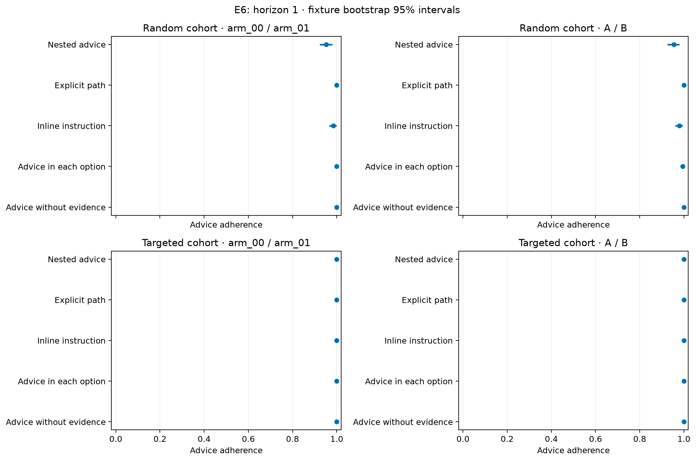
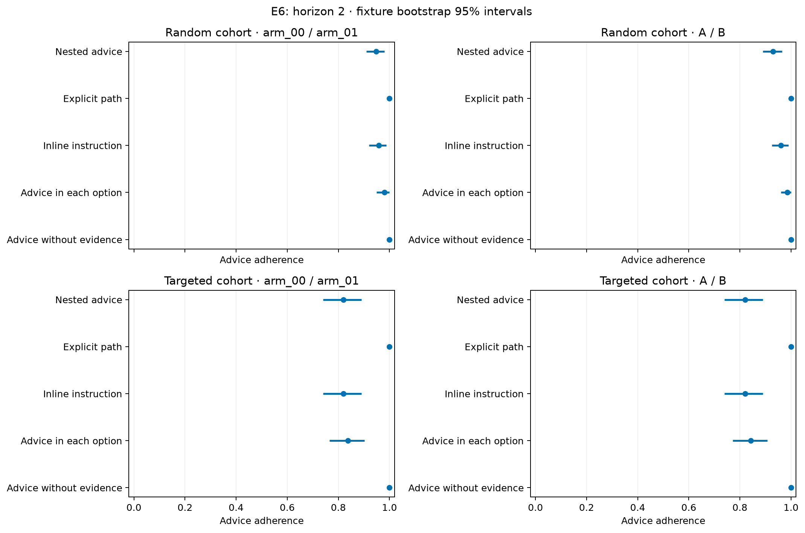
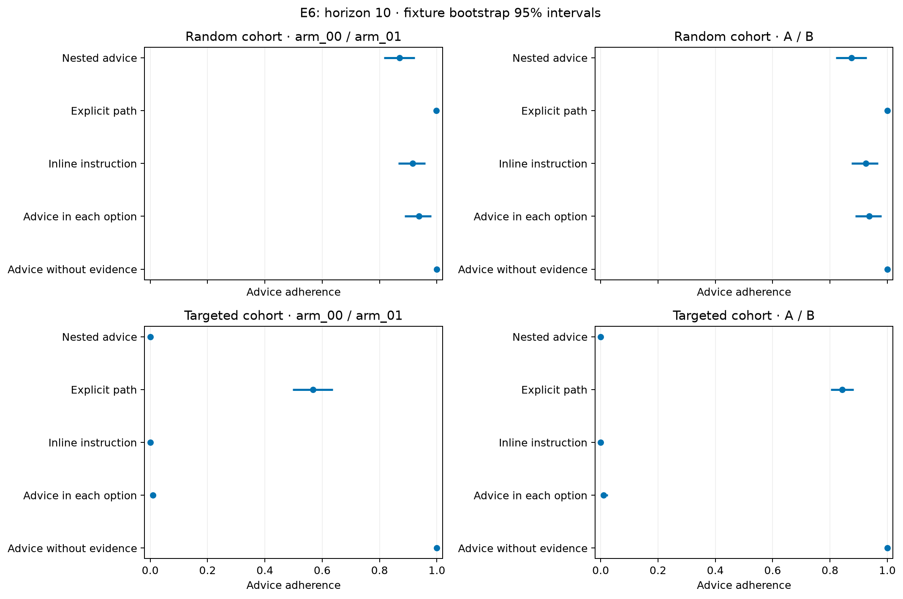

# E6: advice binding follow-up

Recorded decisions: 28,800 of 28,800. Complete four-query fixture cells: 7,200 of 7,200. Missingness is listed for every cohort, label scheme, horizon and format in `advice_completeness.csv`.

Primary descriptive endpoint: chosen-ID adherence, only when an advice pointer was actually supplied. Exact-action-value inputs have no advice pointer and are evaluated by tie-aware optimal-action agreement and Q loss, never advice adherence. A different optimal arm can have zero loss but fail pointer adherence in advice-present conditions.

All estimates average two assignments and two repeats within each complete fixture. Incomplete four-query fixture cells are disclosed and excluded. Intervals resample fixtures within cohort and retain label schemes and horizons as separate factors. Random and targeted cohorts are never pooled. Targeted states were selected using exact exploration value and do not represent a natural population.

## Primary horizon-10 descriptive contrasts

| cohort | label_scheme | horizon | left | right | metric | mean_difference | ci_low | ci_high | n_pairs | n_left | n_right | unit | comparison_role | expected_pairs | missing_pairs |
| --- | --- | --- | --- | --- | --- | --- | --- | --- | --- | --- | --- | --- | --- | --- | --- |
| random | letters | 10 | path_explicit | nested | advice_adherence | 0.1250 | 0.0750 | 0.1800 | 100 | 100 | 100 | fixture | primary_descriptive | 100 | 0 |
| random | letters | 10 | inline | nested | advice_adherence | 0.0500 | 0.0250 | 0.0800 | 100 | 100 | 100 | fixture | primary_descriptive | 100 | 0 |
| random | letters | 10 | per_option | nested | advice_adherence | 0.0625 | 0.0350 | 0.0950 | 100 | 100 | 100 | fixture | primary_descriptive | 100 | 0 |
| random | original | 10 | path_explicit | nested | advice_adherence | 0.1275 | 0.0775 | 0.1825 | 100 | 100 | 100 | fixture | primary_descriptive | 100 | 0 |
| random | original | 10 | inline | nested | advice_adherence | 0.0450 | 0.0125 | 0.0800 | 100 | 100 | 100 | fixture | primary_descriptive | 100 | 0 |
| random | original | 10 | per_option | nested | advice_adherence | 0.0675 | 0.0350 | 0.1025 | 100 | 100 | 100 | fixture | primary_descriptive | 100 | 0 |
| targeted | letters | 10 | path_explicit | nested | advice_adherence | 0.8425 | 0.8025 | 0.8825 | 100 | 100 | 100 | fixture | primary_descriptive | 100 | 0 |
| targeted | letters | 10 | inline | nested | advice_adherence | 0.0000 | 0.0000 | 0.0000 | 100 | 100 | 100 | fixture | primary_descriptive | 100 | 0 |
| targeted | letters | 10 | per_option | nested | advice_adherence | 0.0100 | 0.0000 | 0.0250 | 100 | 100 | 100 | fixture | primary_descriptive | 100 | 0 |
| targeted | original | 10 | path_explicit | nested | advice_adherence | 0.5675 | 0.4975 | 0.6350 | 100 | 100 | 100 | fixture | primary_descriptive | 100 | 0 |
| targeted | original | 10 | inline | nested | advice_adherence | 0.0000 | 0.0000 | 0.0000 | 100 | 100 | 100 | fixture | primary_descriptive | 100 | 0 |
| targeted | original | 10 | per_option | nested | advice_adherence | 0.0100 | 0.0025 | 0.0200 | 100 | 100 | 100 | fixture | primary_descriptive | 100 | 0 |

Differences are intervention minus nested advice. Positive adherence differences favor the intervention. These 95% percentile intervals are exploratory, not simultaneous tests or equivalence evidence. Zero-width boundary bootstrap intervals reflect empirical resampling and do not guarantee perfect population performance.

## Secondary outcomes

| cohort | label_scheme | horizon | format | metric | mean | ci_low | ci_high | n_fixtures |
| --- | --- | --- | --- | --- | --- | --- | --- | --- |
| random | letters | 1 | advice_only | optimal_agreement | 1.0000 | 1.0000 | 1.0000 | 100 |
| random | letters | 1 | advice_only | exact_loss | 0.0000 | 0.0000 | 0.0000 | 100 |
| random | letters | 1 | dp_values | optimal_agreement | 1.0000 | 1.0000 | 1.0000 | 100 |
| random | letters | 1 | dp_values | exact_loss | 0.0000 | 0.0000 | 0.0000 | 100 |
| random | letters | 1 | inline | optimal_agreement | 0.9950 | 0.9850 | 1.0000 | 100 |
| random | letters | 1 | inline | exact_loss | 0.0005 | 0.0000 | 0.0014 | 100 |
| random | letters | 1 | nested | optimal_agreement | 1.0000 | 1.0000 | 1.0000 | 100 |
| random | letters | 1 | nested | exact_loss | 0.0000 | 0.0000 | 0.0000 | 100 |
| random | letters | 1 | path_explicit | optimal_agreement | 1.0000 | 1.0000 | 1.0000 | 100 |
| random | letters | 1 | path_explicit | exact_loss | 0.0000 | 0.0000 | 0.0000 | 100 |
| random | letters | 1 | per_option | optimal_agreement | 1.0000 | 1.0000 | 1.0000 | 100 |
| random | letters | 1 | per_option | exact_loss | 0.0000 | 0.0000 | 0.0000 | 100 |
| random | letters | 2 | advice_only | optimal_agreement | 1.0000 | 1.0000 | 1.0000 | 100 |
| random | letters | 2 | advice_only | exact_loss | 0.0000 | 0.0000 | 0.0000 | 100 |
| random | letters | 2 | dp_values | optimal_agreement | 1.0000 | 1.0000 | 1.0000 | 100 |
| random | letters | 2 | dp_values | exact_loss | 0.0000 | 0.0000 | 0.0000 | 100 |
| random | letters | 2 | inline | optimal_agreement | 0.9600 | 0.9250 | 0.9900 | 100 |
| random | letters | 2 | inline | exact_loss | 0.0018 | 0.0003 | 0.0036 | 100 |
| random | letters | 2 | nested | optimal_agreement | 0.9500 | 0.9125 | 0.9800 | 100 |
| random | letters | 2 | nested | exact_loss | 0.0023 | 0.0008 | 0.0042 | 100 |
| random | letters | 2 | path_explicit | optimal_agreement | 1.0000 | 1.0000 | 1.0000 | 100 |
| random | letters | 2 | path_explicit | exact_loss | 0.0000 | 0.0000 | 0.0000 | 100 |
| random | letters | 2 | per_option | optimal_agreement | 0.9850 | 0.9600 | 1.0000 | 100 |
| random | letters | 2 | per_option | exact_loss | 0.0002 | 0.0000 | 0.0005 | 100 |
| random | letters | 10 | advice_only | optimal_agreement | 1.0000 | 1.0000 | 1.0000 | 100 |
| random | letters | 10 | advice_only | exact_loss | 0.0000 | 0.0000 | 0.0000 | 100 |
| random | letters | 10 | dp_values | optimal_agreement | 1.0000 | 1.0000 | 1.0000 | 100 |
| random | letters | 10 | dp_values | exact_loss | 0.0000 | 0.0000 | 0.0000 | 100 |
| random | letters | 10 | inline | optimal_agreement | 0.9250 | 0.8725 | 0.9700 | 100 |
| random | letters | 10 | inline | exact_loss | 0.0045 | 0.0019 | 0.0076 | 100 |
| random | letters | 10 | nested | optimal_agreement | 0.8950 | 0.8399 | 0.9425 | 100 |
| random | letters | 10 | nested | exact_loss | 0.0069 | 0.0037 | 0.0105 | 100 |
| random | letters | 10 | path_explicit | optimal_agreement | 1.0000 | 1.0000 | 1.0000 | 100 |
| random | letters | 10 | path_explicit | exact_loss | 0.0000 | 0.0000 | 0.0000 | 100 |
| random | letters | 10 | per_option | optimal_agreement | 0.9375 | 0.8850 | 0.9800 | 100 |
| random | letters | 10 | per_option | exact_loss | 0.0030 | 0.0008 | 0.0058 | 100 |
| random | original | 1 | advice_only | optimal_agreement | 1.0000 | 1.0000 | 1.0000 | 100 |
| random | original | 1 | advice_only | exact_loss | 0.0000 | 0.0000 | 0.0000 | 100 |
| random | original | 1 | dp_values | optimal_agreement | 1.0000 | 1.0000 | 1.0000 | 100 |
| random | original | 1 | dp_values | exact_loss | 0.0000 | 0.0000 | 0.0000 | 100 |
| random | original | 1 | inline | optimal_agreement | 1.0000 | 1.0000 | 1.0000 | 100 |
| random | original | 1 | inline | exact_loss | 0.0000 | 0.0000 | 0.0000 | 100 |
| random | original | 1 | nested | optimal_agreement | 1.0000 | 1.0000 | 1.0000 | 100 |
| random | original | 1 | nested | exact_loss | 0.0000 | 0.0000 | 0.0000 | 100 |
| random | original | 1 | path_explicit | optimal_agreement | 1.0000 | 1.0000 | 1.0000 | 100 |
| random | original | 1 | path_explicit | exact_loss | 0.0000 | 0.0000 | 0.0000 | 100 |
| random | original | 1 | per_option | optimal_agreement | 1.0000 | 1.0000 | 1.0000 | 100 |
| random | original | 1 | per_option | exact_loss | 0.0000 | 0.0000 | 0.0000 | 100 |
| random | original | 2 | advice_only | optimal_agreement | 1.0000 | 1.0000 | 1.0000 | 100 |
| random | original | 2 | advice_only | exact_loss | 0.0000 | 0.0000 | 0.0000 | 100 |
| random | original | 2 | dp_values | optimal_agreement | 1.0000 | 1.0000 | 1.0000 | 100 |
| random | original | 2 | dp_values | exact_loss | 0.0000 | 0.0000 | 0.0000 | 100 |
| random | original | 2 | inline | optimal_agreement | 0.9575 | 0.9200 | 0.9875 | 100 |
| random | original | 2 | inline | exact_loss | 0.0019 | 0.0005 | 0.0037 | 100 |
| random | original | 2 | nested | optimal_agreement | 0.9675 | 0.9350 | 0.9950 | 100 |
| random | original | 2 | nested | exact_loss | 0.0012 | 0.0002 | 0.0026 | 100 |
| random | original | 2 | path_explicit | optimal_agreement | 1.0000 | 1.0000 | 1.0000 | 100 |
| random | original | 2 | path_explicit | exact_loss | 0.0000 | 0.0000 | 0.0000 | 100 |
| random | original | 2 | per_option | optimal_agreement | 0.9800 | 0.9500 | 1.0000 | 100 |
| random | original | 2 | per_option | exact_loss | 0.0002 | 0.0000 | 0.0006 | 100 |
| random | original | 10 | advice_only | optimal_agreement | 1.0000 | 1.0000 | 1.0000 | 100 |
| random | original | 10 | advice_only | exact_loss | 0.0000 | 0.0000 | 0.0000 | 100 |
| random | original | 10 | dp_values | optimal_agreement | 1.0000 | 1.0000 | 1.0000 | 100 |
| random | original | 10 | dp_values | exact_loss | 0.0000 | 0.0000 | 0.0000 | 100 |
| random | original | 10 | inline | optimal_agreement | 0.9150 | 0.8600 | 0.9600 | 100 |
| random | original | 10 | inline | exact_loss | 0.0047 | 0.0021 | 0.0079 | 100 |
| random | original | 10 | nested | optimal_agreement | 0.8900 | 0.8350 | 0.9400 | 100 |
| random | original | 10 | nested | exact_loss | 0.0074 | 0.0041 | 0.0111 | 100 |
| random | original | 10 | path_explicit | optimal_agreement | 0.9975 | 0.9925 | 1.0000 | 100 |
| random | original | 10 | path_explicit | exact_loss | 0.0000 | 0.0000 | 0.0000 | 100 |
| random | original | 10 | per_option | optimal_agreement | 0.9375 | 0.8875 | 0.9800 | 100 |
| random | original | 10 | per_option | exact_loss | 0.0030 | 0.0008 | 0.0057 | 100 |
| targeted | letters | 1 | advice_only | optimal_agreement | 1.0000 | 1.0000 | 1.0000 | 100 |
| targeted | letters | 1 | advice_only | exact_loss | 0.0000 | 0.0000 | 0.0000 | 100 |
| targeted | letters | 1 | dp_values | optimal_agreement | 1.0000 | 1.0000 | 1.0000 | 100 |
| targeted | letters | 1 | dp_values | exact_loss | 0.0000 | 0.0000 | 0.0000 | 100 |
| targeted | letters | 1 | inline | optimal_agreement | 1.0000 | 1.0000 | 1.0000 | 100 |
| targeted | letters | 1 | inline | exact_loss | 0.0000 | 0.0000 | 0.0000 | 100 |
| targeted | letters | 1 | nested | optimal_agreement | 1.0000 | 1.0000 | 1.0000 | 100 |
| targeted | letters | 1 | nested | exact_loss | 0.0000 | 0.0000 | 0.0000 | 100 |
| targeted | letters | 1 | path_explicit | optimal_agreement | 1.0000 | 1.0000 | 1.0000 | 100 |
| targeted | letters | 1 | path_explicit | exact_loss | 0.0000 | 0.0000 | 0.0000 | 100 |
| targeted | letters | 1 | per_option | optimal_agreement | 1.0000 | 1.0000 | 1.0000 | 100 |
| targeted | letters | 1 | per_option | exact_loss | 0.0000 | 0.0000 | 0.0000 | 100 |
| targeted | letters | 2 | advice_only | optimal_agreement | 1.0000 | 1.0000 | 1.0000 | 100 |
| targeted | letters | 2 | advice_only | exact_loss | 0.0000 | 0.0000 | 0.0000 | 100 |
| targeted | letters | 2 | dp_values | optimal_agreement | 1.0000 | 1.0000 | 1.0000 | 100 |
| targeted | letters | 2 | dp_values | exact_loss | 0.0000 | 0.0000 | 0.0000 | 100 |
| targeted | letters | 2 | inline | optimal_agreement | 0.8200 | 0.7400 | 0.8900 | 100 |
| targeted | letters | 2 | inline | exact_loss | 0.0060 | 0.0032 | 0.0091 | 100 |
| targeted | letters | 2 | nested | optimal_agreement | 0.8200 | 0.7400 | 0.8900 | 100 |
| targeted | letters | 2 | nested | exact_loss | 0.0060 | 0.0032 | 0.0092 | 100 |
| targeted | letters | 2 | path_explicit | optimal_agreement | 1.0000 | 1.0000 | 1.0000 | 100 |
| targeted | letters | 2 | path_explicit | exact_loss | 0.0000 | 0.0000 | 0.0000 | 100 |
| targeted | letters | 2 | per_option | optimal_agreement | 0.8425 | 0.7725 | 0.9100 | 100 |
| targeted | letters | 2 | per_option | exact_loss | 0.0048 | 0.0026 | 0.0072 | 100 |
| targeted | letters | 10 | advice_only | optimal_agreement | 1.0000 | 1.0000 | 1.0000 | 100 |
| targeted | letters | 10 | advice_only | exact_loss | 0.0000 | 0.0000 | 0.0000 | 100 |
| targeted | letters | 10 | dp_values | optimal_agreement | 1.0000 | 1.0000 | 1.0000 | 100 |
| targeted | letters | 10 | dp_values | exact_loss | 0.0000 | 0.0000 | 0.0000 | 100 |
| targeted | letters | 10 | inline | optimal_agreement | 0.0000 | 0.0000 | 0.0000 | 100 |
| targeted | letters | 10 | inline | exact_loss | 0.0595 | 0.0563 | 0.0629 | 100 |
| targeted | letters | 10 | nested | optimal_agreement | 0.0000 | 0.0000 | 0.0000 | 100 |
| targeted | letters | 10 | nested | exact_loss | 0.0595 | 0.0563 | 0.0628 | 100 |
| targeted | letters | 10 | path_explicit | optimal_agreement | 0.8425 | 0.8025 | 0.8825 | 100 |
| targeted | letters | 10 | path_explicit | exact_loss | 0.0073 | 0.0055 | 0.0091 | 100 |
| targeted | letters | 10 | per_option | optimal_agreement | 0.0100 | 0.0000 | 0.0250 | 100 |
| targeted | letters | 10 | per_option | exact_loss | 0.0587 | 0.0555 | 0.0619 | 100 |
| targeted | original | 1 | advice_only | optimal_agreement | 1.0000 | 1.0000 | 1.0000 | 100 |
| targeted | original | 1 | advice_only | exact_loss | 0.0000 | 0.0000 | 0.0000 | 100 |
| targeted | original | 1 | dp_values | optimal_agreement | 1.0000 | 1.0000 | 1.0000 | 100 |
| targeted | original | 1 | dp_values | exact_loss | 0.0000 | 0.0000 | 0.0000 | 100 |
| targeted | original | 1 | inline | optimal_agreement | 1.0000 | 1.0000 | 1.0000 | 100 |
| targeted | original | 1 | inline | exact_loss | 0.0000 | 0.0000 | 0.0000 | 100 |
| targeted | original | 1 | nested | optimal_agreement | 1.0000 | 1.0000 | 1.0000 | 100 |
| targeted | original | 1 | nested | exact_loss | 0.0000 | 0.0000 | 0.0000 | 100 |
| targeted | original | 1 | path_explicit | optimal_agreement | 1.0000 | 1.0000 | 1.0000 | 100 |
| targeted | original | 1 | path_explicit | exact_loss | 0.0000 | 0.0000 | 0.0000 | 100 |
| targeted | original | 1 | per_option | optimal_agreement | 1.0000 | 1.0000 | 1.0000 | 100 |
| targeted | original | 1 | per_option | exact_loss | 0.0000 | 0.0000 | 0.0000 | 100 |
| targeted | original | 2 | advice_only | optimal_agreement | 1.0000 | 1.0000 | 1.0000 | 100 |
| targeted | original | 2 | advice_only | exact_loss | 0.0000 | 0.0000 | 0.0000 | 100 |
| targeted | original | 2 | dp_values | optimal_agreement | 1.0000 | 1.0000 | 1.0000 | 100 |
| targeted | original | 2 | dp_values | exact_loss | 0.0000 | 0.0000 | 0.0000 | 100 |
| targeted | original | 2 | inline | optimal_agreement | 0.8200 | 0.7400 | 0.8900 | 100 |
| targeted | original | 2 | inline | exact_loss | 0.0060 | 0.0033 | 0.0092 | 100 |
| targeted | original | 2 | nested | optimal_agreement | 0.8200 | 0.7400 | 0.8900 | 100 |
| targeted | original | 2 | nested | exact_loss | 0.0060 | 0.0032 | 0.0092 | 100 |
| targeted | original | 2 | path_explicit | optimal_agreement | 1.0000 | 1.0000 | 1.0000 | 100 |
| targeted | original | 2 | path_explicit | exact_loss | 0.0000 | 0.0000 | 0.0000 | 100 |
| targeted | original | 2 | per_option | optimal_agreement | 0.8375 | 0.7650 | 0.9025 | 100 |
| targeted | original | 2 | per_option | exact_loss | 0.0051 | 0.0028 | 0.0077 | 100 |
| targeted | original | 10 | advice_only | optimal_agreement | 1.0000 | 1.0000 | 1.0000 | 100 |
| targeted | original | 10 | advice_only | exact_loss | 0.0000 | 0.0000 | 0.0000 | 100 |
| targeted | original | 10 | dp_values | optimal_agreement | 1.0000 | 1.0000 | 1.0000 | 100 |
| targeted | original | 10 | dp_values | exact_loss | 0.0000 | 0.0000 | 0.0000 | 100 |
| targeted | original | 10 | inline | optimal_agreement | 0.0000 | 0.0000 | 0.0000 | 100 |
| targeted | original | 10 | inline | exact_loss | 0.0595 | 0.0563 | 0.0628 | 100 |
| targeted | original | 10 | nested | optimal_agreement | 0.0000 | 0.0000 | 0.0000 | 100 |
| targeted | original | 10 | nested | exact_loss | 0.0595 | 0.0562 | 0.0628 | 100 |
| targeted | original | 10 | path_explicit | optimal_agreement | 0.5675 | 0.4975 | 0.6350 | 100 |
| targeted | original | 10 | path_explicit | exact_loss | 0.0217 | 0.0185 | 0.0251 | 100 |
| targeted | original | 10 | per_option | optimal_agreement | 0.0100 | 0.0025 | 0.0200 | 100 |
| targeted | original | 10 | per_option | exact_loss | 0.0587 | 0.0556 | 0.0617 | 100 |

Advice-only contrasts, action-value comparisons, and other horizons are secondary exploratory analyses. Paired label-scheme and horizon contrasts appear in `advice_interactions.csv`. Numeric action values supply planning results; their successful use is distinct from independently computing those values. Label and advice-format interventions change communication, not necessarily a single cognitive mechanism.

