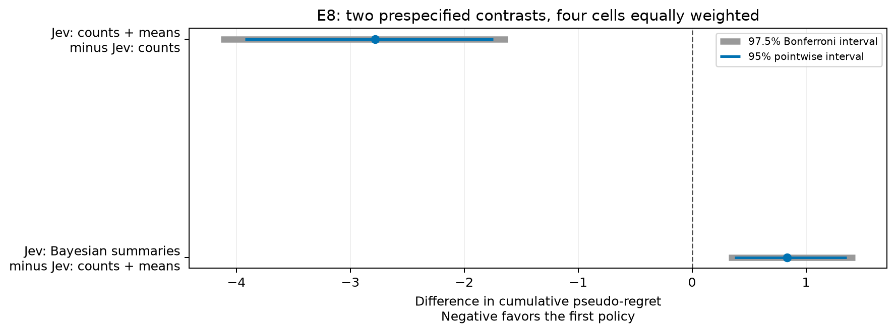

# E8: fresh online evidence ladder

The endpoint is cumulative pseudo-regret. Negative left-minus-right differences favor the first policy. Exactly two overall contrasts were specified before E8 collection: means versus counts, and Bayesian summaries versus means.

## Prespecified overall contrasts

| left | right | n_pairs | expected_pairs | missing_pairs | missing_cells | analysis_role | status | ci95_low | ci95_high | ci975_low | ci975_high | mean_difference |
| --- | --- | --- | --- | --- | --- | --- | --- | --- | --- | --- | --- | --- |
| means_direct | counts_direct | 320 | 320 | 0 |  | prespecified_primary | complete | -3.9253 | -1.7478 | -4.1358 | -1.6175 | -2.7839 |
| bayes_direct | means_direct | 320 | 320 | 0 |  | prespecified_primary | complete | 0.3752 | 1.3561 | 0.3209 | 1.4337 | 0.8332 |

Each estimate equally weights close/prior environments crossed with 3/10 arms. Bootstrap resampling pairs whole episodes within each cell. The 95% intervals are pointwise; 97.5% intervals use quantiles 0.0125 and 0.9875 and target Bonferroni 95% family coverage for these two contrasts only, subject to bootstrap approximation. They do not cover subgroup or classical comparisons. Crossing zero does not establish equivalence.

## Completeness

| left | right | family | k | expected_pairs | n_left | n_right | n_pairs | missing_left | missing_right | missing_pairs |
| --- | --- | --- | --- | --- | --- | --- | --- | --- | --- | --- |
| means_direct | counts_direct | close | 3 | 80 | 80 | 80 | 80 | 0 | 0 | 0 |
| means_direct | counts_direct | close | 10 | 80 | 80 | 80 | 80 | 0 | 0 | 0 |
| means_direct | counts_direct | prior | 3 | 80 | 80 | 80 | 80 | 0 | 0 | 0 |
| means_direct | counts_direct | prior | 10 | 80 | 80 | 80 | 80 | 0 | 0 | 0 |
| bayes_direct | means_direct | close | 3 | 80 | 80 | 80 | 80 | 0 | 0 | 0 |
| bayes_direct | means_direct | close | 10 | 80 | 80 | 80 | 80 | 0 | 0 | 0 |
| bayes_direct | means_direct | prior | 3 | 80 | 80 | 80 | 80 | 0 | 0 | 0 |
| bayes_direct | means_direct | prior | 10 | 80 | 80 | 80 | 80 | 0 | 0 | 0 |

Recorded incomplete episode rows excluded: 0. The frozen target is 80 paired tasks per cell, 320 overall. A missing cell produces no pooled estimate; an available but incomplete four-cell comparison is labeled descriptive only. No cell is silently omitted and no sample size is redefined.

## Per-cell exploratory contrasts

| left | right | family | k | mean_difference | ci95_low | ci95_high | n_pairs | analysis_role |
| --- | --- | --- | --- | --- | --- | --- | --- | --- |
| means_direct | counts_direct | close | 3 | -0.0356 | -0.4113 | 0.3356 | 80 | exploratory_cell |
| means_direct | counts_direct | close | 10 | -0.0544 | -0.3388 | 0.2294 | 80 | exploratory_cell |
| means_direct | counts_direct | prior | 3 | -1.6673 | -3.5636 | -0.1381 | 80 | exploratory_cell |
| means_direct | counts_direct | prior | 10 | -9.3785 | -13.5341 | -5.5833 | 80 | exploratory_cell |
| bayes_direct | means_direct | close | 3 | -0.0206 | -0.2556 | 0.2188 | 80 | exploratory_cell |
| bayes_direct | means_direct | close | 10 | -0.1319 | -0.3556 | 0.0713 | 80 | exploratory_cell |
| bayes_direct | means_direct | prior | 3 | 1.2189 | 0.2063 | 2.5564 | 80 | exploratory_cell |
| bayes_direct | means_direct | prior | 10 | 2.2663 | 0.9118 | 3.9025 | 80 | exploratory_cell |

## Classical comparisons (secondary)

| left | right | metric | mean_difference | ci_low | ci_high | n_pairs | n_left | n_right | unit | n_cells | status | analysis_role |
| --- | --- | --- | --- | --- | --- | --- | --- | --- | --- | --- | --- | --- |
| counts_direct | bayes_ucb | pseudo_regret | 5.1294 | 3.6687 | 6.6543 | 320 | 320 | 320 | episode | 4 | ok | secondary_exploratory |
| counts_direct | finite_ap_index | pseudo_regret | 5.3547 | 3.9068 | 6.8557 | 320 | 320 | 320 | episode | 4 | ok | secondary_exploratory |
| counts_direct | greedy | pseudo_regret | 3.4213 | 1.9914 | 4.8753 | 320 | 320 | 320 | episode | 4 | ok | secondary_exploratory |
| counts_direct | ids | pseudo_regret | 5.1966 | 3.6968 | 6.7140 | 320 | 320 | 320 | episode | 4 | ok | secondary_exploratory |
| counts_direct | knowledge_gradient | pseudo_regret | 5.0857 | 3.6222 | 6.6011 | 320 | 320 | 320 | episode | 4 | ok | secondary_exploratory |
| counts_direct | random | pseudo_regret | -8.6534 | -10.3658 | -6.9563 | 320 | 320 | 320 | episode | 4 | ok | secondary_exploratory |
| counts_direct | ts | pseudo_regret | 3.1964 | 1.7445 | 4.6843 | 320 | 320 | 320 | episode | 4 | ok | secondary_exploratory |
| counts_direct | ucb1 | pseudo_regret | -1.5960 | -3.0129 | -0.1185 | 320 | 320 | 320 | episode | 4 | ok | secondary_exploratory |
| means_direct | bayes_ucb | pseudo_regret | 2.3455 | 1.3189 | 3.4311 | 320 | 320 | 320 | episode | 4 | ok | secondary_exploratory |
| means_direct | finite_ap_index | pseudo_regret | 2.5707 | 1.5876 | 3.6172 | 320 | 320 | 320 | episode | 4 | ok | secondary_exploratory |
| means_direct | greedy | pseudo_regret | 0.6374 | -0.3510 | 1.6805 | 320 | 320 | 320 | episode | 4 | ok | secondary_exploratory |
| means_direct | ids | pseudo_regret | 2.4127 | 1.3942 | 3.4894 | 320 | 320 | 320 | episode | 4 | ok | secondary_exploratory |
| means_direct | knowledge_gradient | pseudo_regret | 2.3018 | 1.3149 | 3.3263 | 320 | 320 | 320 | episode | 4 | ok | secondary_exploratory |
| means_direct | random | pseudo_regret | -11.4373 | -12.7835 | -10.1253 | 320 | 320 | 320 | episode | 4 | ok | secondary_exploratory |
| means_direct | ts | pseudo_regret | 0.4125 | -0.5763 | 1.4623 | 320 | 320 | 320 | episode | 4 | ok | secondary_exploratory |
| means_direct | ucb1 | pseudo_regret | -4.3800 | -5.3766 | -3.3302 | 320 | 320 | 320 | episode | 4 | ok | secondary_exploratory |
| bayes_direct | bayes_ucb | pseudo_regret | 3.1787 | 2.0366 | 4.3780 | 320 | 320 | 320 | episode | 4 | ok | secondary_exploratory |
| bayes_direct | finite_ap_index | pseudo_regret | 3.4039 | 2.2870 | 4.5485 | 320 | 320 | 320 | episode | 4 | ok | secondary_exploratory |
| bayes_direct | greedy | pseudo_regret | 1.4706 | 0.3119 | 2.6539 | 320 | 320 | 320 | episode | 4 | ok | secondary_exploratory |
| bayes_direct | ids | pseudo_regret | 3.2459 | 2.0965 | 4.4488 | 320 | 320 | 320 | episode | 4 | ok | secondary_exploratory |
| bayes_direct | knowledge_gradient | pseudo_regret | 3.1350 | 2.0332 | 4.3164 | 320 | 320 | 320 | episode | 4 | ok | secondary_exploratory |
| bayes_direct | random | pseudo_regret | -10.6042 | -12.0076 | -9.1935 | 320 | 320 | 320 | episode | 4 | ok | secondary_exploratory |
| bayes_direct | ts | pseudo_regret | 1.2456 | 0.1108 | 2.4261 | 320 | 320 | 320 | episode | 4 | ok | secondary_exploratory |
| bayes_direct | ucb1 | pseudo_regret | -3.5468 | -4.6713 | -2.4141 | 320 | 320 | 320 | episode | 4 | ok | secondary_exploratory |

Counts, means, and Bayesian summaries contain the same underlying evidence under the stated prior. Effects concern the usefulness of supplied computation and its representation package on adaptive trajectories. These fresh tasks evaluate E2-motivated hypotheses; they do not reveal internal reasoning or establish broad superiority. Baseline comparisons, reward, coverage, switching and abandonment summaries are exploratory.

