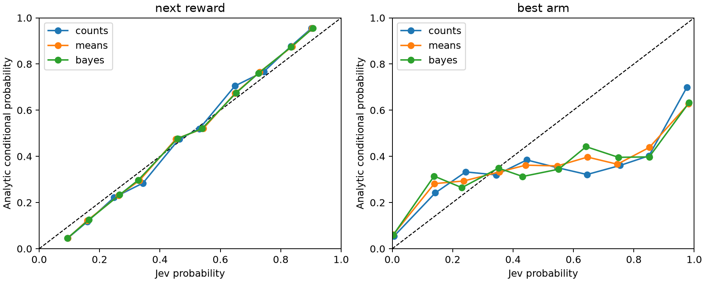

# E7: probability forecasts, separate from action selection

Recorded 24,000 questions; independent fixtures per K and target are the resampling units. Arms and API repeats are averaged within fixtures.

The targets are analytic posterior predictive reward probabilities and quadrature-computed probabilities of being the latent best arm. Excess Brier risk is the sum of squared errors between distributions. Excess log loss is KL(reference || prediction), clipping predictions to 1e-6 and renormalizing. For a binary event the reported two-class Brier excess equals twice the scalar squared error.

## Excess Brier risk

| target | k | representation | metric | mean | ci_low | ci_high | n_fixtures |
| --- | --- | --- | --- | --- | --- | --- | --- |
| best_arm | 2 | bayes | excess_brier | 0.0746 | 0.0564 | 0.0931 | 100 |
| best_arm | 2 | counts | excess_brier | 0.0709 | 0.0530 | 0.0901 | 100 |
| best_arm | 2 | means | excess_brier | 0.0870 | 0.0660 | 0.1093 | 100 |
| best_arm | 3 | bayes | excess_brier | 0.1195 | 0.0940 | 0.1460 | 100 |
| best_arm | 3 | counts | excess_brier | 0.1422 | 0.1125 | 0.1738 | 100 |
| best_arm | 3 | means | excess_brier | 0.1306 | 0.1054 | 0.1581 | 100 |
| best_arm | 5 | bayes | excess_brier | 0.2258 | 0.1945 | 0.2589 | 100 |
| best_arm | 5 | counts | excess_brier | 0.2071 | 0.1728 | 0.2441 | 100 |
| best_arm | 5 | means | excess_brier | 0.2329 | 0.2011 | 0.2663 | 100 |
| best_arm | 10 | bayes | excess_brier | 0.3319 | 0.2935 | 0.3709 | 100 |
| best_arm | 10 | counts | excess_brier | 0.2703 | 0.2329 | 0.3113 | 100 |
| best_arm | 10 | means | excess_brier | 0.3338 | 0.2945 | 0.3748 | 100 |
| best_arm | 15 | bayes | excess_brier | 0.4030 | 0.3594 | 0.4493 | 100 |
| best_arm | 15 | counts | excess_brier | 0.2863 | 0.2476 | 0.3296 | 100 |
| best_arm | 15 | means | excess_brier | 0.3826 | 0.3374 | 0.4285 | 100 |
| next_reward | 2 | bayes | excess_brier | 0.0023 | 0.0020 | 0.0026 | 100 |
| next_reward | 2 | counts | excess_brier | 0.0042 | 0.0032 | 0.0052 | 100 |
| next_reward | 2 | means | excess_brier | 0.0029 | 0.0026 | 0.0033 | 100 |
| next_reward | 3 | bayes | excess_brier | 0.0023 | 0.0021 | 0.0026 | 100 |
| next_reward | 3 | counts | excess_brier | 0.0047 | 0.0040 | 0.0055 | 100 |
| next_reward | 3 | means | excess_brier | 0.0032 | 0.0029 | 0.0036 | 100 |
| next_reward | 5 | bayes | excess_brier | 0.0023 | 0.0021 | 0.0025 | 100 |
| next_reward | 5 | counts | excess_brier | 0.0051 | 0.0045 | 0.0058 | 100 |
| next_reward | 5 | means | excess_brier | 0.0030 | 0.0028 | 0.0032 | 100 |
| next_reward | 10 | bayes | excess_brier | 0.0022 | 0.0020 | 0.0023 | 100 |
| next_reward | 10 | counts | excess_brier | 0.0047 | 0.0042 | 0.0052 | 100 |
| next_reward | 10 | means | excess_brier | 0.0029 | 0.0027 | 0.0030 | 100 |
| next_reward | 15 | bayes | excess_brier | 0.0022 | 0.0021 | 0.0023 | 100 |
| next_reward | 15 | counts | excess_brier | 0.0050 | 0.0046 | 0.0054 | 100 |
| next_reward | 15 | means | excess_brier | 0.0029 | 0.0027 | 0.0030 | 100 |

## Simple forecast controls

| target | k | metric | mean | ci_low | ci_high | n_fixtures |
| --- | --- | --- | --- | --- | --- | --- |
| best_arm | 2 | excess_brier | 0.0672 | 0.0558 | 0.0792 | 100 |
| best_arm | 3 | excess_brier | 0.1140 | 0.0942 | 0.1340 | 100 |
| best_arm | 5 | excess_brier | 0.1337 | 0.1111 | 0.1583 | 100 |
| best_arm | 10 | excess_brier | 0.1491 | 0.1279 | 0.1716 | 100 |
| best_arm | 15 | excess_brier | 0.1363 | 0.1186 | 0.1557 | 100 |
| next_reward | 2 | excess_brier | 0.0191 | 0.0140 | 0.0246 | 100 |
| next_reward | 3 | excess_brier | 0.0198 | 0.0156 | 0.0243 | 100 |
| next_reward | 5 | excess_brier | 0.0225 | 0.0195 | 0.0256 | 100 |
| next_reward | 10 | excess_brier | 0.0206 | 0.0181 | 0.0231 | 100 |
| next_reward | 15 | excess_brier | 0.0227 | 0.0207 | 0.0247 | 100 |

## Interpretation limits

These are belief questions, not action recommendations. Errors cannot be directly substituted for online regret. The simple reward baseline is the unsmoothed empirical rate (0.5 if unobserved); the simple best-arm baseline normalizes posterior means, which is not a Bayesian best-arm distribution. Analytic references are the proper-scoring optimum by construction. Paired intervals are exploratory, pointwise, and unadjusted for multiplicity.

Reliability curves pool individual probability components descriptively; scalar components and arms are dependent. Inferential tables weight independent fixtures equally. No outcome labels were simulated or silently treated as observed.
