# Post hoc exploration-strategy audit

Completed episode-policy records: 13,120; incomplete records excluded: 0. Public Beta(1,1) counts were reconstructed from each policy's own observed actions and rewards. No hidden success probabilities or other policies' histories enter behavioral scoring.

Early is t/T <= 0.2, middle is 0.2 < t/T <= 0.8, and late is t/T > 0.8. Each metric is first averaged within episode and phase. The reported 95% intervals bootstrap whole episode-phase averages; individual turns are not replicates. Plots show descriptive means; intervals are in `phase_summary.csv`.

Posterior-mean maximizers form a tie-aware set (absolute tolerance 1e-10). Strict non-greedy choices have a larger mean deficit. Lower-mean/higher-uncertainty requires the chosen posterior standard deviation to exceed the maximum among posterior-mean maximizers. Equal-best-mean/higher-uncertainty requires a greedy-set choice with greater standard deviation than at least one other greedy-set member; it is reported separately and can be exploratory without sacrificing immediate expected reward.

Same-history agreement compares the chosen action with all maximizers of Bayes-UCB (q_t=1-1/t) or the finite-horizon knowledge-gradient score, recomputed on this policy's own public state. Index ties use tolerance 1e-12. Mean top-set sizes are supplied because tied recommendations can inflate agreement. These agreements do not identify Jev's internal algorithm.

## Exact two-arm decision-value checks

E3 exact Q values and recorded decision losses were checked at every visited state. A separately flagged post hoc exact Bellman table also scores two-arm, 100-pull histories; original null loss fields in those traces are not treated as recorded scores. No exact reference is supplied for larger arm counts. These Q values assume Bayes-optimal continuation after the current action. Useful non-greedy actions strictly improve on the best posterior-mean-maximizing action's Q value; inferior non-greedy actions are strictly worse; neutral choices are tied within tolerance. The prior family matches the Bayesian model; clear/close families use a working-prior normative reference, not their fixed-instance population optimum. These conditions remain separate and are not pooled across arm counts. Elsewhere, non-greedy or uncertainty-seeking behavior is descriptive and is not labeled useful or wasteful without a normative action-value reference.

| experiment | family | k | horizon | policy | phase | normative_reference | normative_interpretation | metric | mean | ci_low | ci_high | n_episodes | n_recorded_turns | analysis_role |
| --- | --- | --- | --- | --- | --- | --- | --- | --- | --- | --- | --- | --- | --- | --- |
| e3_exact_online | prior | 2 | 20 | bayes_direct | early | exact_e3 | matched_prior | exact_loss | 0.0009 | 0.0005 | 0.0012 | 200 | 800 | post_hoc_behavioral |
| e3_exact_online | prior | 2 | 20 | bayes_direct | early | exact_e3 | matched_prior | strict_exploration_required | 0.0262 | 0.0163 | 0.0375 | 200 | 800 | post_hoc_behavioral |
| e3_exact_online | prior | 2 | 20 | bayes_direct | early | exact_e3 | matched_prior | useful_non_greedy | 0.0000 | 0.0000 | 0.0000 | 200 | 800 | post_hoc_behavioral |
| e3_exact_online | prior | 2 | 20 | bayes_direct | early | exact_e3 | matched_prior | inferior_non_greedy | 0.0000 | 0.0000 | 0.0000 | 200 | 800 | post_hoc_behavioral |
| e3_exact_online | prior | 2 | 20 | bayes_direct | early | exact_e3 | matched_prior | neutral_non_greedy | 0.0000 | 0.0000 | 0.0000 | 200 | 800 | post_hoc_behavioral |
| e3_exact_online | prior | 2 | 20 | bayes_direct | late | exact_e3 | matched_prior | exact_loss | 0.0011 | 0.0003 | 0.0020 | 200 | 800 | post_hoc_behavioral |
| e3_exact_online | prior | 2 | 20 | bayes_direct | late | exact_e3 | matched_prior | strict_exploration_required | 0.0338 | 0.0175 | 0.0525 | 200 | 800 | post_hoc_behavioral |
| e3_exact_online | prior | 2 | 20 | bayes_direct | late | exact_e3 | matched_prior | useful_non_greedy | 0.0000 | 0.0000 | 0.0000 | 200 | 800 | post_hoc_behavioral |
| e3_exact_online | prior | 2 | 20 | bayes_direct | late | exact_e3 | matched_prior | inferior_non_greedy | 0.0037 | 0.0000 | 0.0112 | 200 | 800 | post_hoc_behavioral |
| e3_exact_online | prior | 2 | 20 | bayes_direct | late | exact_e3 | matched_prior | neutral_non_greedy | 0.0000 | 0.0000 | 0.0000 | 200 | 800 | post_hoc_behavioral |
| e3_exact_online | prior | 2 | 20 | bayes_direct | middle | exact_e3 | matched_prior | exact_loss | 0.0048 | 0.0034 | 0.0063 | 200 | 2400 | post_hoc_behavioral |
| e3_exact_online | prior | 2 | 20 | bayes_direct | middle | exact_e3 | matched_prior | strict_exploration_required | 0.1154 | 0.0896 | 0.1433 | 200 | 2400 | post_hoc_behavioral |
| e3_exact_online | prior | 2 | 20 | bayes_direct | middle | exact_e3 | matched_prior | useful_non_greedy | 0.0000 | 0.0000 | 0.0000 | 200 | 2400 | post_hoc_behavioral |
| e3_exact_online | prior | 2 | 20 | bayes_direct | middle | exact_e3 | matched_prior | inferior_non_greedy | 0.0025 | 0.0008 | 0.0046 | 200 | 2400 | post_hoc_behavioral |
| e3_exact_online | prior | 2 | 20 | bayes_direct | middle | exact_e3 | matched_prior | neutral_non_greedy | 0.0000 | 0.0000 | 0.0000 | 200 | 2400 | post_hoc_behavioral |
| e3_exact_online | prior | 2 | 20 | bayes_sample | early | exact_e3 | matched_prior | exact_loss | 0.0137 | 0.0106 | 0.0171 | 200 | 800 | post_hoc_behavioral |
| e3_exact_online | prior | 2 | 20 | bayes_sample | early | exact_e3 | matched_prior | strict_exploration_required | 0.0200 | 0.0112 | 0.0300 | 200 | 800 | post_hoc_behavioral |
| e3_exact_online | prior | 2 | 20 | bayes_sample | early | exact_e3 | matched_prior | useful_non_greedy | 0.0075 | 0.0025 | 0.0138 | 200 | 800 | post_hoc_behavioral |
| e3_exact_online | prior | 2 | 20 | bayes_sample | early | exact_e3 | matched_prior | inferior_non_greedy | 0.0788 | 0.0612 | 0.0975 | 200 | 800 | post_hoc_behavioral |
| e3_exact_online | prior | 2 | 20 | bayes_sample | early | exact_e3 | matched_prior | neutral_non_greedy | 0.0000 | 0.0000 | 0.0000 | 200 | 800 | post_hoc_behavioral |
| e3_exact_online | prior | 2 | 20 | bayes_sample | late | exact_e3 | matched_prior | exact_loss | 0.0157 | 0.0114 | 0.0204 | 200 | 800 | post_hoc_behavioral |
| e3_exact_online | prior | 2 | 20 | bayes_sample | late | exact_e3 | matched_prior | strict_exploration_required | 0.0125 | 0.0050 | 0.0225 | 200 | 800 | post_hoc_behavioral |
| e3_exact_online | prior | 2 | 20 | bayes_sample | late | exact_e3 | matched_prior | useful_non_greedy | 0.0037 | 0.0000 | 0.0088 | 200 | 800 | post_hoc_behavioral |
| e3_exact_online | prior | 2 | 20 | bayes_sample | late | exact_e3 | matched_prior | inferior_non_greedy | 0.0775 | 0.0600 | 0.0963 | 200 | 800 | post_hoc_behavioral |
| e3_exact_online | prior | 2 | 20 | bayes_sample | late | exact_e3 | matched_prior | neutral_non_greedy | 0.0000 | 0.0000 | 0.0000 | 200 | 800 | post_hoc_behavioral |
| e3_exact_online | prior | 2 | 20 | bayes_sample | middle | exact_e3 | matched_prior | exact_loss | 0.0248 | 0.0212 | 0.0287 | 200 | 2400 | post_hoc_behavioral |
| e3_exact_online | prior | 2 | 20 | bayes_sample | middle | exact_e3 | matched_prior | strict_exploration_required | 0.0646 | 0.0479 | 0.0825 | 200 | 2400 | post_hoc_behavioral |
| e3_exact_online | prior | 2 | 20 | bayes_sample | middle | exact_e3 | matched_prior | useful_non_greedy | 0.0150 | 0.0104 | 0.0200 | 200 | 2400 | post_hoc_behavioral |
| e3_exact_online | prior | 2 | 20 | bayes_sample | middle | exact_e3 | matched_prior | inferior_non_greedy | 0.0975 | 0.0854 | 0.1104 | 200 | 2400 | post_hoc_behavioral |
| e3_exact_online | prior | 2 | 20 | bayes_sample | middle | exact_e3 | matched_prior | neutral_non_greedy | 0.0000 | 0.0000 | 0.0000 | 200 | 2400 | post_hoc_behavioral |
| e3_exact_online | prior | 2 | 20 | bayes_ucb | early | exact_e3 | matched_prior | exact_loss | 0.0012 | 0.0008 | 0.0016 | 200 | 800 | post_hoc_behavioral |
| e3_exact_online | prior | 2 | 20 | bayes_ucb | early | exact_e3 | matched_prior | strict_exploration_required | 0.0362 | 0.0250 | 0.0488 | 200 | 800 | post_hoc_behavioral |
| e3_exact_online | prior | 2 | 20 | bayes_ucb | early | exact_e3 | matched_prior | useful_non_greedy | 0.0000 | 0.0000 | 0.0000 | 200 | 800 | post_hoc_behavioral |
| e3_exact_online | prior | 2 | 20 | bayes_ucb | early | exact_e3 | matched_prior | inferior_non_greedy | 0.0000 | 0.0000 | 0.0000 | 200 | 800 | post_hoc_behavioral |
| e3_exact_online | prior | 2 | 20 | bayes_ucb | early | exact_e3 | matched_prior | neutral_non_greedy | 0.0000 | 0.0000 | 0.0000 | 200 | 800 | post_hoc_behavioral |
| e3_exact_online | prior | 2 | 20 | bayes_ucb | late | exact_e3 | matched_prior | exact_loss | 0.0050 | 0.0031 | 0.0071 | 200 | 800 | post_hoc_behavioral |
| e3_exact_online | prior | 2 | 20 | bayes_ucb | late | exact_e3 | matched_prior | strict_exploration_required | 0.0037 | 0.0000 | 0.0088 | 200 | 800 | post_hoc_behavioral |
| e3_exact_online | prior | 2 | 20 | bayes_ucb | late | exact_e3 | matched_prior | useful_non_greedy | 0.0037 | 0.0000 | 0.0088 | 200 | 800 | post_hoc_behavioral |
| e3_exact_online | prior | 2 | 20 | bayes_ucb | late | exact_e3 | matched_prior | inferior_non_greedy | 0.0537 | 0.0387 | 0.0712 | 200 | 800 | post_hoc_behavioral |
| e3_exact_online | prior | 2 | 20 | bayes_ucb | late | exact_e3 | matched_prior | neutral_non_greedy | 0.0000 | 0.0000 | 0.0000 | 200 | 800 | post_hoc_behavioral |
| e3_exact_online | prior | 2 | 20 | bayes_ucb | middle | exact_e3 | matched_prior | exact_loss | 0.0028 | 0.0020 | 0.0035 | 200 | 2400 | post_hoc_behavioral |
| e3_exact_online | prior | 2 | 20 | bayes_ucb | middle | exact_e3 | matched_prior | strict_exploration_required | 0.0488 | 0.0383 | 0.0596 | 200 | 2400 | post_hoc_behavioral |
| e3_exact_online | prior | 2 | 20 | bayes_ucb | middle | exact_e3 | matched_prior | useful_non_greedy | 0.0325 | 0.0250 | 0.0404 | 200 | 2400 | post_hoc_behavioral |
| e3_exact_online | prior | 2 | 20 | bayes_ucb | middle | exact_e3 | matched_prior | inferior_non_greedy | 0.0342 | 0.0271 | 0.0417 | 200 | 2400 | post_hoc_behavioral |
| e3_exact_online | prior | 2 | 20 | bayes_ucb | middle | exact_e3 | matched_prior | neutral_non_greedy | 0.0000 | 0.0000 | 0.0000 | 200 | 2400 | post_hoc_behavioral |
| e3_exact_online | prior | 2 | 20 | counts_direct | early | exact_e3 | matched_prior | exact_loss | 0.0070 | 0.0052 | 0.0090 | 200 | 800 | post_hoc_behavioral |
| e3_exact_online | prior | 2 | 20 | counts_direct | early | exact_e3 | matched_prior | strict_exploration_required | 0.0512 | 0.0375 | 0.0650 | 200 | 800 | post_hoc_behavioral |
| e3_exact_online | prior | 2 | 20 | counts_direct | early | exact_e3 | matched_prior | useful_non_greedy | 0.0000 | 0.0000 | 0.0000 | 200 | 800 | post_hoc_behavioral |
| e3_exact_online | prior | 2 | 20 | counts_direct | early | exact_e3 | matched_prior | inferior_non_greedy | 0.0138 | 0.0063 | 0.0225 | 200 | 800 | post_hoc_behavioral |
| e3_exact_online | prior | 2 | 20 | counts_direct | early | exact_e3 | matched_prior | neutral_non_greedy | 0.0000 | 0.0000 | 0.0000 | 200 | 800 | post_hoc_behavioral |
| e3_exact_online | prior | 2 | 20 | counts_direct | late | exact_e3 | matched_prior | exact_loss | 0.0062 | 0.0035 | 0.0091 | 200 | 800 | post_hoc_behavioral |
| e3_exact_online | prior | 2 | 20 | counts_direct | late | exact_e3 | matched_prior | strict_exploration_required | 0.0525 | 0.0312 | 0.0762 | 200 | 800 | post_hoc_behavioral |
| e3_exact_online | prior | 2 | 20 | counts_direct | late | exact_e3 | matched_prior | useful_non_greedy | 0.0000 | 0.0000 | 0.0000 | 200 | 800 | post_hoc_behavioral |
| e3_exact_online | prior | 2 | 20 | counts_direct | late | exact_e3 | matched_prior | inferior_non_greedy | 0.0425 | 0.0200 | 0.0675 | 200 | 800 | post_hoc_behavioral |
| e3_exact_online | prior | 2 | 20 | counts_direct | late | exact_e3 | matched_prior | neutral_non_greedy | 0.0000 | 0.0000 | 0.0000 | 200 | 800 | post_hoc_behavioral |
| e3_exact_online | prior | 2 | 20 | counts_direct | middle | exact_e3 | matched_prior | exact_loss | 0.0110 | 0.0083 | 0.0140 | 200 | 2400 | post_hoc_behavioral |
| e3_exact_online | prior | 2 | 20 | counts_direct | middle | exact_e3 | matched_prior | strict_exploration_required | 0.1583 | 0.1250 | 0.1925 | 200 | 2400 | post_hoc_behavioral |
| e3_exact_online | prior | 2 | 20 | counts_direct | middle | exact_e3 | matched_prior | useful_non_greedy | 0.0092 | 0.0050 | 0.0138 | 200 | 2400 | post_hoc_behavioral |
| e3_exact_online | prior | 2 | 20 | counts_direct | middle | exact_e3 | matched_prior | inferior_non_greedy | 0.0258 | 0.0179 | 0.0346 | 200 | 2400 | post_hoc_behavioral |
| e3_exact_online | prior | 2 | 20 | counts_direct | middle | exact_e3 | matched_prior | neutral_non_greedy | 0.0000 | 0.0000 | 0.0000 | 200 | 2400 | post_hoc_behavioral |
| e3_exact_online | prior | 2 | 20 | counts_sample | early | exact_e3 | matched_prior | exact_loss | 0.0241 | 0.0200 | 0.0284 | 200 | 800 | post_hoc_behavioral |
| e3_exact_online | prior | 2 | 20 | counts_sample | early | exact_e3 | matched_prior | strict_exploration_required | 0.0325 | 0.0213 | 0.0450 | 200 | 800 | post_hoc_behavioral |
| e3_exact_online | prior | 2 | 20 | counts_sample | early | exact_e3 | matched_prior | useful_non_greedy | 0.0063 | 0.0013 | 0.0125 | 200 | 800 | post_hoc_behavioral |
| e3_exact_online | prior | 2 | 20 | counts_sample | early | exact_e3 | matched_prior | inferior_non_greedy | 0.1250 | 0.1037 | 0.1462 | 200 | 800 | post_hoc_behavioral |
| e3_exact_online | prior | 2 | 20 | counts_sample | early | exact_e3 | matched_prior | neutral_non_greedy | 0.0000 | 0.0000 | 0.0000 | 200 | 800 | post_hoc_behavioral |
| e3_exact_online | prior | 2 | 20 | counts_sample | late | exact_e3 | matched_prior | exact_loss | 0.0159 | 0.0113 | 0.0211 | 200 | 800 | post_hoc_behavioral |
| e3_exact_online | prior | 2 | 20 | counts_sample | late | exact_e3 | matched_prior | strict_exploration_required | 0.0163 | 0.0075 | 0.0275 | 200 | 800 | post_hoc_behavioral |
| e3_exact_online | prior | 2 | 20 | counts_sample | late | exact_e3 | matched_prior | useful_non_greedy | 0.0063 | 0.0013 | 0.0125 | 200 | 800 | post_hoc_behavioral |
| e3_exact_online | prior | 2 | 20 | counts_sample | late | exact_e3 | matched_prior | inferior_non_greedy | 0.0700 | 0.0512 | 0.0887 | 200 | 800 | post_hoc_behavioral |
| e3_exact_online | prior | 2 | 20 | counts_sample | late | exact_e3 | matched_prior | neutral_non_greedy | 0.0000 | 0.0000 | 0.0000 | 200 | 800 | post_hoc_behavioral |
| e3_exact_online | prior | 2 | 20 | counts_sample | middle | exact_e3 | matched_prior | exact_loss | 0.0274 | 0.0231 | 0.0321 | 200 | 2400 | post_hoc_behavioral |
| e3_exact_online | prior | 2 | 20 | counts_sample | middle | exact_e3 | matched_prior | strict_exploration_required | 0.0712 | 0.0521 | 0.0917 | 200 | 2400 | post_hoc_behavioral |
| e3_exact_online | prior | 2 | 20 | counts_sample | middle | exact_e3 | matched_prior | useful_non_greedy | 0.0158 | 0.0108 | 0.0213 | 200 | 2400 | post_hoc_behavioral |
| e3_exact_online | prior | 2 | 20 | counts_sample | middle | exact_e3 | matched_prior | inferior_non_greedy | 0.1087 | 0.0946 | 0.1237 | 200 | 2400 | post_hoc_behavioral |
| e3_exact_online | prior | 2 | 20 | counts_sample | middle | exact_e3 | matched_prior | neutral_non_greedy | 0.0000 | 0.0000 | 0.0000 | 200 | 2400 | post_hoc_behavioral |
| e3_exact_online | prior | 2 | 20 | dp_direct | early | exact_e3 | matched_prior | exact_loss | 0.0000 | 0.0000 | 0.0000 | 200 | 800 | post_hoc_behavioral |
| e3_exact_online | prior | 2 | 20 | dp_direct | early | exact_e3 | matched_prior | strict_exploration_required | 0.0262 | 0.0163 | 0.0375 | 200 | 800 | post_hoc_behavioral |
| e3_exact_online | prior | 2 | 20 | dp_direct | early | exact_e3 | matched_prior | useful_non_greedy | 0.0262 | 0.0163 | 0.0375 | 200 | 800 | post_hoc_behavioral |
| e3_exact_online | prior | 2 | 20 | dp_direct | early | exact_e3 | matched_prior | inferior_non_greedy | 0.0000 | 0.0000 | 0.0000 | 200 | 800 | post_hoc_behavioral |
| e3_exact_online | prior | 2 | 20 | dp_direct | early | exact_e3 | matched_prior | neutral_non_greedy | 0.0000 | 0.0000 | 0.0000 | 200 | 800 | post_hoc_behavioral |
| e3_exact_online | prior | 2 | 20 | dp_direct | late | exact_e3 | matched_prior | exact_loss | 0.0000 | 0.0000 | 0.0000 | 200 | 800 | post_hoc_behavioral |
| e3_exact_online | prior | 2 | 20 | dp_direct | late | exact_e3 | matched_prior | strict_exploration_required | 0.0100 | 0.0037 | 0.0175 | 200 | 800 | post_hoc_behavioral |
| e3_exact_online | prior | 2 | 20 | dp_direct | late | exact_e3 | matched_prior | useful_non_greedy | 0.0100 | 0.0037 | 0.0175 | 200 | 800 | post_hoc_behavioral |
| e3_exact_online | prior | 2 | 20 | dp_direct | late | exact_e3 | matched_prior | inferior_non_greedy | 0.0000 | 0.0000 | 0.0000 | 200 | 800 | post_hoc_behavioral |
| e3_exact_online | prior | 2 | 20 | dp_direct | late | exact_e3 | matched_prior | neutral_non_greedy | 0.0000 | 0.0000 | 0.0000 | 200 | 800 | post_hoc_behavioral |
| e3_exact_online | prior | 2 | 20 | dp_direct | middle | exact_e3 | matched_prior | exact_loss | 0.0000 | 0.0000 | 0.0000 | 200 | 2400 | post_hoc_behavioral |
| e3_exact_online | prior | 2 | 20 | dp_direct | middle | exact_e3 | matched_prior | strict_exploration_required | 0.0433 | 0.0333 | 0.0542 | 200 | 2400 | post_hoc_behavioral |
| e3_exact_online | prior | 2 | 20 | dp_direct | middle | exact_e3 | matched_prior | useful_non_greedy | 0.0433 | 0.0333 | 0.0546 | 200 | 2400 | post_hoc_behavioral |
| e3_exact_online | prior | 2 | 20 | dp_direct | middle | exact_e3 | matched_prior | inferior_non_greedy | 0.0000 | 0.0000 | 0.0000 | 200 | 2400 | post_hoc_behavioral |
| e3_exact_online | prior | 2 | 20 | dp_direct | middle | exact_e3 | matched_prior | neutral_non_greedy | 0.0000 | 0.0000 | 0.0000 | 200 | 2400 | post_hoc_behavioral |
| e3_exact_online | prior | 2 | 20 | exact | early | exact_e3 | matched_prior | exact_loss | 0.0000 | 0.0000 | 0.0000 | 200 | 800 | post_hoc_behavioral |
| e3_exact_online | prior | 2 | 20 | exact | early | exact_e3 | matched_prior | strict_exploration_required | 0.0225 | 0.0125 | 0.0325 | 200 | 800 | post_hoc_behavioral |
| e3_exact_online | prior | 2 | 20 | exact | early | exact_e3 | matched_prior | useful_non_greedy | 0.0225 | 0.0138 | 0.0325 | 200 | 800 | post_hoc_behavioral |
| e3_exact_online | prior | 2 | 20 | exact | early | exact_e3 | matched_prior | inferior_non_greedy | 0.0000 | 0.0000 | 0.0000 | 200 | 800 | post_hoc_behavioral |
| e3_exact_online | prior | 2 | 20 | exact | early | exact_e3 | matched_prior | neutral_non_greedy | 0.0000 | 0.0000 | 0.0000 | 200 | 800 | post_hoc_behavioral |
| e3_exact_online | prior | 2 | 20 | exact | late | exact_e3 | matched_prior | exact_loss | 0.0000 | 0.0000 | 0.0000 | 200 | 800 | post_hoc_behavioral |
| e3_exact_online | prior | 2 | 20 | exact | late | exact_e3 | matched_prior | strict_exploration_required | 0.0125 | 0.0050 | 0.0200 | 200 | 800 | post_hoc_behavioral |
| e3_exact_online | prior | 2 | 20 | exact | late | exact_e3 | matched_prior | useful_non_greedy | 0.0125 | 0.0050 | 0.0213 | 200 | 800 | post_hoc_behavioral |
| e3_exact_online | prior | 2 | 20 | exact | late | exact_e3 | matched_prior | inferior_non_greedy | 0.0000 | 0.0000 | 0.0000 | 200 | 800 | post_hoc_behavioral |
| e3_exact_online | prior | 2 | 20 | exact | late | exact_e3 | matched_prior | neutral_non_greedy | 0.0000 | 0.0000 | 0.0000 | 200 | 800 | post_hoc_behavioral |
| e3_exact_online | prior | 2 | 20 | exact | middle | exact_e3 | matched_prior | exact_loss | 0.0000 | 0.0000 | 0.0000 | 200 | 2400 | post_hoc_behavioral |
| e3_exact_online | prior | 2 | 20 | exact | middle | exact_e3 | matched_prior | strict_exploration_required | 0.0404 | 0.0308 | 0.0504 | 200 | 2400 | post_hoc_behavioral |
| e3_exact_online | prior | 2 | 20 | exact | middle | exact_e3 | matched_prior | useful_non_greedy | 0.0404 | 0.0308 | 0.0508 | 200 | 2400 | post_hoc_behavioral |
| e3_exact_online | prior | 2 | 20 | exact | middle | exact_e3 | matched_prior | inferior_non_greedy | 0.0000 | 0.0000 | 0.0000 | 200 | 2400 | post_hoc_behavioral |
| e3_exact_online | prior | 2 | 20 | exact | middle | exact_e3 | matched_prior | neutral_non_greedy | 0.0000 | 0.0000 | 0.0000 | 200 | 2400 | post_hoc_behavioral |
| e3_exact_online | prior | 2 | 20 | finite_ap_index | early | exact_e3 | matched_prior | exact_loss | 0.0000 | 0.0000 | 0.0000 | 200 | 800 | post_hoc_behavioral |
| e3_exact_online | prior | 2 | 20 | finite_ap_index | early | exact_e3 | matched_prior | strict_exploration_required | 0.0262 | 0.0163 | 0.0375 | 200 | 800 | post_hoc_behavioral |
| e3_exact_online | prior | 2 | 20 | finite_ap_index | early | exact_e3 | matched_prior | useful_non_greedy | 0.0262 | 0.0163 | 0.0375 | 200 | 800 | post_hoc_behavioral |
| e3_exact_online | prior | 2 | 20 | finite_ap_index | early | exact_e3 | matched_prior | inferior_non_greedy | 0.0000 | 0.0000 | 0.0000 | 200 | 800 | post_hoc_behavioral |
| e3_exact_online | prior | 2 | 20 | finite_ap_index | early | exact_e3 | matched_prior | neutral_non_greedy | 0.0000 | 0.0000 | 0.0000 | 200 | 800 | post_hoc_behavioral |
| e3_exact_online | prior | 2 | 20 | finite_ap_index | late | exact_e3 | matched_prior | exact_loss | 0.0000 | 0.0000 | 0.0001 | 200 | 800 | post_hoc_behavioral |
| e3_exact_online | prior | 2 | 20 | finite_ap_index | late | exact_e3 | matched_prior | strict_exploration_required | 0.0150 | 0.0063 | 0.0250 | 200 | 800 | post_hoc_behavioral |
| e3_exact_online | prior | 2 | 20 | finite_ap_index | late | exact_e3 | matched_prior | useful_non_greedy | 0.0075 | 0.0025 | 0.0138 | 200 | 800 | post_hoc_behavioral |
| e3_exact_online | prior | 2 | 20 | finite_ap_index | late | exact_e3 | matched_prior | inferior_non_greedy | 0.0000 | 0.0000 | 0.0000 | 200 | 800 | post_hoc_behavioral |
| e3_exact_online | prior | 2 | 20 | finite_ap_index | late | exact_e3 | matched_prior | neutral_non_greedy | 0.0000 | 0.0000 | 0.0000 | 200 | 800 | post_hoc_behavioral |
| e3_exact_online | prior | 2 | 20 | finite_ap_index | middle | exact_e3 | matched_prior | exact_loss | 0.0001 | 0.0001 | 0.0002 | 200 | 2400 | post_hoc_behavioral |
| e3_exact_online | prior | 2 | 20 | finite_ap_index | middle | exact_e3 | matched_prior | strict_exploration_required | 0.0529 | 0.0404 | 0.0667 | 200 | 2400 | post_hoc_behavioral |
| e3_exact_online | prior | 2 | 20 | finite_ap_index | middle | exact_e3 | matched_prior | useful_non_greedy | 0.0283 | 0.0204 | 0.0367 | 200 | 2400 | post_hoc_behavioral |
| e3_exact_online | prior | 2 | 20 | finite_ap_index | middle | exact_e3 | matched_prior | inferior_non_greedy | 0.0000 | 0.0000 | 0.0000 | 200 | 2400 | post_hoc_behavioral |
| e3_exact_online | prior | 2 | 20 | finite_ap_index | middle | exact_e3 | matched_prior | neutral_non_greedy | 0.0000 | 0.0000 | 0.0000 | 200 | 2400 | post_hoc_behavioral |
| e3_exact_online | prior | 2 | 20 | greedy | early | exact_e3 | matched_prior | exact_loss | 0.0028 | 0.0019 | 0.0038 | 200 | 800 | post_hoc_behavioral |
| e3_exact_online | prior | 2 | 20 | greedy | early | exact_e3 | matched_prior | strict_exploration_required | 0.0400 | 0.0275 | 0.0525 | 200 | 800 | post_hoc_behavioral |
| e3_exact_online | prior | 2 | 20 | greedy | early | exact_e3 | matched_prior | useful_non_greedy | 0.0000 | 0.0000 | 0.0000 | 200 | 800 | post_hoc_behavioral |
| e3_exact_online | prior | 2 | 20 | greedy | early | exact_e3 | matched_prior | inferior_non_greedy | 0.0000 | 0.0000 | 0.0000 | 200 | 800 | post_hoc_behavioral |
| e3_exact_online | prior | 2 | 20 | greedy | early | exact_e3 | matched_prior | neutral_non_greedy | 0.0000 | 0.0000 | 0.0000 | 200 | 800 | post_hoc_behavioral |
| e3_exact_online | prior | 2 | 20 | greedy | late | exact_e3 | matched_prior | exact_loss | 0.0009 | 0.0004 | 0.0017 | 200 | 800 | post_hoc_behavioral |
| e3_exact_online | prior | 2 | 20 | greedy | late | exact_e3 | matched_prior | strict_exploration_required | 0.0362 | 0.0200 | 0.0537 | 200 | 800 | post_hoc_behavioral |
| e3_exact_online | prior | 2 | 20 | greedy | late | exact_e3 | matched_prior | useful_non_greedy | 0.0000 | 0.0000 | 0.0000 | 200 | 800 | post_hoc_behavioral |
| e3_exact_online | prior | 2 | 20 | greedy | late | exact_e3 | matched_prior | inferior_non_greedy | 0.0000 | 0.0000 | 0.0000 | 200 | 800 | post_hoc_behavioral |
| e3_exact_online | prior | 2 | 20 | greedy | late | exact_e3 | matched_prior | neutral_non_greedy | 0.0000 | 0.0000 | 0.0000 | 200 | 800 | post_hoc_behavioral |
| e3_exact_online | prior | 2 | 20 | greedy | middle | exact_e3 | matched_prior | exact_loss | 0.0040 | 0.0028 | 0.0053 | 200 | 2400 | post_hoc_behavioral |
| e3_exact_online | prior | 2 | 20 | greedy | middle | exact_e3 | matched_prior | strict_exploration_required | 0.1108 | 0.0858 | 0.1367 | 200 | 2400 | post_hoc_behavioral |
| e3_exact_online | prior | 2 | 20 | greedy | middle | exact_e3 | matched_prior | useful_non_greedy | 0.0000 | 0.0000 | 0.0000 | 200 | 2400 | post_hoc_behavioral |
| e3_exact_online | prior | 2 | 20 | greedy | middle | exact_e3 | matched_prior | inferior_non_greedy | 0.0000 | 0.0000 | 0.0000 | 200 | 2400 | post_hoc_behavioral |
| e3_exact_online | prior | 2 | 20 | greedy | middle | exact_e3 | matched_prior | neutral_non_greedy | 0.0000 | 0.0000 | 0.0000 | 200 | 2400 | post_hoc_behavioral |
| e3_exact_online | prior | 2 | 20 | ids | early | exact_e3 | matched_prior | exact_loss | 0.0003 | 0.0001 | 0.0005 | 200 | 800 | post_hoc_behavioral |
| e3_exact_online | prior | 2 | 20 | ids | early | exact_e3 | matched_prior | strict_exploration_required | 0.0225 | 0.0138 | 0.0325 | 200 | 800 | post_hoc_behavioral |
| e3_exact_online | prior | 2 | 20 | ids | early | exact_e3 | matched_prior | useful_non_greedy | 0.0138 | 0.0063 | 0.0225 | 200 | 800 | post_hoc_behavioral |
| e3_exact_online | prior | 2 | 20 | ids | early | exact_e3 | matched_prior | inferior_non_greedy | 0.0000 | 0.0000 | 0.0000 | 200 | 800 | post_hoc_behavioral |
| e3_exact_online | prior | 2 | 20 | ids | early | exact_e3 | matched_prior | neutral_non_greedy | 0.0000 | 0.0000 | 0.0000 | 200 | 800 | post_hoc_behavioral |
| e3_exact_online | prior | 2 | 20 | ids | late | exact_e3 | matched_prior | exact_loss | 0.0045 | 0.0027 | 0.0064 | 200 | 800 | post_hoc_behavioral |
| e3_exact_online | prior | 2 | 20 | ids | late | exact_e3 | matched_prior | strict_exploration_required | 0.0025 | 0.0000 | 0.0063 | 200 | 800 | post_hoc_behavioral |
| e3_exact_online | prior | 2 | 20 | ids | late | exact_e3 | matched_prior | useful_non_greedy | 0.0025 | 0.0000 | 0.0063 | 200 | 800 | post_hoc_behavioral |
| e3_exact_online | prior | 2 | 20 | ids | late | exact_e3 | matched_prior | inferior_non_greedy | 0.0475 | 0.0325 | 0.0638 | 200 | 800 | post_hoc_behavioral |
| e3_exact_online | prior | 2 | 20 | ids | late | exact_e3 | matched_prior | neutral_non_greedy | 0.0000 | 0.0000 | 0.0000 | 200 | 800 | post_hoc_behavioral |
| e3_exact_online | prior | 2 | 20 | ids | middle | exact_e3 | matched_prior | exact_loss | 0.0014 | 0.0010 | 0.0020 | 200 | 2400 | post_hoc_behavioral |
| e3_exact_online | prior | 2 | 20 | ids | middle | exact_e3 | matched_prior | strict_exploration_required | 0.0429 | 0.0325 | 0.0537 | 200 | 2400 | post_hoc_behavioral |
| e3_exact_online | prior | 2 | 20 | ids | middle | exact_e3 | matched_prior | useful_non_greedy | 0.0275 | 0.0204 | 0.0350 | 200 | 2400 | post_hoc_behavioral |
| e3_exact_online | prior | 2 | 20 | ids | middle | exact_e3 | matched_prior | inferior_non_greedy | 0.0258 | 0.0196 | 0.0325 | 200 | 2400 | post_hoc_behavioral |
| e3_exact_online | prior | 2 | 20 | ids | middle | exact_e3 | matched_prior | neutral_non_greedy | 0.0000 | 0.0000 | 0.0000 | 200 | 2400 | post_hoc_behavioral |
| e3_exact_online | prior | 2 | 20 | knowledge_gradient | early | exact_e3 | matched_prior | exact_loss | 0.0032 | 0.0023 | 0.0042 | 200 | 800 | post_hoc_behavioral |
| e3_exact_online | prior | 2 | 20 | knowledge_gradient | early | exact_e3 | matched_prior | strict_exploration_required | 0.0250 | 0.0150 | 0.0350 | 200 | 800 | post_hoc_behavioral |
| e3_exact_online | prior | 2 | 20 | knowledge_gradient | early | exact_e3 | matched_prior | useful_non_greedy | 0.0250 | 0.0150 | 0.0350 | 200 | 800 | post_hoc_behavioral |
| e3_exact_online | prior | 2 | 20 | knowledge_gradient | early | exact_e3 | matched_prior | inferior_non_greedy | 0.0450 | 0.0325 | 0.0587 | 200 | 800 | post_hoc_behavioral |
| e3_exact_online | prior | 2 | 20 | knowledge_gradient | early | exact_e3 | matched_prior | neutral_non_greedy | 0.0000 | 0.0000 | 0.0000 | 200 | 800 | post_hoc_behavioral |
| e3_exact_online | prior | 2 | 20 | knowledge_gradient | late | exact_e3 | matched_prior | exact_loss | 0.0000 | 0.0000 | 0.0001 | 200 | 800 | post_hoc_behavioral |
| e3_exact_online | prior | 2 | 20 | knowledge_gradient | late | exact_e3 | matched_prior | strict_exploration_required | 0.0000 | 0.0000 | 0.0000 | 200 | 800 | post_hoc_behavioral |
| e3_exact_online | prior | 2 | 20 | knowledge_gradient | late | exact_e3 | matched_prior | useful_non_greedy | 0.0000 | 0.0000 | 0.0000 | 200 | 800 | post_hoc_behavioral |
| e3_exact_online | prior | 2 | 20 | knowledge_gradient | late | exact_e3 | matched_prior | inferior_non_greedy | 0.0075 | 0.0025 | 0.0138 | 200 | 800 | post_hoc_behavioral |
| e3_exact_online | prior | 2 | 20 | knowledge_gradient | late | exact_e3 | matched_prior | neutral_non_greedy | 0.0000 | 0.0000 | 0.0000 | 200 | 800 | post_hoc_behavioral |
| e3_exact_online | prior | 2 | 20 | knowledge_gradient | middle | exact_e3 | matched_prior | exact_loss | 0.0015 | 0.0011 | 0.0021 | 200 | 2400 | post_hoc_behavioral |
| e3_exact_online | prior | 2 | 20 | knowledge_gradient | middle | exact_e3 | matched_prior | strict_exploration_required | 0.0304 | 0.0238 | 0.0371 | 200 | 2400 | post_hoc_behavioral |
| e3_exact_online | prior | 2 | 20 | knowledge_gradient | middle | exact_e3 | matched_prior | useful_non_greedy | 0.0279 | 0.0217 | 0.0346 | 200 | 2400 | post_hoc_behavioral |
| e3_exact_online | prior | 2 | 20 | knowledge_gradient | middle | exact_e3 | matched_prior | inferior_non_greedy | 0.0575 | 0.0404 | 0.0754 | 200 | 2400 | post_hoc_behavioral |
| e3_exact_online | prior | 2 | 20 | knowledge_gradient | middle | exact_e3 | matched_prior | neutral_non_greedy | 0.0000 | 0.0000 | 0.0000 | 200 | 2400 | post_hoc_behavioral |
| e3_exact_online | prior | 2 | 20 | random | early | exact_e3 | matched_prior | exact_loss | 0.0652 | 0.0572 | 0.0737 | 200 | 800 | post_hoc_behavioral |
| e3_exact_online | prior | 2 | 20 | random | early | exact_e3 | matched_prior | strict_exploration_required | 0.0200 | 0.0112 | 0.0300 | 200 | 800 | post_hoc_behavioral |
| e3_exact_online | prior | 2 | 20 | random | early | exact_e3 | matched_prior | useful_non_greedy | 0.0125 | 0.0050 | 0.0200 | 200 | 800 | post_hoc_behavioral |
| e3_exact_online | prior | 2 | 20 | random | early | exact_e3 | matched_prior | inferior_non_greedy | 0.3237 | 0.2925 | 0.3550 | 200 | 800 | post_hoc_behavioral |
| e3_exact_online | prior | 2 | 20 | random | early | exact_e3 | matched_prior | neutral_non_greedy | 0.0000 | 0.0000 | 0.0000 | 200 | 800 | post_hoc_behavioral |
| e3_exact_online | prior | 2 | 20 | random | late | exact_e3 | matched_prior | exact_loss | 0.1509 | 0.1328 | 0.1692 | 200 | 800 | post_hoc_behavioral |
| e3_exact_online | prior | 2 | 20 | random | late | exact_e3 | matched_prior | strict_exploration_required | 0.0025 | 0.0000 | 0.0063 | 200 | 800 | post_hoc_behavioral |
| e3_exact_online | prior | 2 | 20 | random | late | exact_e3 | matched_prior | useful_non_greedy | 0.0013 | 0.0000 | 0.0037 | 200 | 800 | post_hoc_behavioral |
| e3_exact_online | prior | 2 | 20 | random | late | exact_e3 | matched_prior | inferior_non_greedy | 0.4738 | 0.4400 | 0.5075 | 200 | 800 | post_hoc_behavioral |
| e3_exact_online | prior | 2 | 20 | random | late | exact_e3 | matched_prior | neutral_non_greedy | 0.0000 | 0.0000 | 0.0000 | 200 | 800 | post_hoc_behavioral |
| e3_exact_online | prior | 2 | 20 | random | middle | exact_e3 | matched_prior | exact_loss | 0.1372 | 0.1237 | 0.1514 | 200 | 2400 | post_hoc_behavioral |
| e3_exact_online | prior | 2 | 20 | random | middle | exact_e3 | matched_prior | strict_exploration_required | 0.0146 | 0.0083 | 0.0217 | 200 | 2400 | post_hoc_behavioral |
| e3_exact_online | prior | 2 | 20 | random | middle | exact_e3 | matched_prior | useful_non_greedy | 0.0079 | 0.0046 | 0.0121 | 200 | 2400 | post_hoc_behavioral |
| e3_exact_online | prior | 2 | 20 | random | middle | exact_e3 | matched_prior | inferior_non_greedy | 0.4650 | 0.4429 | 0.4867 | 200 | 2400 | post_hoc_behavioral |
| e3_exact_online | prior | 2 | 20 | random | middle | exact_e3 | matched_prior | neutral_non_greedy | 0.0000 | 0.0000 | 0.0000 | 200 | 2400 | post_hoc_behavioral |
| e3_exact_online | prior | 2 | 20 | ts | early | exact_e3 | matched_prior | exact_loss | 0.0256 | 0.0215 | 0.0298 | 200 | 800 | post_hoc_behavioral |
| e3_exact_online | prior | 2 | 20 | ts | early | exact_e3 | matched_prior | strict_exploration_required | 0.0275 | 0.0175 | 0.0387 | 200 | 800 | post_hoc_behavioral |
| e3_exact_online | prior | 2 | 20 | ts | early | exact_e3 | matched_prior | useful_non_greedy | 0.0150 | 0.0075 | 0.0238 | 200 | 800 | post_hoc_behavioral |
| e3_exact_online | prior | 2 | 20 | ts | early | exact_e3 | matched_prior | inferior_non_greedy | 0.1625 | 0.1388 | 0.1875 | 200 | 800 | post_hoc_behavioral |
| e3_exact_online | prior | 2 | 20 | ts | early | exact_e3 | matched_prior | neutral_non_greedy | 0.0000 | 0.0000 | 0.0000 | 200 | 800 | post_hoc_behavioral |
| e3_exact_online | prior | 2 | 20 | ts | late | exact_e3 | matched_prior | exact_loss | 0.0177 | 0.0131 | 0.0227 | 200 | 800 | post_hoc_behavioral |
| e3_exact_online | prior | 2 | 20 | ts | late | exact_e3 | matched_prior | strict_exploration_required | 0.0013 | 0.0000 | 0.0037 | 200 | 800 | post_hoc_behavioral |
| e3_exact_online | prior | 2 | 20 | ts | late | exact_e3 | matched_prior | useful_non_greedy | 0.0000 | 0.0000 | 0.0000 | 200 | 800 | post_hoc_behavioral |
| e3_exact_online | prior | 2 | 20 | ts | late | exact_e3 | matched_prior | inferior_non_greedy | 0.1163 | 0.0912 | 0.1425 | 200 | 800 | post_hoc_behavioral |
| e3_exact_online | prior | 2 | 20 | ts | late | exact_e3 | matched_prior | neutral_non_greedy | 0.0000 | 0.0000 | 0.0000 | 200 | 800 | post_hoc_behavioral |
| e3_exact_online | prior | 2 | 20 | ts | middle | exact_e3 | matched_prior | exact_loss | 0.0274 | 0.0242 | 0.0308 | 200 | 2400 | post_hoc_behavioral |
| e3_exact_online | prior | 2 | 20 | ts | middle | exact_e3 | matched_prior | strict_exploration_required | 0.0362 | 0.0267 | 0.0471 | 200 | 2400 | post_hoc_behavioral |
| e3_exact_online | prior | 2 | 20 | ts | middle | exact_e3 | matched_prior | useful_non_greedy | 0.0154 | 0.0108 | 0.0204 | 200 | 2400 | post_hoc_behavioral |
| e3_exact_online | prior | 2 | 20 | ts | middle | exact_e3 | matched_prior | inferior_non_greedy | 0.1750 | 0.1558 | 0.1946 | 200 | 2400 | post_hoc_behavioral |
| e3_exact_online | prior | 2 | 20 | ts | middle | exact_e3 | matched_prior | neutral_non_greedy | 0.0000 | 0.0000 | 0.0000 | 200 | 2400 | post_hoc_behavioral |
| e3_exact_online | prior | 2 | 20 | ucb1 | early | exact_e3 | matched_prior | exact_loss | 0.0203 | 0.0176 | 0.0229 | 200 | 800 | post_hoc_behavioral |
| e3_exact_online | prior | 2 | 20 | ucb1 | early | exact_e3 | matched_prior | strict_exploration_required | 0.0000 | 0.0000 | 0.0000 | 200 | 800 | post_hoc_behavioral |
| e3_exact_online | prior | 2 | 20 | ucb1 | early | exact_e3 | matched_prior | useful_non_greedy | 0.0000 | 0.0000 | 0.0000 | 200 | 800 | post_hoc_behavioral |
| e3_exact_online | prior | 2 | 20 | ucb1 | early | exact_e3 | matched_prior | inferior_non_greedy | 0.1837 | 0.1588 | 0.2087 | 200 | 800 | post_hoc_behavioral |
| e3_exact_online | prior | 2 | 20 | ucb1 | early | exact_e3 | matched_prior | neutral_non_greedy | 0.0000 | 0.0000 | 0.0000 | 200 | 800 | post_hoc_behavioral |
| e3_exact_online | prior | 2 | 20 | ucb1 | late | exact_e3 | matched_prior | exact_loss | 0.0431 | 0.0358 | 0.0504 | 200 | 800 | post_hoc_behavioral |
| e3_exact_online | prior | 2 | 20 | ucb1 | late | exact_e3 | matched_prior | strict_exploration_required | 0.0000 | 0.0000 | 0.0000 | 200 | 800 | post_hoc_behavioral |
| e3_exact_online | prior | 2 | 20 | ucb1 | late | exact_e3 | matched_prior | useful_non_greedy | 0.0000 | 0.0000 | 0.0000 | 200 | 800 | post_hoc_behavioral |
| e3_exact_online | prior | 2 | 20 | ucb1 | late | exact_e3 | matched_prior | inferior_non_greedy | 0.2137 | 0.1837 | 0.2437 | 200 | 800 | post_hoc_behavioral |
| e3_exact_online | prior | 2 | 20 | ucb1 | late | exact_e3 | matched_prior | neutral_non_greedy | 0.0000 | 0.0000 | 0.0000 | 200 | 800 | post_hoc_behavioral |
| e3_exact_online | prior | 2 | 20 | ucb1 | middle | exact_e3 | matched_prior | exact_loss | 0.0566 | 0.0519 | 0.0614 | 200 | 2400 | post_hoc_behavioral |
| e3_exact_online | prior | 2 | 20 | ucb1 | middle | exact_e3 | matched_prior | strict_exploration_required | 0.0163 | 0.0112 | 0.0213 | 200 | 2400 | post_hoc_behavioral |
| e3_exact_online | prior | 2 | 20 | ucb1 | middle | exact_e3 | matched_prior | useful_non_greedy | 0.0163 | 0.0112 | 0.0217 | 200 | 2400 | post_hoc_behavioral |
| e3_exact_online | prior | 2 | 20 | ucb1 | middle | exact_e3 | matched_prior | inferior_non_greedy | 0.2658 | 0.2492 | 0.2833 | 200 | 2400 | post_hoc_behavioral |
| e3_exact_online | prior | 2 | 20 | ucb1 | middle | exact_e3 | matched_prior | neutral_non_greedy | 0.0000 | 0.0000 | 0.0000 | 200 | 2400 | post_hoc_behavioral |
| e4_scaling | clear | 2 | 100 | bayes_direct | early | posthoc_exact_two_arm_h100 | working_prior_stress_test | exact_loss | 0.0045 | 0.0028 | 0.0064 | 40 | 800 | post_hoc_behavioral |
| e4_scaling | clear | 2 | 100 | bayes_direct | early | posthoc_exact_two_arm_h100 | working_prior_stress_test | strict_exploration_required | 0.1987 | 0.1325 | 0.2700 | 40 | 800 | post_hoc_behavioral |
| e4_scaling | clear | 2 | 100 | bayes_direct | early | posthoc_exact_two_arm_h100 | working_prior_stress_test | useful_non_greedy | 0.0000 | 0.0000 | 0.0000 | 40 | 800 | post_hoc_behavioral |
| e4_scaling | clear | 2 | 100 | bayes_direct | early | posthoc_exact_two_arm_h100 | working_prior_stress_test | inferior_non_greedy | 0.0000 | 0.0000 | 0.0000 | 40 | 800 | post_hoc_behavioral |
| e4_scaling | clear | 2 | 100 | bayes_direct | early | posthoc_exact_two_arm_h100 | working_prior_stress_test | neutral_non_greedy | 0.0000 | 0.0000 | 0.0000 | 40 | 800 | post_hoc_behavioral |
| e4_scaling | clear | 2 | 100 | bayes_direct | late | posthoc_exact_two_arm_h100 | working_prior_stress_test | exact_loss | 0.0051 | 0.0019 | 0.0092 | 40 | 800 | post_hoc_behavioral |
| e4_scaling | clear | 2 | 100 | bayes_direct | late | posthoc_exact_two_arm_h100 | working_prior_stress_test | strict_exploration_required | 0.1337 | 0.0638 | 0.2113 | 40 | 800 | post_hoc_behavioral |
| e4_scaling | clear | 2 | 100 | bayes_direct | late | posthoc_exact_two_arm_h100 | working_prior_stress_test | useful_non_greedy | 0.0000 | 0.0000 | 0.0000 | 40 | 800 | post_hoc_behavioral |
| e4_scaling | clear | 2 | 100 | bayes_direct | late | posthoc_exact_two_arm_h100 | working_prior_stress_test | inferior_non_greedy | 0.0000 | 0.0000 | 0.0000 | 40 | 800 | post_hoc_behavioral |
| e4_scaling | clear | 2 | 100 | bayes_direct | late | posthoc_exact_two_arm_h100 | working_prior_stress_test | neutral_non_greedy | 0.0000 | 0.0000 | 0.0000 | 40 | 800 | post_hoc_behavioral |
| e4_scaling | clear | 2 | 100 | bayes_direct | middle | posthoc_exact_two_arm_h100 | working_prior_stress_test | exact_loss | 0.0112 | 0.0066 | 0.0163 | 40 | 2400 | post_hoc_behavioral |
| e4_scaling | clear | 2 | 100 | bayes_direct | middle | posthoc_exact_two_arm_h100 | working_prior_stress_test | strict_exploration_required | 0.3496 | 0.2208 | 0.4817 | 40 | 2400 | post_hoc_behavioral |
| e4_scaling | clear | 2 | 100 | bayes_direct | middle | posthoc_exact_two_arm_h100 | working_prior_stress_test | useful_non_greedy | 0.0000 | 0.0000 | 0.0000 | 40 | 2400 | post_hoc_behavioral |
| e4_scaling | clear | 2 | 100 | bayes_direct | middle | posthoc_exact_two_arm_h100 | working_prior_stress_test | inferior_non_greedy | 0.0067 | 0.0000 | 0.0200 | 40 | 2400 | post_hoc_behavioral |
| e4_scaling | clear | 2 | 100 | bayes_direct | middle | posthoc_exact_two_arm_h100 | working_prior_stress_test | neutral_non_greedy | 0.0000 | 0.0000 | 0.0000 | 40 | 2400 | post_hoc_behavioral |
| e4_scaling | clear | 2 | 100 | bayes_sample | early | posthoc_exact_two_arm_h100 | working_prior_stress_test | exact_loss | 0.0243 | 0.0177 | 0.0319 | 40 | 800 | post_hoc_behavioral |
| e4_scaling | clear | 2 | 100 | bayes_sample | early | posthoc_exact_two_arm_h100 | working_prior_stress_test | strict_exploration_required | 0.0975 | 0.0500 | 0.1550 | 40 | 800 | post_hoc_behavioral |
| e4_scaling | clear | 2 | 100 | bayes_sample | early | posthoc_exact_two_arm_h100 | working_prior_stress_test | useful_non_greedy | 0.0088 | 0.0038 | 0.0150 | 40 | 800 | post_hoc_behavioral |
| e4_scaling | clear | 2 | 100 | bayes_sample | early | posthoc_exact_two_arm_h100 | working_prior_stress_test | inferior_non_greedy | 0.0887 | 0.0675 | 0.1112 | 40 | 800 | post_hoc_behavioral |
| e4_scaling | clear | 2 | 100 | bayes_sample | early | posthoc_exact_two_arm_h100 | working_prior_stress_test | neutral_non_greedy | 0.0000 | 0.0000 | 0.0000 | 40 | 800 | post_hoc_behavioral |
| e4_scaling | clear | 2 | 100 | bayes_sample | late | posthoc_exact_two_arm_h100 | working_prior_stress_test | exact_loss | 0.0186 | 0.0138 | 0.0237 | 40 | 800 | post_hoc_behavioral |
| e4_scaling | clear | 2 | 100 | bayes_sample | late | posthoc_exact_two_arm_h100 | working_prior_stress_test | strict_exploration_required | 0.0150 | 0.0000 | 0.0450 | 40 | 800 | post_hoc_behavioral |
| e4_scaling | clear | 2 | 100 | bayes_sample | late | posthoc_exact_two_arm_h100 | working_prior_stress_test | useful_non_greedy | 0.0013 | 0.0000 | 0.0038 | 40 | 800 | post_hoc_behavioral |
| e4_scaling | clear | 2 | 100 | bayes_sample | late | posthoc_exact_two_arm_h100 | working_prior_stress_test | inferior_non_greedy | 0.0563 | 0.0400 | 0.0738 | 40 | 800 | post_hoc_behavioral |
| e4_scaling | clear | 2 | 100 | bayes_sample | late | posthoc_exact_two_arm_h100 | working_prior_stress_test | neutral_non_greedy | 0.0000 | 0.0000 | 0.0000 | 40 | 800 | post_hoc_behavioral |
| e4_scaling | clear | 2 | 100 | bayes_sample | middle | posthoc_exact_two_arm_h100 | working_prior_stress_test | exact_loss | 0.0166 | 0.0138 | 0.0196 | 40 | 2400 | post_hoc_behavioral |
| e4_scaling | clear | 2 | 100 | bayes_sample | middle | posthoc_exact_two_arm_h100 | working_prior_stress_test | strict_exploration_required | 0.0533 | 0.0196 | 0.0967 | 40 | 2400 | post_hoc_behavioral |
| e4_scaling | clear | 2 | 100 | bayes_sample | middle | posthoc_exact_two_arm_h100 | working_prior_stress_test | useful_non_greedy | 0.0054 | 0.0021 | 0.0096 | 40 | 2400 | post_hoc_behavioral |
| e4_scaling | clear | 2 | 100 | bayes_sample | middle | posthoc_exact_two_arm_h100 | working_prior_stress_test | inferior_non_greedy | 0.0512 | 0.0417 | 0.0608 | 40 | 2400 | post_hoc_behavioral |
| e4_scaling | clear | 2 | 100 | bayes_sample | middle | posthoc_exact_two_arm_h100 | working_prior_stress_test | neutral_non_greedy | 0.0000 | 0.0000 | 0.0000 | 40 | 2400 | post_hoc_behavioral |
| e4_scaling | clear | 2 | 100 | bayes_ucb | early | posthoc_exact_two_arm_h100 | working_prior_stress_test | exact_loss | 0.0009 | 0.0006 | 0.0012 | 40 | 800 | post_hoc_behavioral |
| e4_scaling | clear | 2 | 100 | bayes_ucb | early | posthoc_exact_two_arm_h100 | working_prior_stress_test | strict_exploration_required | 0.0938 | 0.0688 | 0.1200 | 40 | 800 | post_hoc_behavioral |
| e4_scaling | clear | 2 | 100 | bayes_ucb | early | posthoc_exact_two_arm_h100 | working_prior_stress_test | useful_non_greedy | 0.0375 | 0.0238 | 0.0538 | 40 | 800 | post_hoc_behavioral |
| e4_scaling | clear | 2 | 100 | bayes_ucb | early | posthoc_exact_two_arm_h100 | working_prior_stress_test | inferior_non_greedy | 0.0000 | 0.0000 | 0.0000 | 40 | 800 | post_hoc_behavioral |
| e4_scaling | clear | 2 | 100 | bayes_ucb | early | posthoc_exact_two_arm_h100 | working_prior_stress_test | neutral_non_greedy | 0.0000 | 0.0000 | 0.0000 | 40 | 800 | post_hoc_behavioral |
| e4_scaling | clear | 2 | 100 | bayes_ucb | late | posthoc_exact_two_arm_h100 | working_prior_stress_test | exact_loss | 0.0044 | 0.0015 | 0.0083 | 40 | 800 | post_hoc_behavioral |
| e4_scaling | clear | 2 | 100 | bayes_ucb | late | posthoc_exact_two_arm_h100 | working_prior_stress_test | strict_exploration_required | 0.0025 | 0.0000 | 0.0063 | 40 | 800 | post_hoc_behavioral |
| e4_scaling | clear | 2 | 100 | bayes_ucb | late | posthoc_exact_two_arm_h100 | working_prior_stress_test | useful_non_greedy | 0.0025 | 0.0000 | 0.0063 | 40 | 800 | post_hoc_behavioral |
| e4_scaling | clear | 2 | 100 | bayes_ucb | late | posthoc_exact_two_arm_h100 | working_prior_stress_test | inferior_non_greedy | 0.0175 | 0.0063 | 0.0325 | 40 | 800 | post_hoc_behavioral |
| e4_scaling | clear | 2 | 100 | bayes_ucb | late | posthoc_exact_two_arm_h100 | working_prior_stress_test | neutral_non_greedy | 0.0000 | 0.0000 | 0.0000 | 40 | 800 | post_hoc_behavioral |
| e4_scaling | clear | 2 | 100 | bayes_ucb | middle | posthoc_exact_two_arm_h100 | working_prior_stress_test | exact_loss | 0.0042 | 0.0029 | 0.0056 | 40 | 2400 | post_hoc_behavioral |
| e4_scaling | clear | 2 | 100 | bayes_ucb | middle | posthoc_exact_two_arm_h100 | working_prior_stress_test | strict_exploration_required | 0.0054 | 0.0017 | 0.0100 | 40 | 2400 | post_hoc_behavioral |
| e4_scaling | clear | 2 | 100 | bayes_ucb | middle | posthoc_exact_two_arm_h100 | working_prior_stress_test | useful_non_greedy | 0.0054 | 0.0017 | 0.0100 | 40 | 2400 | post_hoc_behavioral |
| e4_scaling | clear | 2 | 100 | bayes_ucb | middle | posthoc_exact_two_arm_h100 | working_prior_stress_test | inferior_non_greedy | 0.0208 | 0.0150 | 0.0279 | 40 | 2400 | post_hoc_behavioral |
| e4_scaling | clear | 2 | 100 | bayes_ucb | middle | posthoc_exact_two_arm_h100 | working_prior_stress_test | neutral_non_greedy | 0.0000 | 0.0000 | 0.0000 | 40 | 2400 | post_hoc_behavioral |
| e4_scaling | clear | 2 | 100 | counts_direct | early | posthoc_exact_two_arm_h100 | working_prior_stress_test | exact_loss | 0.0119 | 0.0062 | 0.0184 | 40 | 800 | post_hoc_behavioral |
| e4_scaling | clear | 2 | 100 | counts_direct | early | posthoc_exact_two_arm_h100 | working_prior_stress_test | strict_exploration_required | 0.2488 | 0.1675 | 0.3338 | 40 | 800 | post_hoc_behavioral |
| e4_scaling | clear | 2 | 100 | counts_direct | early | posthoc_exact_two_arm_h100 | working_prior_stress_test | useful_non_greedy | 0.0025 | 0.0000 | 0.0063 | 40 | 800 | post_hoc_behavioral |
| e4_scaling | clear | 2 | 100 | counts_direct | early | posthoc_exact_two_arm_h100 | working_prior_stress_test | inferior_non_greedy | 0.0138 | 0.0013 | 0.0363 | 40 | 800 | post_hoc_behavioral |
| e4_scaling | clear | 2 | 100 | counts_direct | early | posthoc_exact_two_arm_h100 | working_prior_stress_test | neutral_non_greedy | 0.0000 | 0.0000 | 0.0000 | 40 | 800 | post_hoc_behavioral |
| e4_scaling | clear | 2 | 100 | counts_direct | late | posthoc_exact_two_arm_h100 | working_prior_stress_test | exact_loss | 0.0080 | 0.0041 | 0.0126 | 40 | 800 | post_hoc_behavioral |
| e4_scaling | clear | 2 | 100 | counts_direct | late | posthoc_exact_two_arm_h100 | working_prior_stress_test | strict_exploration_required | 0.2013 | 0.1138 | 0.2975 | 40 | 800 | post_hoc_behavioral |
| e4_scaling | clear | 2 | 100 | counts_direct | late | posthoc_exact_two_arm_h100 | working_prior_stress_test | useful_non_greedy | 0.0000 | 0.0000 | 0.0000 | 40 | 800 | post_hoc_behavioral |
| e4_scaling | clear | 2 | 100 | counts_direct | late | posthoc_exact_two_arm_h100 | working_prior_stress_test | inferior_non_greedy | 0.0000 | 0.0000 | 0.0000 | 40 | 800 | post_hoc_behavioral |
| e4_scaling | clear | 2 | 100 | counts_direct | late | posthoc_exact_two_arm_h100 | working_prior_stress_test | neutral_non_greedy | 0.0000 | 0.0000 | 0.0000 | 40 | 800 | post_hoc_behavioral |
| e4_scaling | clear | 2 | 100 | counts_direct | middle | posthoc_exact_two_arm_h100 | working_prior_stress_test | exact_loss | 0.0170 | 0.0102 | 0.0245 | 40 | 2400 | post_hoc_behavioral |
| e4_scaling | clear | 2 | 100 | counts_direct | middle | posthoc_exact_two_arm_h100 | working_prior_stress_test | strict_exploration_required | 0.3850 | 0.2458 | 0.5246 | 40 | 2400 | post_hoc_behavioral |
| e4_scaling | clear | 2 | 100 | counts_direct | middle | posthoc_exact_two_arm_h100 | working_prior_stress_test | useful_non_greedy | 0.0000 | 0.0000 | 0.0000 | 40 | 2400 | post_hoc_behavioral |
| e4_scaling | clear | 2 | 100 | counts_direct | middle | posthoc_exact_two_arm_h100 | working_prior_stress_test | inferior_non_greedy | 0.0158 | 0.0000 | 0.0413 | 40 | 2400 | post_hoc_behavioral |
| e4_scaling | clear | 2 | 100 | counts_direct | middle | posthoc_exact_two_arm_h100 | working_prior_stress_test | neutral_non_greedy | 0.0000 | 0.0000 | 0.0000 | 40 | 2400 | post_hoc_behavioral |
| e4_scaling | clear | 2 | 100 | counts_sample | early | posthoc_exact_two_arm_h100 | working_prior_stress_test | exact_loss | 0.0225 | 0.0185 | 0.0267 | 40 | 800 | post_hoc_behavioral |
| e4_scaling | clear | 2 | 100 | counts_sample | early | posthoc_exact_two_arm_h100 | working_prior_stress_test | strict_exploration_required | 0.0675 | 0.0388 | 0.0988 | 40 | 800 | post_hoc_behavioral |
| e4_scaling | clear | 2 | 100 | counts_sample | early | posthoc_exact_two_arm_h100 | working_prior_stress_test | useful_non_greedy | 0.0112 | 0.0050 | 0.0187 | 40 | 800 | post_hoc_behavioral |
| e4_scaling | clear | 2 | 100 | counts_sample | early | posthoc_exact_two_arm_h100 | working_prior_stress_test | inferior_non_greedy | 0.1112 | 0.0950 | 0.1288 | 40 | 800 | post_hoc_behavioral |
| e4_scaling | clear | 2 | 100 | counts_sample | early | posthoc_exact_two_arm_h100 | working_prior_stress_test | neutral_non_greedy | 0.0000 | 0.0000 | 0.0000 | 40 | 800 | post_hoc_behavioral |
| e4_scaling | clear | 2 | 100 | counts_sample | late | posthoc_exact_two_arm_h100 | working_prior_stress_test | exact_loss | 0.0161 | 0.0105 | 0.0229 | 40 | 800 | post_hoc_behavioral |
| e4_scaling | clear | 2 | 100 | counts_sample | late | posthoc_exact_two_arm_h100 | working_prior_stress_test | strict_exploration_required | 0.0000 | 0.0000 | 0.0000 | 40 | 800 | post_hoc_behavioral |
| e4_scaling | clear | 2 | 100 | counts_sample | late | posthoc_exact_two_arm_h100 | working_prior_stress_test | useful_non_greedy | 0.0000 | 0.0000 | 0.0000 | 40 | 800 | post_hoc_behavioral |
| e4_scaling | clear | 2 | 100 | counts_sample | late | posthoc_exact_two_arm_h100 | working_prior_stress_test | inferior_non_greedy | 0.0412 | 0.0287 | 0.0550 | 40 | 800 | post_hoc_behavioral |
| e4_scaling | clear | 2 | 100 | counts_sample | late | posthoc_exact_two_arm_h100 | working_prior_stress_test | neutral_non_greedy | 0.0000 | 0.0000 | 0.0000 | 40 | 800 | post_hoc_behavioral |
| e4_scaling | clear | 2 | 100 | counts_sample | middle | posthoc_exact_two_arm_h100 | working_prior_stress_test | exact_loss | 0.0244 | 0.0209 | 0.0279 | 40 | 2400 | post_hoc_behavioral |
| e4_scaling | clear | 2 | 100 | counts_sample | middle | posthoc_exact_two_arm_h100 | working_prior_stress_test | strict_exploration_required | 0.0238 | 0.0050 | 0.0479 | 40 | 2400 | post_hoc_behavioral |
| e4_scaling | clear | 2 | 100 | counts_sample | middle | posthoc_exact_two_arm_h100 | working_prior_stress_test | useful_non_greedy | 0.0033 | 0.0008 | 0.0067 | 40 | 2400 | post_hoc_behavioral |
| e4_scaling | clear | 2 | 100 | counts_sample | middle | posthoc_exact_two_arm_h100 | working_prior_stress_test | inferior_non_greedy | 0.0700 | 0.0596 | 0.0813 | 40 | 2400 | post_hoc_behavioral |
| e4_scaling | clear | 2 | 100 | counts_sample | middle | posthoc_exact_two_arm_h100 | working_prior_stress_test | neutral_non_greedy | 0.0000 | 0.0000 | 0.0000 | 40 | 2400 | post_hoc_behavioral |
| e4_scaling | clear | 2 | 100 | finite_ap_index | early | posthoc_exact_two_arm_h100 | working_prior_stress_test | exact_loss | 0.0001 | 0.0000 | 0.0002 | 40 | 800 | post_hoc_behavioral |
| e4_scaling | clear | 2 | 100 | finite_ap_index | early | posthoc_exact_two_arm_h100 | working_prior_stress_test | strict_exploration_required | 0.0575 | 0.0400 | 0.0762 | 40 | 800 | post_hoc_behavioral |
| e4_scaling | clear | 2 | 100 | finite_ap_index | early | posthoc_exact_two_arm_h100 | working_prior_stress_test | useful_non_greedy | 0.0450 | 0.0312 | 0.0613 | 40 | 800 | post_hoc_behavioral |
| e4_scaling | clear | 2 | 100 | finite_ap_index | early | posthoc_exact_two_arm_h100 | working_prior_stress_test | inferior_non_greedy | 0.0000 | 0.0000 | 0.0000 | 40 | 800 | post_hoc_behavioral |
| e4_scaling | clear | 2 | 100 | finite_ap_index | early | posthoc_exact_two_arm_h100 | working_prior_stress_test | neutral_non_greedy | 0.0000 | 0.0000 | 0.0000 | 40 | 800 | post_hoc_behavioral |
| e4_scaling | clear | 2 | 100 | finite_ap_index | late | posthoc_exact_two_arm_h100 | working_prior_stress_test | exact_loss | 0.0000 | 0.0000 | 0.0000 | 40 | 800 | post_hoc_behavioral |
| e4_scaling | clear | 2 | 100 | finite_ap_index | late | posthoc_exact_two_arm_h100 | working_prior_stress_test | strict_exploration_required | 0.0000 | 0.0000 | 0.0000 | 40 | 800 | post_hoc_behavioral |
| e4_scaling | clear | 2 | 100 | finite_ap_index | late | posthoc_exact_two_arm_h100 | working_prior_stress_test | useful_non_greedy | 0.0000 | 0.0000 | 0.0000 | 40 | 800 | post_hoc_behavioral |
| e4_scaling | clear | 2 | 100 | finite_ap_index | late | posthoc_exact_two_arm_h100 | working_prior_stress_test | inferior_non_greedy | 0.0000 | 0.0000 | 0.0000 | 40 | 800 | post_hoc_behavioral |
| e4_scaling | clear | 2 | 100 | finite_ap_index | late | posthoc_exact_two_arm_h100 | working_prior_stress_test | neutral_non_greedy | 0.0000 | 0.0000 | 0.0000 | 40 | 800 | post_hoc_behavioral |
| e4_scaling | clear | 2 | 100 | finite_ap_index | middle | posthoc_exact_two_arm_h100 | working_prior_stress_test | exact_loss | 0.0000 | 0.0000 | 0.0001 | 40 | 2400 | post_hoc_behavioral |
| e4_scaling | clear | 2 | 100 | finite_ap_index | middle | posthoc_exact_two_arm_h100 | working_prior_stress_test | strict_exploration_required | 0.0079 | 0.0017 | 0.0179 | 40 | 2400 | post_hoc_behavioral |
| e4_scaling | clear | 2 | 100 | finite_ap_index | middle | posthoc_exact_two_arm_h100 | working_prior_stress_test | useful_non_greedy | 0.0042 | 0.0004 | 0.0100 | 40 | 2400 | post_hoc_behavioral |
| e4_scaling | clear | 2 | 100 | finite_ap_index | middle | posthoc_exact_two_arm_h100 | working_prior_stress_test | inferior_non_greedy | 0.0000 | 0.0000 | 0.0000 | 40 | 2400 | post_hoc_behavioral |
| e4_scaling | clear | 2 | 100 | finite_ap_index | middle | posthoc_exact_two_arm_h100 | working_prior_stress_test | neutral_non_greedy | 0.0000 | 0.0000 | 0.0000 | 40 | 2400 | post_hoc_behavioral |
| e4_scaling | clear | 2 | 100 | greedy | early | posthoc_exact_two_arm_h100 | working_prior_stress_test | exact_loss | 0.0082 | 0.0053 | 0.0113 | 40 | 800 | post_hoc_behavioral |
| e4_scaling | clear | 2 | 100 | greedy | early | posthoc_exact_two_arm_h100 | working_prior_stress_test | strict_exploration_required | 0.2587 | 0.1750 | 0.3463 | 40 | 800 | post_hoc_behavioral |
| e4_scaling | clear | 2 | 100 | greedy | early | posthoc_exact_two_arm_h100 | working_prior_stress_test | useful_non_greedy | 0.0000 | 0.0000 | 0.0000 | 40 | 800 | post_hoc_behavioral |
| e4_scaling | clear | 2 | 100 | greedy | early | posthoc_exact_two_arm_h100 | working_prior_stress_test | inferior_non_greedy | 0.0000 | 0.0000 | 0.0000 | 40 | 800 | post_hoc_behavioral |
| e4_scaling | clear | 2 | 100 | greedy | early | posthoc_exact_two_arm_h100 | working_prior_stress_test | neutral_non_greedy | 0.0000 | 0.0000 | 0.0000 | 40 | 800 | post_hoc_behavioral |
| e4_scaling | clear | 2 | 100 | greedy | late | posthoc_exact_two_arm_h100 | working_prior_stress_test | exact_loss | 0.0059 | 0.0031 | 0.0090 | 40 | 800 | post_hoc_behavioral |
| e4_scaling | clear | 2 | 100 | greedy | late | posthoc_exact_two_arm_h100 | working_prior_stress_test | strict_exploration_required | 0.1700 | 0.0925 | 0.2538 | 40 | 800 | post_hoc_behavioral |
| e4_scaling | clear | 2 | 100 | greedy | late | posthoc_exact_two_arm_h100 | working_prior_stress_test | useful_non_greedy | 0.0000 | 0.0000 | 0.0000 | 40 | 800 | post_hoc_behavioral |
| e4_scaling | clear | 2 | 100 | greedy | late | posthoc_exact_two_arm_h100 | working_prior_stress_test | inferior_non_greedy | 0.0000 | 0.0000 | 0.0000 | 40 | 800 | post_hoc_behavioral |
| e4_scaling | clear | 2 | 100 | greedy | late | posthoc_exact_two_arm_h100 | working_prior_stress_test | neutral_non_greedy | 0.0000 | 0.0000 | 0.0000 | 40 | 800 | post_hoc_behavioral |
| e4_scaling | clear | 2 | 100 | greedy | middle | posthoc_exact_two_arm_h100 | working_prior_stress_test | exact_loss | 0.0125 | 0.0074 | 0.0180 | 40 | 2400 | post_hoc_behavioral |
| e4_scaling | clear | 2 | 100 | greedy | middle | posthoc_exact_two_arm_h100 | working_prior_stress_test | strict_exploration_required | 0.3713 | 0.2371 | 0.5125 | 40 | 2400 | post_hoc_behavioral |
| e4_scaling | clear | 2 | 100 | greedy | middle | posthoc_exact_two_arm_h100 | working_prior_stress_test | useful_non_greedy | 0.0000 | 0.0000 | 0.0000 | 40 | 2400 | post_hoc_behavioral |
| e4_scaling | clear | 2 | 100 | greedy | middle | posthoc_exact_two_arm_h100 | working_prior_stress_test | inferior_non_greedy | 0.0000 | 0.0000 | 0.0000 | 40 | 2400 | post_hoc_behavioral |
| e4_scaling | clear | 2 | 100 | greedy | middle | posthoc_exact_two_arm_h100 | working_prior_stress_test | neutral_non_greedy | 0.0000 | 0.0000 | 0.0000 | 40 | 2400 | post_hoc_behavioral |
| e4_scaling | clear | 2 | 100 | ids | early | posthoc_exact_two_arm_h100 | working_prior_stress_test | exact_loss | 0.0013 | 0.0008 | 0.0019 | 40 | 800 | post_hoc_behavioral |
| e4_scaling | clear | 2 | 100 | ids | early | posthoc_exact_two_arm_h100 | working_prior_stress_test | strict_exploration_required | 0.1087 | 0.0725 | 0.1475 | 40 | 800 | post_hoc_behavioral |
| e4_scaling | clear | 2 | 100 | ids | early | posthoc_exact_two_arm_h100 | working_prior_stress_test | useful_non_greedy | 0.0250 | 0.0150 | 0.0363 | 40 | 800 | post_hoc_behavioral |
| e4_scaling | clear | 2 | 100 | ids | early | posthoc_exact_two_arm_h100 | working_prior_stress_test | inferior_non_greedy | 0.0013 | 0.0000 | 0.0038 | 40 | 800 | post_hoc_behavioral |
| e4_scaling | clear | 2 | 100 | ids | early | posthoc_exact_two_arm_h100 | working_prior_stress_test | neutral_non_greedy | 0.0000 | 0.0000 | 0.0000 | 40 | 800 | post_hoc_behavioral |
| e4_scaling | clear | 2 | 100 | ids | late | posthoc_exact_two_arm_h100 | working_prior_stress_test | exact_loss | 0.0020 | 0.0004 | 0.0039 | 40 | 800 | post_hoc_behavioral |
| e4_scaling | clear | 2 | 100 | ids | late | posthoc_exact_two_arm_h100 | working_prior_stress_test | strict_exploration_required | 0.0000 | 0.0000 | 0.0000 | 40 | 800 | post_hoc_behavioral |
| e4_scaling | clear | 2 | 100 | ids | late | posthoc_exact_two_arm_h100 | working_prior_stress_test | useful_non_greedy | 0.0000 | 0.0000 | 0.0000 | 40 | 800 | post_hoc_behavioral |
| e4_scaling | clear | 2 | 100 | ids | late | posthoc_exact_two_arm_h100 | working_prior_stress_test | inferior_non_greedy | 0.0088 | 0.0025 | 0.0175 | 40 | 800 | post_hoc_behavioral |
| e4_scaling | clear | 2 | 100 | ids | late | posthoc_exact_two_arm_h100 | working_prior_stress_test | neutral_non_greedy | 0.0000 | 0.0000 | 0.0000 | 40 | 800 | post_hoc_behavioral |
| e4_scaling | clear | 2 | 100 | ids | middle | posthoc_exact_two_arm_h100 | working_prior_stress_test | exact_loss | 0.0033 | 0.0022 | 0.0044 | 40 | 2400 | post_hoc_behavioral |
| e4_scaling | clear | 2 | 100 | ids | middle | posthoc_exact_two_arm_h100 | working_prior_stress_test | strict_exploration_required | 0.0683 | 0.0283 | 0.1187 | 40 | 2400 | post_hoc_behavioral |
| e4_scaling | clear | 2 | 100 | ids | middle | posthoc_exact_two_arm_h100 | working_prior_stress_test | useful_non_greedy | 0.0075 | 0.0037 | 0.0121 | 40 | 2400 | post_hoc_behavioral |
| e4_scaling | clear | 2 | 100 | ids | middle | posthoc_exact_two_arm_h100 | working_prior_stress_test | inferior_non_greedy | 0.0092 | 0.0063 | 0.0121 | 40 | 2400 | post_hoc_behavioral |
| e4_scaling | clear | 2 | 100 | ids | middle | posthoc_exact_two_arm_h100 | working_prior_stress_test | neutral_non_greedy | 0.0000 | 0.0000 | 0.0000 | 40 | 2400 | post_hoc_behavioral |
| e4_scaling | clear | 2 | 100 | knowledge_gradient | early | posthoc_exact_two_arm_h100 | working_prior_stress_test | exact_loss | 0.0029 | 0.0016 | 0.0043 | 40 | 800 | post_hoc_behavioral |
| e4_scaling | clear | 2 | 100 | knowledge_gradient | early | posthoc_exact_two_arm_h100 | working_prior_stress_test | strict_exploration_required | 0.1575 | 0.1000 | 0.2213 | 40 | 800 | post_hoc_behavioral |
| e4_scaling | clear | 2 | 100 | knowledge_gradient | early | posthoc_exact_two_arm_h100 | working_prior_stress_test | useful_non_greedy | 0.0300 | 0.0163 | 0.0462 | 40 | 800 | post_hoc_behavioral |
| e4_scaling | clear | 2 | 100 | knowledge_gradient | early | posthoc_exact_two_arm_h100 | working_prior_stress_test | inferior_non_greedy | 0.0112 | 0.0025 | 0.0225 | 40 | 800 | post_hoc_behavioral |
| e4_scaling | clear | 2 | 100 | knowledge_gradient | early | posthoc_exact_two_arm_h100 | working_prior_stress_test | neutral_non_greedy | 0.0000 | 0.0000 | 0.0000 | 40 | 800 | post_hoc_behavioral |
| e4_scaling | clear | 2 | 100 | knowledge_gradient | late | posthoc_exact_two_arm_h100 | working_prior_stress_test | exact_loss | 0.0016 | 0.0004 | 0.0034 | 40 | 800 | post_hoc_behavioral |
| e4_scaling | clear | 2 | 100 | knowledge_gradient | late | posthoc_exact_two_arm_h100 | working_prior_stress_test | strict_exploration_required | 0.0588 | 0.0150 | 0.1137 | 40 | 800 | post_hoc_behavioral |
| e4_scaling | clear | 2 | 100 | knowledge_gradient | late | posthoc_exact_two_arm_h100 | working_prior_stress_test | useful_non_greedy | 0.0000 | 0.0000 | 0.0000 | 40 | 800 | post_hoc_behavioral |
| e4_scaling | clear | 2 | 100 | knowledge_gradient | late | posthoc_exact_two_arm_h100 | working_prior_stress_test | inferior_non_greedy | 0.0000 | 0.0000 | 0.0000 | 40 | 800 | post_hoc_behavioral |
| e4_scaling | clear | 2 | 100 | knowledge_gradient | late | posthoc_exact_two_arm_h100 | working_prior_stress_test | neutral_non_greedy | 0.0000 | 0.0000 | 0.0000 | 40 | 800 | post_hoc_behavioral |
| e4_scaling | clear | 2 | 100 | knowledge_gradient | middle | posthoc_exact_two_arm_h100 | working_prior_stress_test | exact_loss | 0.0058 | 0.0028 | 0.0093 | 40 | 2400 | post_hoc_behavioral |
| e4_scaling | clear | 2 | 100 | knowledge_gradient | middle | posthoc_exact_two_arm_h100 | working_prior_stress_test | strict_exploration_required | 0.2296 | 0.1221 | 0.3442 | 40 | 2400 | post_hoc_behavioral |
| e4_scaling | clear | 2 | 100 | knowledge_gradient | middle | posthoc_exact_two_arm_h100 | working_prior_stress_test | useful_non_greedy | 0.0017 | 0.0004 | 0.0033 | 40 | 2400 | post_hoc_behavioral |
| e4_scaling | clear | 2 | 100 | knowledge_gradient | middle | posthoc_exact_two_arm_h100 | working_prior_stress_test | inferior_non_greedy | 0.0000 | 0.0000 | 0.0000 | 40 | 2400 | post_hoc_behavioral |
| e4_scaling | clear | 2 | 100 | knowledge_gradient | middle | posthoc_exact_two_arm_h100 | working_prior_stress_test | neutral_non_greedy | 0.0000 | 0.0000 | 0.0000 | 40 | 2400 | post_hoc_behavioral |
| e4_scaling | clear | 2 | 100 | random | early | posthoc_exact_two_arm_h100 | working_prior_stress_test | exact_loss | 0.1208 | 0.1010 | 0.1415 | 40 | 800 | post_hoc_behavioral |
| e4_scaling | clear | 2 | 100 | random | early | posthoc_exact_two_arm_h100 | working_prior_stress_test | strict_exploration_required | 0.0288 | 0.0112 | 0.0488 | 40 | 800 | post_hoc_behavioral |
| e4_scaling | clear | 2 | 100 | random | early | posthoc_exact_two_arm_h100 | working_prior_stress_test | useful_non_greedy | 0.0163 | 0.0063 | 0.0275 | 40 | 800 | post_hoc_behavioral |
| e4_scaling | clear | 2 | 100 | random | early | posthoc_exact_two_arm_h100 | working_prior_stress_test | inferior_non_greedy | 0.4100 | 0.3763 | 0.4437 | 40 | 800 | post_hoc_behavioral |
| e4_scaling | clear | 2 | 100 | random | early | posthoc_exact_two_arm_h100 | working_prior_stress_test | neutral_non_greedy | 0.0000 | 0.0000 | 0.0000 | 40 | 800 | post_hoc_behavioral |
| e4_scaling | clear | 2 | 100 | random | late | posthoc_exact_two_arm_h100 | working_prior_stress_test | exact_loss | 0.2008 | 0.1804 | 0.2233 | 40 | 800 | post_hoc_behavioral |
| e4_scaling | clear | 2 | 100 | random | late | posthoc_exact_two_arm_h100 | working_prior_stress_test | strict_exploration_required | 0.0000 | 0.0000 | 0.0000 | 40 | 800 | post_hoc_behavioral |
| e4_scaling | clear | 2 | 100 | random | late | posthoc_exact_two_arm_h100 | working_prior_stress_test | useful_non_greedy | 0.0000 | 0.0000 | 0.0000 | 40 | 800 | post_hoc_behavioral |
| e4_scaling | clear | 2 | 100 | random | late | posthoc_exact_two_arm_h100 | working_prior_stress_test | inferior_non_greedy | 0.4950 | 0.4525 | 0.5375 | 40 | 800 | post_hoc_behavioral |
| e4_scaling | clear | 2 | 100 | random | late | posthoc_exact_two_arm_h100 | working_prior_stress_test | neutral_non_greedy | 0.0000 | 0.0000 | 0.0000 | 40 | 800 | post_hoc_behavioral |
| e4_scaling | clear | 2 | 100 | random | middle | posthoc_exact_two_arm_h100 | working_prior_stress_test | exact_loss | 0.1969 | 0.1776 | 0.2157 | 40 | 2400 | post_hoc_behavioral |
| e4_scaling | clear | 2 | 100 | random | middle | posthoc_exact_two_arm_h100 | working_prior_stress_test | strict_exploration_required | 0.0008 | 0.0000 | 0.0025 | 40 | 2400 | post_hoc_behavioral |
| e4_scaling | clear | 2 | 100 | random | middle | posthoc_exact_two_arm_h100 | working_prior_stress_test | useful_non_greedy | 0.0004 | 0.0000 | 0.0013 | 40 | 2400 | post_hoc_behavioral |
| e4_scaling | clear | 2 | 100 | random | middle | posthoc_exact_two_arm_h100 | working_prior_stress_test | inferior_non_greedy | 0.5083 | 0.4875 | 0.5275 | 40 | 2400 | post_hoc_behavioral |
| e4_scaling | clear | 2 | 100 | random | middle | posthoc_exact_two_arm_h100 | working_prior_stress_test | neutral_non_greedy | 0.0000 | 0.0000 | 0.0000 | 40 | 2400 | post_hoc_behavioral |
| e4_scaling | clear | 2 | 100 | ts | early | posthoc_exact_two_arm_h100 | working_prior_stress_test | exact_loss | 0.0206 | 0.0151 | 0.0272 | 40 | 800 | post_hoc_behavioral |
| e4_scaling | clear | 2 | 100 | ts | early | posthoc_exact_two_arm_h100 | working_prior_stress_test | strict_exploration_required | 0.0462 | 0.0262 | 0.0700 | 40 | 800 | post_hoc_behavioral |
| e4_scaling | clear | 2 | 100 | ts | early | posthoc_exact_two_arm_h100 | working_prior_stress_test | useful_non_greedy | 0.0138 | 0.0063 | 0.0225 | 40 | 800 | post_hoc_behavioral |
| e4_scaling | clear | 2 | 100 | ts | early | posthoc_exact_two_arm_h100 | working_prior_stress_test | inferior_non_greedy | 0.1175 | 0.0912 | 0.1462 | 40 | 800 | post_hoc_behavioral |
| e4_scaling | clear | 2 | 100 | ts | early | posthoc_exact_two_arm_h100 | working_prior_stress_test | neutral_non_greedy | 0.0000 | 0.0000 | 0.0000 | 40 | 800 | post_hoc_behavioral |
| e4_scaling | clear | 2 | 100 | ts | late | posthoc_exact_two_arm_h100 | working_prior_stress_test | exact_loss | 0.0085 | 0.0050 | 0.0124 | 40 | 800 | post_hoc_behavioral |
| e4_scaling | clear | 2 | 100 | ts | late | posthoc_exact_two_arm_h100 | working_prior_stress_test | strict_exploration_required | 0.0000 | 0.0000 | 0.0000 | 40 | 800 | post_hoc_behavioral |
| e4_scaling | clear | 2 | 100 | ts | late | posthoc_exact_two_arm_h100 | working_prior_stress_test | useful_non_greedy | 0.0000 | 0.0000 | 0.0000 | 40 | 800 | post_hoc_behavioral |
| e4_scaling | clear | 2 | 100 | ts | late | posthoc_exact_two_arm_h100 | working_prior_stress_test | inferior_non_greedy | 0.0300 | 0.0175 | 0.0450 | 40 | 800 | post_hoc_behavioral |
| e4_scaling | clear | 2 | 100 | ts | late | posthoc_exact_two_arm_h100 | working_prior_stress_test | neutral_non_greedy | 0.0000 | 0.0000 | 0.0000 | 40 | 800 | post_hoc_behavioral |
| e4_scaling | clear | 2 | 100 | ts | middle | posthoc_exact_two_arm_h100 | working_prior_stress_test | exact_loss | 0.0107 | 0.0080 | 0.0135 | 40 | 2400 | post_hoc_behavioral |
| e4_scaling | clear | 2 | 100 | ts | middle | posthoc_exact_two_arm_h100 | working_prior_stress_test | strict_exploration_required | 0.0279 | 0.0100 | 0.0508 | 40 | 2400 | post_hoc_behavioral |
| e4_scaling | clear | 2 | 100 | ts | middle | posthoc_exact_two_arm_h100 | working_prior_stress_test | useful_non_greedy | 0.0096 | 0.0038 | 0.0167 | 40 | 2400 | post_hoc_behavioral |
| e4_scaling | clear | 2 | 100 | ts | middle | posthoc_exact_two_arm_h100 | working_prior_stress_test | inferior_non_greedy | 0.0450 | 0.0321 | 0.0592 | 40 | 2400 | post_hoc_behavioral |
| e4_scaling | clear | 2 | 100 | ts | middle | posthoc_exact_two_arm_h100 | working_prior_stress_test | neutral_non_greedy | 0.0000 | 0.0000 | 0.0000 | 40 | 2400 | post_hoc_behavioral |
| e4_scaling | clear | 2 | 100 | ucb1 | early | posthoc_exact_two_arm_h100 | working_prior_stress_test | exact_loss | 0.0432 | 0.0353 | 0.0516 | 40 | 800 | post_hoc_behavioral |
| e4_scaling | clear | 2 | 100 | ucb1 | early | posthoc_exact_two_arm_h100 | working_prior_stress_test | strict_exploration_required | 0.0100 | 0.0025 | 0.0200 | 40 | 800 | post_hoc_behavioral |
| e4_scaling | clear | 2 | 100 | ucb1 | early | posthoc_exact_two_arm_h100 | working_prior_stress_test | useful_non_greedy | 0.0100 | 0.0025 | 0.0200 | 40 | 800 | post_hoc_behavioral |
| e4_scaling | clear | 2 | 100 | ucb1 | early | posthoc_exact_two_arm_h100 | working_prior_stress_test | inferior_non_greedy | 0.2100 | 0.1850 | 0.2338 | 40 | 800 | post_hoc_behavioral |
| e4_scaling | clear | 2 | 100 | ucb1 | early | posthoc_exact_two_arm_h100 | working_prior_stress_test | neutral_non_greedy | 0.0000 | 0.0000 | 0.0000 | 40 | 800 | post_hoc_behavioral |
| e4_scaling | clear | 2 | 100 | ucb1 | late | posthoc_exact_two_arm_h100 | working_prior_stress_test | exact_loss | 0.0396 | 0.0305 | 0.0495 | 40 | 800 | post_hoc_behavioral |
| e4_scaling | clear | 2 | 100 | ucb1 | late | posthoc_exact_two_arm_h100 | working_prior_stress_test | strict_exploration_required | 0.0000 | 0.0000 | 0.0000 | 40 | 800 | post_hoc_behavioral |
| e4_scaling | clear | 2 | 100 | ucb1 | late | posthoc_exact_two_arm_h100 | working_prior_stress_test | useful_non_greedy | 0.0000 | 0.0000 | 0.0000 | 40 | 800 | post_hoc_behavioral |
| e4_scaling | clear | 2 | 100 | ucb1 | late | posthoc_exact_two_arm_h100 | working_prior_stress_test | inferior_non_greedy | 0.1175 | 0.0875 | 0.1500 | 40 | 800 | post_hoc_behavioral |
| e4_scaling | clear | 2 | 100 | ucb1 | late | posthoc_exact_two_arm_h100 | working_prior_stress_test | neutral_non_greedy | 0.0000 | 0.0000 | 0.0000 | 40 | 800 | post_hoc_behavioral |
| e4_scaling | clear | 2 | 100 | ucb1 | middle | posthoc_exact_two_arm_h100 | working_prior_stress_test | exact_loss | 0.0561 | 0.0500 | 0.0622 | 40 | 2400 | post_hoc_behavioral |
| e4_scaling | clear | 2 | 100 | ucb1 | middle | posthoc_exact_two_arm_h100 | working_prior_stress_test | strict_exploration_required | 0.0004 | 0.0000 | 0.0013 | 40 | 2400 | post_hoc_behavioral |
| e4_scaling | clear | 2 | 100 | ucb1 | middle | posthoc_exact_two_arm_h100 | working_prior_stress_test | useful_non_greedy | 0.0004 | 0.0000 | 0.0013 | 40 | 2400 | post_hoc_behavioral |
| e4_scaling | clear | 2 | 100 | ucb1 | middle | posthoc_exact_two_arm_h100 | working_prior_stress_test | inferior_non_greedy | 0.1704 | 0.1525 | 0.1888 | 40 | 2400 | post_hoc_behavioral |
| e4_scaling | clear | 2 | 100 | ucb1 | middle | posthoc_exact_two_arm_h100 | working_prior_stress_test | neutral_non_greedy | 0.0000 | 0.0000 | 0.0000 | 40 | 2400 | post_hoc_behavioral |
| e4_scaling | close | 2 | 100 | bayes_direct | early | posthoc_exact_two_arm_h100 | working_prior_stress_test | exact_loss | 0.0128 | 0.0088 | 0.0171 | 40 | 800 | post_hoc_behavioral |
| e4_scaling | close | 2 | 100 | bayes_direct | early | posthoc_exact_two_arm_h100 | working_prior_stress_test | strict_exploration_required | 0.3650 | 0.2863 | 0.4412 | 40 | 800 | post_hoc_behavioral |
| e4_scaling | close | 2 | 100 | bayes_direct | early | posthoc_exact_two_arm_h100 | working_prior_stress_test | useful_non_greedy | 0.0000 | 0.0000 | 0.0000 | 40 | 800 | post_hoc_behavioral |
| e4_scaling | close | 2 | 100 | bayes_direct | early | posthoc_exact_two_arm_h100 | working_prior_stress_test | inferior_non_greedy | 0.0112 | 0.0000 | 0.0263 | 40 | 800 | post_hoc_behavioral |
| e4_scaling | close | 2 | 100 | bayes_direct | early | posthoc_exact_two_arm_h100 | working_prior_stress_test | neutral_non_greedy | 0.0000 | 0.0000 | 0.0000 | 40 | 800 | post_hoc_behavioral |
| e4_scaling | close | 2 | 100 | bayes_direct | late | posthoc_exact_two_arm_h100 | working_prior_stress_test | exact_loss | 0.0110 | 0.0062 | 0.0167 | 40 | 800 | post_hoc_behavioral |
| e4_scaling | close | 2 | 100 | bayes_direct | late | posthoc_exact_two_arm_h100 | working_prior_stress_test | strict_exploration_required | 0.2963 | 0.2025 | 0.3937 | 40 | 800 | post_hoc_behavioral |
| e4_scaling | close | 2 | 100 | bayes_direct | late | posthoc_exact_two_arm_h100 | working_prior_stress_test | useful_non_greedy | 0.0000 | 0.0000 | 0.0000 | 40 | 800 | post_hoc_behavioral |
| e4_scaling | close | 2 | 100 | bayes_direct | late | posthoc_exact_two_arm_h100 | working_prior_stress_test | inferior_non_greedy | 0.0238 | 0.0000 | 0.0712 | 40 | 800 | post_hoc_behavioral |
| e4_scaling | close | 2 | 100 | bayes_direct | late | posthoc_exact_two_arm_h100 | working_prior_stress_test | neutral_non_greedy | 0.0000 | 0.0000 | 0.0000 | 40 | 800 | post_hoc_behavioral |
| e4_scaling | close | 2 | 100 | bayes_direct | middle | posthoc_exact_two_arm_h100 | working_prior_stress_test | exact_loss | 0.0264 | 0.0204 | 0.0331 | 40 | 2400 | post_hoc_behavioral |
| e4_scaling | close | 2 | 100 | bayes_direct | middle | posthoc_exact_two_arm_h100 | working_prior_stress_test | strict_exploration_required | 0.7983 | 0.7017 | 0.8817 | 40 | 2400 | post_hoc_behavioral |
| e4_scaling | close | 2 | 100 | bayes_direct | middle | posthoc_exact_two_arm_h100 | working_prior_stress_test | useful_non_greedy | 0.0000 | 0.0000 | 0.0000 | 40 | 2400 | post_hoc_behavioral |
| e4_scaling | close | 2 | 100 | bayes_direct | middle | posthoc_exact_two_arm_h100 | working_prior_stress_test | inferior_non_greedy | 0.0142 | 0.0004 | 0.0342 | 40 | 2400 | post_hoc_behavioral |
| e4_scaling | close | 2 | 100 | bayes_direct | middle | posthoc_exact_two_arm_h100 | working_prior_stress_test | neutral_non_greedy | 0.0000 | 0.0000 | 0.0000 | 40 | 2400 | post_hoc_behavioral |
| e4_scaling | close | 2 | 100 | bayes_sample | early | posthoc_exact_two_arm_h100 | working_prior_stress_test | exact_loss | 0.0176 | 0.0142 | 0.0212 | 40 | 800 | post_hoc_behavioral |
| e4_scaling | close | 2 | 100 | bayes_sample | early | posthoc_exact_two_arm_h100 | working_prior_stress_test | strict_exploration_required | 0.1600 | 0.1062 | 0.2188 | 40 | 800 | post_hoc_behavioral |
| e4_scaling | close | 2 | 100 | bayes_sample | early | posthoc_exact_two_arm_h100 | working_prior_stress_test | useful_non_greedy | 0.0250 | 0.0138 | 0.0375 | 40 | 800 | post_hoc_behavioral |
| e4_scaling | close | 2 | 100 | bayes_sample | early | posthoc_exact_two_arm_h100 | working_prior_stress_test | inferior_non_greedy | 0.1137 | 0.0900 | 0.1400 | 40 | 800 | post_hoc_behavioral |
| e4_scaling | close | 2 | 100 | bayes_sample | early | posthoc_exact_two_arm_h100 | working_prior_stress_test | neutral_non_greedy | 0.0000 | 0.0000 | 0.0000 | 40 | 800 | post_hoc_behavioral |
| e4_scaling | close | 2 | 100 | bayes_sample | late | posthoc_exact_two_arm_h100 | working_prior_stress_test | exact_loss | 0.0117 | 0.0087 | 0.0149 | 40 | 800 | post_hoc_behavioral |
| e4_scaling | close | 2 | 100 | bayes_sample | late | posthoc_exact_two_arm_h100 | working_prior_stress_test | strict_exploration_required | 0.0325 | 0.0138 | 0.0537 | 40 | 800 | post_hoc_behavioral |
| e4_scaling | close | 2 | 100 | bayes_sample | late | posthoc_exact_two_arm_h100 | working_prior_stress_test | useful_non_greedy | 0.0075 | 0.0025 | 0.0138 | 40 | 800 | post_hoc_behavioral |
| e4_scaling | close | 2 | 100 | bayes_sample | late | posthoc_exact_two_arm_h100 | working_prior_stress_test | inferior_non_greedy | 0.1175 | 0.0750 | 0.1700 | 40 | 800 | post_hoc_behavioral |
| e4_scaling | close | 2 | 100 | bayes_sample | late | posthoc_exact_two_arm_h100 | working_prior_stress_test | neutral_non_greedy | 0.0000 | 0.0000 | 0.0000 | 40 | 800 | post_hoc_behavioral |
| e4_scaling | close | 2 | 100 | bayes_sample | middle | posthoc_exact_two_arm_h100 | working_prior_stress_test | exact_loss | 0.0147 | 0.0118 | 0.0179 | 40 | 2400 | post_hoc_behavioral |
| e4_scaling | close | 2 | 100 | bayes_sample | middle | posthoc_exact_two_arm_h100 | working_prior_stress_test | strict_exploration_required | 0.2542 | 0.1708 | 0.3429 | 40 | 2400 | post_hoc_behavioral |
| e4_scaling | close | 2 | 100 | bayes_sample | middle | posthoc_exact_two_arm_h100 | working_prior_stress_test | useful_non_greedy | 0.0375 | 0.0246 | 0.0517 | 40 | 2400 | post_hoc_behavioral |
| e4_scaling | close | 2 | 100 | bayes_sample | middle | posthoc_exact_two_arm_h100 | working_prior_stress_test | inferior_non_greedy | 0.0938 | 0.0738 | 0.1158 | 40 | 2400 | post_hoc_behavioral |
| e4_scaling | close | 2 | 100 | bayes_sample | middle | posthoc_exact_two_arm_h100 | working_prior_stress_test | neutral_non_greedy | 0.0000 | 0.0000 | 0.0000 | 40 | 2400 | post_hoc_behavioral |
| e4_scaling | close | 2 | 100 | bayes_ucb | early | posthoc_exact_two_arm_h100 | working_prior_stress_test | exact_loss | 0.0012 | 0.0008 | 0.0016 | 40 | 800 | post_hoc_behavioral |
| e4_scaling | close | 2 | 100 | bayes_ucb | early | posthoc_exact_two_arm_h100 | working_prior_stress_test | strict_exploration_required | 0.1413 | 0.1138 | 0.1688 | 40 | 800 | post_hoc_behavioral |
| e4_scaling | close | 2 | 100 | bayes_ucb | early | posthoc_exact_two_arm_h100 | working_prior_stress_test | useful_non_greedy | 0.0650 | 0.0500 | 0.0813 | 40 | 800 | post_hoc_behavioral |
| e4_scaling | close | 2 | 100 | bayes_ucb | early | posthoc_exact_two_arm_h100 | working_prior_stress_test | inferior_non_greedy | 0.0013 | 0.0000 | 0.0038 | 40 | 800 | post_hoc_behavioral |
| e4_scaling | close | 2 | 100 | bayes_ucb | early | posthoc_exact_two_arm_h100 | working_prior_stress_test | neutral_non_greedy | 0.0000 | 0.0000 | 0.0000 | 40 | 800 | post_hoc_behavioral |
| e4_scaling | close | 2 | 100 | bayes_ucb | late | posthoc_exact_two_arm_h100 | working_prior_stress_test | exact_loss | 0.0101 | 0.0044 | 0.0169 | 40 | 800 | post_hoc_behavioral |
| e4_scaling | close | 2 | 100 | bayes_ucb | late | posthoc_exact_two_arm_h100 | working_prior_stress_test | strict_exploration_required | 0.0138 | 0.0025 | 0.0300 | 40 | 800 | post_hoc_behavioral |
| e4_scaling | close | 2 | 100 | bayes_ucb | late | posthoc_exact_two_arm_h100 | working_prior_stress_test | useful_non_greedy | 0.0138 | 0.0025 | 0.0300 | 40 | 800 | post_hoc_behavioral |
| e4_scaling | close | 2 | 100 | bayes_ucb | late | posthoc_exact_two_arm_h100 | working_prior_stress_test | inferior_non_greedy | 0.1075 | 0.0475 | 0.1763 | 40 | 800 | post_hoc_behavioral |
| e4_scaling | close | 2 | 100 | bayes_ucb | late | posthoc_exact_two_arm_h100 | working_prior_stress_test | neutral_non_greedy | 0.0000 | 0.0000 | 0.0000 | 40 | 800 | post_hoc_behavioral |
| e4_scaling | close | 2 | 100 | bayes_ucb | middle | posthoc_exact_two_arm_h100 | working_prior_stress_test | exact_loss | 0.0032 | 0.0021 | 0.0045 | 40 | 2400 | post_hoc_behavioral |
| e4_scaling | close | 2 | 100 | bayes_ucb | middle | posthoc_exact_two_arm_h100 | working_prior_stress_test | strict_exploration_required | 0.0679 | 0.0488 | 0.0875 | 40 | 2400 | post_hoc_behavioral |
| e4_scaling | close | 2 | 100 | bayes_ucb | middle | posthoc_exact_two_arm_h100 | working_prior_stress_test | useful_non_greedy | 0.0671 | 0.0479 | 0.0867 | 40 | 2400 | post_hoc_behavioral |
| e4_scaling | close | 2 | 100 | bayes_ucb | middle | posthoc_exact_two_arm_h100 | working_prior_stress_test | inferior_non_greedy | 0.0488 | 0.0371 | 0.0608 | 40 | 2400 | post_hoc_behavioral |
| e4_scaling | close | 2 | 100 | bayes_ucb | middle | posthoc_exact_two_arm_h100 | working_prior_stress_test | neutral_non_greedy | 0.0000 | 0.0000 | 0.0000 | 40 | 2400 | post_hoc_behavioral |
| e4_scaling | close | 2 | 100 | counts_direct | early | posthoc_exact_two_arm_h100 | working_prior_stress_test | exact_loss | 0.0307 | 0.0222 | 0.0398 | 40 | 800 | post_hoc_behavioral |
| e4_scaling | close | 2 | 100 | counts_direct | early | posthoc_exact_two_arm_h100 | working_prior_stress_test | strict_exploration_required | 0.4163 | 0.3350 | 0.4975 | 40 | 800 | post_hoc_behavioral |
| e4_scaling | close | 2 | 100 | counts_direct | early | posthoc_exact_two_arm_h100 | working_prior_stress_test | useful_non_greedy | 0.0000 | 0.0000 | 0.0000 | 40 | 800 | post_hoc_behavioral |
| e4_scaling | close | 2 | 100 | counts_direct | early | posthoc_exact_two_arm_h100 | working_prior_stress_test | inferior_non_greedy | 0.0600 | 0.0263 | 0.1025 | 40 | 800 | post_hoc_behavioral |
| e4_scaling | close | 2 | 100 | counts_direct | early | posthoc_exact_two_arm_h100 | working_prior_stress_test | neutral_non_greedy | 0.0000 | 0.0000 | 0.0000 | 40 | 800 | post_hoc_behavioral |
| e4_scaling | close | 2 | 100 | counts_direct | late | posthoc_exact_two_arm_h100 | working_prior_stress_test | exact_loss | 0.0293 | 0.0196 | 0.0395 | 40 | 800 | post_hoc_behavioral |
| e4_scaling | close | 2 | 100 | counts_direct | late | posthoc_exact_two_arm_h100 | working_prior_stress_test | strict_exploration_required | 0.4025 | 0.2800 | 0.5262 | 40 | 800 | post_hoc_behavioral |
| e4_scaling | close | 2 | 100 | counts_direct | late | posthoc_exact_two_arm_h100 | working_prior_stress_test | useful_non_greedy | 0.0000 | 0.0000 | 0.0000 | 40 | 800 | post_hoc_behavioral |
| e4_scaling | close | 2 | 100 | counts_direct | late | posthoc_exact_two_arm_h100 | working_prior_stress_test | inferior_non_greedy | 0.0525 | 0.0000 | 0.1187 | 40 | 800 | post_hoc_behavioral |
| e4_scaling | close | 2 | 100 | counts_direct | late | posthoc_exact_two_arm_h100 | working_prior_stress_test | neutral_non_greedy | 0.0000 | 0.0000 | 0.0000 | 40 | 800 | post_hoc_behavioral |
| e4_scaling | close | 2 | 100 | counts_direct | middle | posthoc_exact_two_arm_h100 | working_prior_stress_test | exact_loss | 0.0487 | 0.0368 | 0.0610 | 40 | 2400 | post_hoc_behavioral |
| e4_scaling | close | 2 | 100 | counts_direct | middle | posthoc_exact_two_arm_h100 | working_prior_stress_test | strict_exploration_required | 0.7325 | 0.6171 | 0.8396 | 40 | 2400 | post_hoc_behavioral |
| e4_scaling | close | 2 | 100 | counts_direct | middle | posthoc_exact_two_arm_h100 | working_prior_stress_test | useful_non_greedy | 0.0000 | 0.0000 | 0.0000 | 40 | 2400 | post_hoc_behavioral |
| e4_scaling | close | 2 | 100 | counts_direct | middle | posthoc_exact_two_arm_h100 | working_prior_stress_test | inferior_non_greedy | 0.0763 | 0.0175 | 0.1521 | 40 | 2400 | post_hoc_behavioral |
| e4_scaling | close | 2 | 100 | counts_direct | middle | posthoc_exact_two_arm_h100 | working_prior_stress_test | neutral_non_greedy | 0.0000 | 0.0000 | 0.0000 | 40 | 2400 | post_hoc_behavioral |
| e4_scaling | close | 2 | 100 | counts_sample | early | posthoc_exact_two_arm_h100 | working_prior_stress_test | exact_loss | 0.0237 | 0.0183 | 0.0295 | 40 | 800 | post_hoc_behavioral |
| e4_scaling | close | 2 | 100 | counts_sample | early | posthoc_exact_two_arm_h100 | working_prior_stress_test | strict_exploration_required | 0.1900 | 0.1300 | 0.2538 | 40 | 800 | post_hoc_behavioral |
| e4_scaling | close | 2 | 100 | counts_sample | early | posthoc_exact_two_arm_h100 | working_prior_stress_test | useful_non_greedy | 0.0300 | 0.0200 | 0.0400 | 40 | 800 | post_hoc_behavioral |
| e4_scaling | close | 2 | 100 | counts_sample | early | posthoc_exact_two_arm_h100 | working_prior_stress_test | inferior_non_greedy | 0.1163 | 0.0912 | 0.1425 | 40 | 800 | post_hoc_behavioral |
| e4_scaling | close | 2 | 100 | counts_sample | early | posthoc_exact_two_arm_h100 | working_prior_stress_test | neutral_non_greedy | 0.0000 | 0.0000 | 0.0000 | 40 | 800 | post_hoc_behavioral |
| e4_scaling | close | 2 | 100 | counts_sample | late | posthoc_exact_two_arm_h100 | working_prior_stress_test | exact_loss | 0.0074 | 0.0050 | 0.0103 | 40 | 800 | post_hoc_behavioral |
| e4_scaling | close | 2 | 100 | counts_sample | late | posthoc_exact_two_arm_h100 | working_prior_stress_test | strict_exploration_required | 0.0650 | 0.0250 | 0.1150 | 40 | 800 | post_hoc_behavioral |
| e4_scaling | close | 2 | 100 | counts_sample | late | posthoc_exact_two_arm_h100 | working_prior_stress_test | useful_non_greedy | 0.0138 | 0.0050 | 0.0250 | 40 | 800 | post_hoc_behavioral |
| e4_scaling | close | 2 | 100 | counts_sample | late | posthoc_exact_two_arm_h100 | working_prior_stress_test | inferior_non_greedy | 0.1038 | 0.0650 | 0.1487 | 40 | 800 | post_hoc_behavioral |
| e4_scaling | close | 2 | 100 | counts_sample | late | posthoc_exact_two_arm_h100 | working_prior_stress_test | neutral_non_greedy | 0.0000 | 0.0000 | 0.0000 | 40 | 800 | post_hoc_behavioral |
| e4_scaling | close | 2 | 100 | counts_sample | middle | posthoc_exact_two_arm_h100 | working_prior_stress_test | exact_loss | 0.0158 | 0.0130 | 0.0188 | 40 | 2400 | post_hoc_behavioral |
| e4_scaling | close | 2 | 100 | counts_sample | middle | posthoc_exact_two_arm_h100 | working_prior_stress_test | strict_exploration_required | 0.2292 | 0.1608 | 0.3013 | 40 | 2400 | post_hoc_behavioral |
| e4_scaling | close | 2 | 100 | counts_sample | middle | posthoc_exact_two_arm_h100 | working_prior_stress_test | useful_non_greedy | 0.0429 | 0.0304 | 0.0563 | 40 | 2400 | post_hoc_behavioral |
| e4_scaling | close | 2 | 100 | counts_sample | middle | posthoc_exact_two_arm_h100 | working_prior_stress_test | inferior_non_greedy | 0.1321 | 0.1004 | 0.1662 | 40 | 2400 | post_hoc_behavioral |
| e4_scaling | close | 2 | 100 | counts_sample | middle | posthoc_exact_two_arm_h100 | working_prior_stress_test | neutral_non_greedy | 0.0000 | 0.0000 | 0.0000 | 40 | 2400 | post_hoc_behavioral |
| e4_scaling | close | 2 | 100 | finite_ap_index | early | posthoc_exact_two_arm_h100 | working_prior_stress_test | exact_loss | 0.0002 | 0.0001 | 0.0003 | 40 | 800 | post_hoc_behavioral |
| e4_scaling | close | 2 | 100 | finite_ap_index | early | posthoc_exact_two_arm_h100 | working_prior_stress_test | strict_exploration_required | 0.1025 | 0.0813 | 0.1250 | 40 | 800 | post_hoc_behavioral |
| e4_scaling | close | 2 | 100 | finite_ap_index | early | posthoc_exact_two_arm_h100 | working_prior_stress_test | useful_non_greedy | 0.0775 | 0.0613 | 0.0950 | 40 | 800 | post_hoc_behavioral |
| e4_scaling | close | 2 | 100 | finite_ap_index | early | posthoc_exact_two_arm_h100 | working_prior_stress_test | inferior_non_greedy | 0.0000 | 0.0000 | 0.0000 | 40 | 800 | post_hoc_behavioral |
| e4_scaling | close | 2 | 100 | finite_ap_index | early | posthoc_exact_two_arm_h100 | working_prior_stress_test | neutral_non_greedy | 0.0000 | 0.0000 | 0.0000 | 40 | 800 | post_hoc_behavioral |
| e4_scaling | close | 2 | 100 | finite_ap_index | late | posthoc_exact_two_arm_h100 | working_prior_stress_test | exact_loss | 0.0000 | 0.0000 | 0.0000 | 40 | 800 | post_hoc_behavioral |
| e4_scaling | close | 2 | 100 | finite_ap_index | late | posthoc_exact_two_arm_h100 | working_prior_stress_test | strict_exploration_required | 0.0075 | 0.0000 | 0.0200 | 40 | 800 | post_hoc_behavioral |
| e4_scaling | close | 2 | 100 | finite_ap_index | late | posthoc_exact_two_arm_h100 | working_prior_stress_test | useful_non_greedy | 0.0037 | 0.0000 | 0.0112 | 40 | 800 | post_hoc_behavioral |
| e4_scaling | close | 2 | 100 | finite_ap_index | late | posthoc_exact_two_arm_h100 | working_prior_stress_test | inferior_non_greedy | 0.0000 | 0.0000 | 0.0000 | 40 | 800 | post_hoc_behavioral |
| e4_scaling | close | 2 | 100 | finite_ap_index | late | posthoc_exact_two_arm_h100 | working_prior_stress_test | neutral_non_greedy | 0.0000 | 0.0000 | 0.0000 | 40 | 800 | post_hoc_behavioral |
| e4_scaling | close | 2 | 100 | finite_ap_index | middle | posthoc_exact_two_arm_h100 | working_prior_stress_test | exact_loss | 0.0001 | 0.0001 | 0.0002 | 40 | 2400 | post_hoc_behavioral |
| e4_scaling | close | 2 | 100 | finite_ap_index | middle | posthoc_exact_two_arm_h100 | working_prior_stress_test | strict_exploration_required | 0.0696 | 0.0508 | 0.0896 | 40 | 2400 | post_hoc_behavioral |
| e4_scaling | close | 2 | 100 | finite_ap_index | middle | posthoc_exact_two_arm_h100 | working_prior_stress_test | useful_non_greedy | 0.0417 | 0.0300 | 0.0546 | 40 | 2400 | post_hoc_behavioral |
| e4_scaling | close | 2 | 100 | finite_ap_index | middle | posthoc_exact_two_arm_h100 | working_prior_stress_test | inferior_non_greedy | 0.0000 | 0.0000 | 0.0000 | 40 | 2400 | post_hoc_behavioral |
| e4_scaling | close | 2 | 100 | finite_ap_index | middle | posthoc_exact_two_arm_h100 | working_prior_stress_test | neutral_non_greedy | 0.0000 | 0.0000 | 0.0000 | 40 | 2400 | post_hoc_behavioral |
| e4_scaling | close | 2 | 100 | greedy | early | posthoc_exact_two_arm_h100 | working_prior_stress_test | exact_loss | 0.0170 | 0.0123 | 0.0220 | 40 | 800 | post_hoc_behavioral |
| e4_scaling | close | 2 | 100 | greedy | early | posthoc_exact_two_arm_h100 | working_prior_stress_test | strict_exploration_required | 0.4113 | 0.3187 | 0.5062 | 40 | 800 | post_hoc_behavioral |
| e4_scaling | close | 2 | 100 | greedy | early | posthoc_exact_two_arm_h100 | working_prior_stress_test | useful_non_greedy | 0.0000 | 0.0000 | 0.0000 | 40 | 800 | post_hoc_behavioral |
| e4_scaling | close | 2 | 100 | greedy | early | posthoc_exact_two_arm_h100 | working_prior_stress_test | inferior_non_greedy | 0.0000 | 0.0000 | 0.0000 | 40 | 800 | post_hoc_behavioral |
| e4_scaling | close | 2 | 100 | greedy | early | posthoc_exact_two_arm_h100 | working_prior_stress_test | neutral_non_greedy | 0.0000 | 0.0000 | 0.0000 | 40 | 800 | post_hoc_behavioral |
| e4_scaling | close | 2 | 100 | greedy | late | posthoc_exact_two_arm_h100 | working_prior_stress_test | exact_loss | 0.0149 | 0.0086 | 0.0218 | 40 | 800 | post_hoc_behavioral |
| e4_scaling | close | 2 | 100 | greedy | late | posthoc_exact_two_arm_h100 | working_prior_stress_test | strict_exploration_required | 0.3438 | 0.2388 | 0.4500 | 40 | 800 | post_hoc_behavioral |
| e4_scaling | close | 2 | 100 | greedy | late | posthoc_exact_two_arm_h100 | working_prior_stress_test | useful_non_greedy | 0.0000 | 0.0000 | 0.0000 | 40 | 800 | post_hoc_behavioral |
| e4_scaling | close | 2 | 100 | greedy | late | posthoc_exact_two_arm_h100 | working_prior_stress_test | inferior_non_greedy | 0.0000 | 0.0000 | 0.0000 | 40 | 800 | post_hoc_behavioral |
| e4_scaling | close | 2 | 100 | greedy | late | posthoc_exact_two_arm_h100 | working_prior_stress_test | neutral_non_greedy | 0.0000 | 0.0000 | 0.0000 | 40 | 800 | post_hoc_behavioral |
| e4_scaling | close | 2 | 100 | greedy | middle | posthoc_exact_two_arm_h100 | working_prior_stress_test | exact_loss | 0.0275 | 0.0204 | 0.0349 | 40 | 2400 | post_hoc_behavioral |
| e4_scaling | close | 2 | 100 | greedy | middle | posthoc_exact_two_arm_h100 | working_prior_stress_test | strict_exploration_required | 0.7600 | 0.6508 | 0.8600 | 40 | 2400 | post_hoc_behavioral |
| e4_scaling | close | 2 | 100 | greedy | middle | posthoc_exact_two_arm_h100 | working_prior_stress_test | useful_non_greedy | 0.0000 | 0.0000 | 0.0000 | 40 | 2400 | post_hoc_behavioral |
| e4_scaling | close | 2 | 100 | greedy | middle | posthoc_exact_two_arm_h100 | working_prior_stress_test | inferior_non_greedy | 0.0000 | 0.0000 | 0.0000 | 40 | 2400 | post_hoc_behavioral |
| e4_scaling | close | 2 | 100 | greedy | middle | posthoc_exact_two_arm_h100 | working_prior_stress_test | neutral_non_greedy | 0.0000 | 0.0000 | 0.0000 | 40 | 2400 | post_hoc_behavioral |
| e4_scaling | close | 2 | 100 | ids | early | posthoc_exact_two_arm_h100 | working_prior_stress_test | exact_loss | 0.0025 | 0.0015 | 0.0035 | 40 | 800 | post_hoc_behavioral |
| e4_scaling | close | 2 | 100 | ids | early | posthoc_exact_two_arm_h100 | working_prior_stress_test | strict_exploration_required | 0.2000 | 0.1487 | 0.2538 | 40 | 800 | post_hoc_behavioral |
| e4_scaling | close | 2 | 100 | ids | early | posthoc_exact_two_arm_h100 | working_prior_stress_test | useful_non_greedy | 0.0575 | 0.0425 | 0.0738 | 40 | 800 | post_hoc_behavioral |
| e4_scaling | close | 2 | 100 | ids | early | posthoc_exact_two_arm_h100 | working_prior_stress_test | inferior_non_greedy | 0.0013 | 0.0000 | 0.0038 | 40 | 800 | post_hoc_behavioral |
| e4_scaling | close | 2 | 100 | ids | early | posthoc_exact_two_arm_h100 | working_prior_stress_test | neutral_non_greedy | 0.0000 | 0.0000 | 0.0000 | 40 | 800 | post_hoc_behavioral |
| e4_scaling | close | 2 | 100 | ids | late | posthoc_exact_two_arm_h100 | working_prior_stress_test | exact_loss | 0.0037 | 0.0016 | 0.0061 | 40 | 800 | post_hoc_behavioral |
| e4_scaling | close | 2 | 100 | ids | late | posthoc_exact_two_arm_h100 | working_prior_stress_test | strict_exploration_required | 0.0187 | 0.0038 | 0.0412 | 40 | 800 | post_hoc_behavioral |
| e4_scaling | close | 2 | 100 | ids | late | posthoc_exact_two_arm_h100 | working_prior_stress_test | useful_non_greedy | 0.0113 | 0.0025 | 0.0213 | 40 | 800 | post_hoc_behavioral |
| e4_scaling | close | 2 | 100 | ids | late | posthoc_exact_two_arm_h100 | working_prior_stress_test | inferior_non_greedy | 0.0400 | 0.0200 | 0.0638 | 40 | 800 | post_hoc_behavioral |
| e4_scaling | close | 2 | 100 | ids | late | posthoc_exact_two_arm_h100 | working_prior_stress_test | neutral_non_greedy | 0.0000 | 0.0000 | 0.0000 | 40 | 800 | post_hoc_behavioral |
| e4_scaling | close | 2 | 100 | ids | middle | posthoc_exact_two_arm_h100 | working_prior_stress_test | exact_loss | 0.0025 | 0.0017 | 0.0034 | 40 | 2400 | post_hoc_behavioral |
| e4_scaling | close | 2 | 100 | ids | middle | posthoc_exact_two_arm_h100 | working_prior_stress_test | strict_exploration_required | 0.1567 | 0.1158 | 0.2017 | 40 | 2400 | post_hoc_behavioral |
| e4_scaling | close | 2 | 100 | ids | middle | posthoc_exact_two_arm_h100 | working_prior_stress_test | useful_non_greedy | 0.0533 | 0.0371 | 0.0708 | 40 | 2400 | post_hoc_behavioral |
| e4_scaling | close | 2 | 100 | ids | middle | posthoc_exact_two_arm_h100 | working_prior_stress_test | inferior_non_greedy | 0.0167 | 0.0108 | 0.0233 | 40 | 2400 | post_hoc_behavioral |
| e4_scaling | close | 2 | 100 | ids | middle | posthoc_exact_two_arm_h100 | working_prior_stress_test | neutral_non_greedy | 0.0000 | 0.0000 | 0.0000 | 40 | 2400 | post_hoc_behavioral |
| e4_scaling | close | 2 | 100 | knowledge_gradient | early | posthoc_exact_two_arm_h100 | working_prior_stress_test | exact_loss | 0.0026 | 0.0017 | 0.0037 | 40 | 800 | post_hoc_behavioral |
| e4_scaling | close | 2 | 100 | knowledge_gradient | early | posthoc_exact_two_arm_h100 | working_prior_stress_test | strict_exploration_required | 0.1900 | 0.1425 | 0.2413 | 40 | 800 | post_hoc_behavioral |
| e4_scaling | close | 2 | 100 | knowledge_gradient | early | posthoc_exact_two_arm_h100 | working_prior_stress_test | useful_non_greedy | 0.0588 | 0.0412 | 0.0788 | 40 | 800 | post_hoc_behavioral |
| e4_scaling | close | 2 | 100 | knowledge_gradient | early | posthoc_exact_two_arm_h100 | working_prior_stress_test | inferior_non_greedy | 0.0175 | 0.0025 | 0.0350 | 40 | 800 | post_hoc_behavioral |
| e4_scaling | close | 2 | 100 | knowledge_gradient | early | posthoc_exact_two_arm_h100 | working_prior_stress_test | neutral_non_greedy | 0.0000 | 0.0000 | 0.0000 | 40 | 800 | post_hoc_behavioral |
| e4_scaling | close | 2 | 100 | knowledge_gradient | late | posthoc_exact_two_arm_h100 | working_prior_stress_test | exact_loss | 0.0006 | 0.0002 | 0.0011 | 40 | 800 | post_hoc_behavioral |
| e4_scaling | close | 2 | 100 | knowledge_gradient | late | posthoc_exact_two_arm_h100 | working_prior_stress_test | strict_exploration_required | 0.0563 | 0.0213 | 0.0962 | 40 | 800 | post_hoc_behavioral |
| e4_scaling | close | 2 | 100 | knowledge_gradient | late | posthoc_exact_two_arm_h100 | working_prior_stress_test | useful_non_greedy | 0.0050 | 0.0000 | 0.0150 | 40 | 800 | post_hoc_behavioral |
| e4_scaling | close | 2 | 100 | knowledge_gradient | late | posthoc_exact_two_arm_h100 | working_prior_stress_test | inferior_non_greedy | 0.0025 | 0.0000 | 0.0075 | 40 | 800 | post_hoc_behavioral |
| e4_scaling | close | 2 | 100 | knowledge_gradient | late | posthoc_exact_two_arm_h100 | working_prior_stress_test | neutral_non_greedy | 0.0000 | 0.0000 | 0.0000 | 40 | 800 | post_hoc_behavioral |
| e4_scaling | close | 2 | 100 | knowledge_gradient | middle | posthoc_exact_two_arm_h100 | working_prior_stress_test | exact_loss | 0.0044 | 0.0027 | 0.0062 | 40 | 2400 | post_hoc_behavioral |
| e4_scaling | close | 2 | 100 | knowledge_gradient | middle | posthoc_exact_two_arm_h100 | working_prior_stress_test | strict_exploration_required | 0.3296 | 0.2317 | 0.4300 | 40 | 2400 | post_hoc_behavioral |
| e4_scaling | close | 2 | 100 | knowledge_gradient | middle | posthoc_exact_two_arm_h100 | working_prior_stress_test | useful_non_greedy | 0.0254 | 0.0150 | 0.0383 | 40 | 2400 | post_hoc_behavioral |
| e4_scaling | close | 2 | 100 | knowledge_gradient | middle | posthoc_exact_two_arm_h100 | working_prior_stress_test | inferior_non_greedy | 0.0033 | 0.0000 | 0.0075 | 40 | 2400 | post_hoc_behavioral |
| e4_scaling | close | 2 | 100 | knowledge_gradient | middle | posthoc_exact_two_arm_h100 | working_prior_stress_test | neutral_non_greedy | 0.0000 | 0.0000 | 0.0000 | 40 | 2400 | post_hoc_behavioral |
| e4_scaling | close | 2 | 100 | random | early | posthoc_exact_two_arm_h100 | working_prior_stress_test | exact_loss | 0.0736 | 0.0590 | 0.0895 | 40 | 800 | post_hoc_behavioral |
| e4_scaling | close | 2 | 100 | random | early | posthoc_exact_two_arm_h100 | working_prior_stress_test | strict_exploration_required | 0.0550 | 0.0338 | 0.0813 | 40 | 800 | post_hoc_behavioral |
| e4_scaling | close | 2 | 100 | random | early | posthoc_exact_two_arm_h100 | working_prior_stress_test | useful_non_greedy | 0.0250 | 0.0150 | 0.0362 | 40 | 800 | post_hoc_behavioral |
| e4_scaling | close | 2 | 100 | random | early | posthoc_exact_two_arm_h100 | working_prior_stress_test | inferior_non_greedy | 0.4275 | 0.3900 | 0.4662 | 40 | 800 | post_hoc_behavioral |
| e4_scaling | close | 2 | 100 | random | early | posthoc_exact_two_arm_h100 | working_prior_stress_test | neutral_non_greedy | 0.0000 | 0.0000 | 0.0000 | 40 | 800 | post_hoc_behavioral |
| e4_scaling | close | 2 | 100 | random | late | posthoc_exact_two_arm_h100 | working_prior_stress_test | exact_loss | 0.0471 | 0.0357 | 0.0592 | 40 | 800 | post_hoc_behavioral |
| e4_scaling | close | 2 | 100 | random | late | posthoc_exact_two_arm_h100 | working_prior_stress_test | strict_exploration_required | 0.0000 | 0.0000 | 0.0000 | 40 | 800 | post_hoc_behavioral |
| e4_scaling | close | 2 | 100 | random | late | posthoc_exact_two_arm_h100 | working_prior_stress_test | useful_non_greedy | 0.0000 | 0.0000 | 0.0000 | 40 | 800 | post_hoc_behavioral |
| e4_scaling | close | 2 | 100 | random | late | posthoc_exact_two_arm_h100 | working_prior_stress_test | inferior_non_greedy | 0.5088 | 0.4688 | 0.5475 | 40 | 800 | post_hoc_behavioral |
| e4_scaling | close | 2 | 100 | random | late | posthoc_exact_two_arm_h100 | working_prior_stress_test | neutral_non_greedy | 0.0000 | 0.0000 | 0.0000 | 40 | 800 | post_hoc_behavioral |
| e4_scaling | close | 2 | 100 | random | middle | posthoc_exact_two_arm_h100 | working_prior_stress_test | exact_loss | 0.0495 | 0.0399 | 0.0599 | 40 | 2400 | post_hoc_behavioral |
| e4_scaling | close | 2 | 100 | random | middle | posthoc_exact_two_arm_h100 | working_prior_stress_test | strict_exploration_required | 0.0354 | 0.0192 | 0.0550 | 40 | 2400 | post_hoc_behavioral |
| e4_scaling | close | 2 | 100 | random | middle | posthoc_exact_two_arm_h100 | working_prior_stress_test | useful_non_greedy | 0.0163 | 0.0079 | 0.0262 | 40 | 2400 | post_hoc_behavioral |
| e4_scaling | close | 2 | 100 | random | middle | posthoc_exact_two_arm_h100 | working_prior_stress_test | inferior_non_greedy | 0.4825 | 0.4604 | 0.5021 | 40 | 2400 | post_hoc_behavioral |
| e4_scaling | close | 2 | 100 | random | middle | posthoc_exact_two_arm_h100 | working_prior_stress_test | neutral_non_greedy | 0.0000 | 0.0000 | 0.0000 | 40 | 2400 | post_hoc_behavioral |
| e4_scaling | close | 2 | 100 | ts | early | posthoc_exact_two_arm_h100 | working_prior_stress_test | exact_loss | 0.0199 | 0.0165 | 0.0233 | 40 | 800 | post_hoc_behavioral |
| e4_scaling | close | 2 | 100 | ts | early | posthoc_exact_two_arm_h100 | working_prior_stress_test | strict_exploration_required | 0.0800 | 0.0450 | 0.1200 | 40 | 800 | post_hoc_behavioral |
| e4_scaling | close | 2 | 100 | ts | early | posthoc_exact_two_arm_h100 | working_prior_stress_test | useful_non_greedy | 0.0300 | 0.0187 | 0.0413 | 40 | 800 | post_hoc_behavioral |
| e4_scaling | close | 2 | 100 | ts | early | posthoc_exact_two_arm_h100 | working_prior_stress_test | inferior_non_greedy | 0.1725 | 0.1425 | 0.2050 | 40 | 800 | post_hoc_behavioral |
| e4_scaling | close | 2 | 100 | ts | early | posthoc_exact_two_arm_h100 | working_prior_stress_test | neutral_non_greedy | 0.0000 | 0.0000 | 0.0000 | 40 | 800 | post_hoc_behavioral |
| e4_scaling | close | 2 | 100 | ts | late | posthoc_exact_two_arm_h100 | working_prior_stress_test | exact_loss | 0.0115 | 0.0086 | 0.0146 | 40 | 800 | post_hoc_behavioral |
| e4_scaling | close | 2 | 100 | ts | late | posthoc_exact_two_arm_h100 | working_prior_stress_test | strict_exploration_required | 0.0312 | 0.0050 | 0.0650 | 40 | 800 | post_hoc_behavioral |
| e4_scaling | close | 2 | 100 | ts | late | posthoc_exact_two_arm_h100 | working_prior_stress_test | useful_non_greedy | 0.0125 | 0.0013 | 0.0275 | 40 | 800 | post_hoc_behavioral |
| e4_scaling | close | 2 | 100 | ts | late | posthoc_exact_two_arm_h100 | working_prior_stress_test | inferior_non_greedy | 0.1650 | 0.1200 | 0.2138 | 40 | 800 | post_hoc_behavioral |
| e4_scaling | close | 2 | 100 | ts | late | posthoc_exact_two_arm_h100 | working_prior_stress_test | neutral_non_greedy | 0.0000 | 0.0000 | 0.0000 | 40 | 800 | post_hoc_behavioral |
| e4_scaling | close | 2 | 100 | ts | middle | posthoc_exact_two_arm_h100 | working_prior_stress_test | exact_loss | 0.0137 | 0.0117 | 0.0157 | 40 | 2400 | post_hoc_behavioral |
| e4_scaling | close | 2 | 100 | ts | middle | posthoc_exact_two_arm_h100 | working_prior_stress_test | strict_exploration_required | 0.0996 | 0.0688 | 0.1333 | 40 | 2400 | post_hoc_behavioral |
| e4_scaling | close | 2 | 100 | ts | middle | posthoc_exact_two_arm_h100 | working_prior_stress_test | useful_non_greedy | 0.0417 | 0.0283 | 0.0554 | 40 | 2400 | post_hoc_behavioral |
| e4_scaling | close | 2 | 100 | ts | middle | posthoc_exact_two_arm_h100 | working_prior_stress_test | inferior_non_greedy | 0.1675 | 0.1363 | 0.1996 | 40 | 2400 | post_hoc_behavioral |
| e4_scaling | close | 2 | 100 | ts | middle | posthoc_exact_two_arm_h100 | working_prior_stress_test | neutral_non_greedy | 0.0000 | 0.0000 | 0.0000 | 40 | 2400 | post_hoc_behavioral |
| e4_scaling | close | 2 | 100 | ucb1 | early | posthoc_exact_two_arm_h100 | working_prior_stress_test | exact_loss | 0.0296 | 0.0240 | 0.0357 | 40 | 800 | post_hoc_behavioral |
| e4_scaling | close | 2 | 100 | ucb1 | early | posthoc_exact_two_arm_h100 | working_prior_stress_test | strict_exploration_required | 0.0175 | 0.0075 | 0.0288 | 40 | 800 | post_hoc_behavioral |
| e4_scaling | close | 2 | 100 | ucb1 | early | posthoc_exact_two_arm_h100 | working_prior_stress_test | useful_non_greedy | 0.0175 | 0.0087 | 0.0288 | 40 | 800 | post_hoc_behavioral |
| e4_scaling | close | 2 | 100 | ucb1 | early | posthoc_exact_two_arm_h100 | working_prior_stress_test | inferior_non_greedy | 0.2812 | 0.2500 | 0.3125 | 40 | 800 | post_hoc_behavioral |
| e4_scaling | close | 2 | 100 | ucb1 | early | posthoc_exact_two_arm_h100 | working_prior_stress_test | neutral_non_greedy | 0.0000 | 0.0000 | 0.0000 | 40 | 800 | post_hoc_behavioral |
| e4_scaling | close | 2 | 100 | ucb1 | late | posthoc_exact_two_arm_h100 | working_prior_stress_test | exact_loss | 0.0292 | 0.0216 | 0.0376 | 40 | 800 | post_hoc_behavioral |
| e4_scaling | close | 2 | 100 | ucb1 | late | posthoc_exact_two_arm_h100 | working_prior_stress_test | strict_exploration_required | 0.0038 | 0.0000 | 0.0087 | 40 | 800 | post_hoc_behavioral |
| e4_scaling | close | 2 | 100 | ucb1 | late | posthoc_exact_two_arm_h100 | working_prior_stress_test | useful_non_greedy | 0.0038 | 0.0000 | 0.0087 | 40 | 800 | post_hoc_behavioral |
| e4_scaling | close | 2 | 100 | ucb1 | late | posthoc_exact_two_arm_h100 | working_prior_stress_test | inferior_non_greedy | 0.3050 | 0.2388 | 0.3750 | 40 | 800 | post_hoc_behavioral |
| e4_scaling | close | 2 | 100 | ucb1 | late | posthoc_exact_two_arm_h100 | working_prior_stress_test | neutral_non_greedy | 0.0000 | 0.0000 | 0.0000 | 40 | 800 | post_hoc_behavioral |
| e4_scaling | close | 2 | 100 | ucb1 | middle | posthoc_exact_two_arm_h100 | working_prior_stress_test | exact_loss | 0.0295 | 0.0229 | 0.0366 | 40 | 2400 | post_hoc_behavioral |
| e4_scaling | close | 2 | 100 | ucb1 | middle | posthoc_exact_two_arm_h100 | working_prior_stress_test | strict_exploration_required | 0.0200 | 0.0117 | 0.0300 | 40 | 2400 | post_hoc_behavioral |
| e4_scaling | close | 2 | 100 | ucb1 | middle | posthoc_exact_two_arm_h100 | working_prior_stress_test | useful_non_greedy | 0.0200 | 0.0117 | 0.0300 | 40 | 2400 | post_hoc_behavioral |
| e4_scaling | close | 2 | 100 | ucb1 | middle | posthoc_exact_two_arm_h100 | working_prior_stress_test | inferior_non_greedy | 0.3171 | 0.2879 | 0.3471 | 40 | 2400 | post_hoc_behavioral |
| e4_scaling | close | 2 | 100 | ucb1 | middle | posthoc_exact_two_arm_h100 | working_prior_stress_test | neutral_non_greedy | 0.0000 | 0.0000 | 0.0000 | 40 | 2400 | post_hoc_behavioral |
| e4_scaling | prior | 2 | 100 | bayes_direct | early | posthoc_exact_two_arm_h100 | matched_prior | exact_loss | 0.0064 | 0.0036 | 0.0096 | 40 | 800 | post_hoc_behavioral |
| e4_scaling | prior | 2 | 100 | bayes_direct | early | posthoc_exact_two_arm_h100 | matched_prior | strict_exploration_required | 0.2062 | 0.1325 | 0.2838 | 40 | 800 | post_hoc_behavioral |
| e4_scaling | prior | 2 | 100 | bayes_direct | early | posthoc_exact_two_arm_h100 | matched_prior | useful_non_greedy | 0.0000 | 0.0000 | 0.0000 | 40 | 800 | post_hoc_behavioral |
| e4_scaling | prior | 2 | 100 | bayes_direct | early | posthoc_exact_two_arm_h100 | matched_prior | inferior_non_greedy | 0.0063 | 0.0000 | 0.0162 | 40 | 800 | post_hoc_behavioral |
| e4_scaling | prior | 2 | 100 | bayes_direct | early | posthoc_exact_two_arm_h100 | matched_prior | neutral_non_greedy | 0.0000 | 0.0000 | 0.0000 | 40 | 800 | post_hoc_behavioral |
| e4_scaling | prior | 2 | 100 | bayes_direct | late | posthoc_exact_two_arm_h100 | matched_prior | exact_loss | 0.0049 | 0.0022 | 0.0080 | 40 | 800 | post_hoc_behavioral |
| e4_scaling | prior | 2 | 100 | bayes_direct | late | posthoc_exact_two_arm_h100 | matched_prior | strict_exploration_required | 0.1725 | 0.0812 | 0.2750 | 40 | 800 | post_hoc_behavioral |
| e4_scaling | prior | 2 | 100 | bayes_direct | late | posthoc_exact_two_arm_h100 | matched_prior | useful_non_greedy | 0.0013 | 0.0000 | 0.0038 | 40 | 800 | post_hoc_behavioral |
| e4_scaling | prior | 2 | 100 | bayes_direct | late | posthoc_exact_two_arm_h100 | matched_prior | inferior_non_greedy | 0.0238 | 0.0000 | 0.0712 | 40 | 800 | post_hoc_behavioral |
| e4_scaling | prior | 2 | 100 | bayes_direct | late | posthoc_exact_two_arm_h100 | matched_prior | neutral_non_greedy | 0.0000 | 0.0000 | 0.0000 | 40 | 800 | post_hoc_behavioral |
| e4_scaling | prior | 2 | 100 | bayes_direct | middle | posthoc_exact_two_arm_h100 | matched_prior | exact_loss | 0.0106 | 0.0061 | 0.0156 | 40 | 2400 | post_hoc_behavioral |
| e4_scaling | prior | 2 | 100 | bayes_direct | middle | posthoc_exact_two_arm_h100 | matched_prior | strict_exploration_required | 0.3863 | 0.2600 | 0.5167 | 40 | 2400 | post_hoc_behavioral |
| e4_scaling | prior | 2 | 100 | bayes_direct | middle | posthoc_exact_two_arm_h100 | matched_prior | useful_non_greedy | 0.0000 | 0.0000 | 0.0000 | 40 | 2400 | post_hoc_behavioral |
| e4_scaling | prior | 2 | 100 | bayes_direct | middle | posthoc_exact_two_arm_h100 | matched_prior | inferior_non_greedy | 0.0042 | 0.0000 | 0.0104 | 40 | 2400 | post_hoc_behavioral |
| e4_scaling | prior | 2 | 100 | bayes_direct | middle | posthoc_exact_two_arm_h100 | matched_prior | neutral_non_greedy | 0.0000 | 0.0000 | 0.0000 | 40 | 2400 | post_hoc_behavioral |
| e4_scaling | prior | 2 | 100 | bayes_sample | early | posthoc_exact_two_arm_h100 | matched_prior | exact_loss | 0.0175 | 0.0130 | 0.0224 | 40 | 800 | post_hoc_behavioral |
| e4_scaling | prior | 2 | 100 | bayes_sample | early | posthoc_exact_two_arm_h100 | matched_prior | strict_exploration_required | 0.1250 | 0.0775 | 0.1775 | 40 | 800 | post_hoc_behavioral |
| e4_scaling | prior | 2 | 100 | bayes_sample | early | posthoc_exact_two_arm_h100 | matched_prior | useful_non_greedy | 0.0250 | 0.0138 | 0.0375 | 40 | 800 | post_hoc_behavioral |
| e4_scaling | prior | 2 | 100 | bayes_sample | early | posthoc_exact_two_arm_h100 | matched_prior | inferior_non_greedy | 0.0788 | 0.0625 | 0.0962 | 40 | 800 | post_hoc_behavioral |
| e4_scaling | prior | 2 | 100 | bayes_sample | early | posthoc_exact_two_arm_h100 | matched_prior | neutral_non_greedy | 0.0000 | 0.0000 | 0.0000 | 40 | 800 | post_hoc_behavioral |
| e4_scaling | prior | 2 | 100 | bayes_sample | late | posthoc_exact_two_arm_h100 | matched_prior | exact_loss | 0.0134 | 0.0086 | 0.0194 | 40 | 800 | post_hoc_behavioral |
| e4_scaling | prior | 2 | 100 | bayes_sample | late | posthoc_exact_two_arm_h100 | matched_prior | strict_exploration_required | 0.0412 | 0.0000 | 0.0938 | 40 | 800 | post_hoc_behavioral |
| e4_scaling | prior | 2 | 100 | bayes_sample | late | posthoc_exact_two_arm_h100 | matched_prior | useful_non_greedy | 0.0075 | 0.0000 | 0.0175 | 40 | 800 | post_hoc_behavioral |
| e4_scaling | prior | 2 | 100 | bayes_sample | late | posthoc_exact_two_arm_h100 | matched_prior | inferior_non_greedy | 0.0600 | 0.0450 | 0.0750 | 40 | 800 | post_hoc_behavioral |
| e4_scaling | prior | 2 | 100 | bayes_sample | late | posthoc_exact_two_arm_h100 | matched_prior | neutral_non_greedy | 0.0000 | 0.0000 | 0.0000 | 40 | 800 | post_hoc_behavioral |
| e4_scaling | prior | 2 | 100 | bayes_sample | middle | posthoc_exact_two_arm_h100 | matched_prior | exact_loss | 0.0179 | 0.0143 | 0.0219 | 40 | 2400 | post_hoc_behavioral |
| e4_scaling | prior | 2 | 100 | bayes_sample | middle | posthoc_exact_two_arm_h100 | matched_prior | strict_exploration_required | 0.1046 | 0.0475 | 0.1721 | 40 | 2400 | post_hoc_behavioral |
| e4_scaling | prior | 2 | 100 | bayes_sample | middle | posthoc_exact_two_arm_h100 | matched_prior | useful_non_greedy | 0.0187 | 0.0092 | 0.0292 | 40 | 2400 | post_hoc_behavioral |
| e4_scaling | prior | 2 | 100 | bayes_sample | middle | posthoc_exact_two_arm_h100 | matched_prior | inferior_non_greedy | 0.0654 | 0.0550 | 0.0758 | 40 | 2400 | post_hoc_behavioral |
| e4_scaling | prior | 2 | 100 | bayes_sample | middle | posthoc_exact_two_arm_h100 | matched_prior | neutral_non_greedy | 0.0000 | 0.0000 | 0.0000 | 40 | 2400 | post_hoc_behavioral |
| e4_scaling | prior | 2 | 100 | bayes_ucb | early | posthoc_exact_two_arm_h100 | matched_prior | exact_loss | 0.0008 | 0.0005 | 0.0012 | 40 | 800 | post_hoc_behavioral |
| e4_scaling | prior | 2 | 100 | bayes_ucb | early | posthoc_exact_two_arm_h100 | matched_prior | strict_exploration_required | 0.1075 | 0.0688 | 0.1500 | 40 | 800 | post_hoc_behavioral |
| e4_scaling | prior | 2 | 100 | bayes_ucb | early | posthoc_exact_two_arm_h100 | matched_prior | useful_non_greedy | 0.0475 | 0.0275 | 0.0700 | 40 | 800 | post_hoc_behavioral |
| e4_scaling | prior | 2 | 100 | bayes_ucb | early | posthoc_exact_two_arm_h100 | matched_prior | inferior_non_greedy | 0.0013 | 0.0000 | 0.0038 | 40 | 800 | post_hoc_behavioral |
| e4_scaling | prior | 2 | 100 | bayes_ucb | early | posthoc_exact_two_arm_h100 | matched_prior | neutral_non_greedy | 0.0000 | 0.0000 | 0.0000 | 40 | 800 | post_hoc_behavioral |
| e4_scaling | prior | 2 | 100 | bayes_ucb | late | posthoc_exact_two_arm_h100 | matched_prior | exact_loss | 0.0040 | 0.0013 | 0.0075 | 40 | 800 | post_hoc_behavioral |
| e4_scaling | prior | 2 | 100 | bayes_ucb | late | posthoc_exact_two_arm_h100 | matched_prior | strict_exploration_required | 0.0075 | 0.0000 | 0.0187 | 40 | 800 | post_hoc_behavioral |
| e4_scaling | prior | 2 | 100 | bayes_ucb | late | posthoc_exact_two_arm_h100 | matched_prior | useful_non_greedy | 0.0075 | 0.0000 | 0.0187 | 40 | 800 | post_hoc_behavioral |
| e4_scaling | prior | 2 | 100 | bayes_ucb | late | posthoc_exact_two_arm_h100 | matched_prior | inferior_non_greedy | 0.0550 | 0.0200 | 0.0963 | 40 | 800 | post_hoc_behavioral |
| e4_scaling | prior | 2 | 100 | bayes_ucb | late | posthoc_exact_two_arm_h100 | matched_prior | neutral_non_greedy | 0.0000 | 0.0000 | 0.0000 | 40 | 800 | post_hoc_behavioral |
| e4_scaling | prior | 2 | 100 | bayes_ucb | middle | posthoc_exact_two_arm_h100 | matched_prior | exact_loss | 0.0035 | 0.0021 | 0.0050 | 40 | 2400 | post_hoc_behavioral |
| e4_scaling | prior | 2 | 100 | bayes_ucb | middle | posthoc_exact_two_arm_h100 | matched_prior | strict_exploration_required | 0.0238 | 0.0129 | 0.0363 | 40 | 2400 | post_hoc_behavioral |
| e4_scaling | prior | 2 | 100 | bayes_ucb | middle | posthoc_exact_two_arm_h100 | matched_prior | useful_non_greedy | 0.0213 | 0.0117 | 0.0325 | 40 | 2400 | post_hoc_behavioral |
| e4_scaling | prior | 2 | 100 | bayes_ucb | middle | posthoc_exact_two_arm_h100 | matched_prior | inferior_non_greedy | 0.0392 | 0.0246 | 0.0571 | 40 | 2400 | post_hoc_behavioral |
| e4_scaling | prior | 2 | 100 | bayes_ucb | middle | posthoc_exact_two_arm_h100 | matched_prior | neutral_non_greedy | 0.0000 | 0.0000 | 0.0000 | 40 | 2400 | post_hoc_behavioral |
| e4_scaling | prior | 2 | 100 | counts_direct | early | posthoc_exact_two_arm_h100 | matched_prior | exact_loss | 0.0103 | 0.0062 | 0.0148 | 40 | 800 | post_hoc_behavioral |
| e4_scaling | prior | 2 | 100 | counts_direct | early | posthoc_exact_two_arm_h100 | matched_prior | strict_exploration_required | 0.2500 | 0.1688 | 0.3350 | 40 | 800 | post_hoc_behavioral |
| e4_scaling | prior | 2 | 100 | counts_direct | early | posthoc_exact_two_arm_h100 | matched_prior | useful_non_greedy | 0.0125 | 0.0025 | 0.0263 | 40 | 800 | post_hoc_behavioral |
| e4_scaling | prior | 2 | 100 | counts_direct | early | posthoc_exact_two_arm_h100 | matched_prior | inferior_non_greedy | 0.0112 | 0.0025 | 0.0225 | 40 | 800 | post_hoc_behavioral |
| e4_scaling | prior | 2 | 100 | counts_direct | early | posthoc_exact_two_arm_h100 | matched_prior | neutral_non_greedy | 0.0000 | 0.0000 | 0.0000 | 40 | 800 | post_hoc_behavioral |
| e4_scaling | prior | 2 | 100 | counts_direct | late | posthoc_exact_two_arm_h100 | matched_prior | exact_loss | 0.0068 | 0.0030 | 0.0113 | 40 | 800 | post_hoc_behavioral |
| e4_scaling | prior | 2 | 100 | counts_direct | late | posthoc_exact_two_arm_h100 | matched_prior | strict_exploration_required | 0.1638 | 0.0775 | 0.2600 | 40 | 800 | post_hoc_behavioral |
| e4_scaling | prior | 2 | 100 | counts_direct | late | posthoc_exact_two_arm_h100 | matched_prior | useful_non_greedy | 0.0000 | 0.0000 | 0.0000 | 40 | 800 | post_hoc_behavioral |
| e4_scaling | prior | 2 | 100 | counts_direct | late | posthoc_exact_two_arm_h100 | matched_prior | inferior_non_greedy | 0.0212 | 0.0000 | 0.0588 | 40 | 800 | post_hoc_behavioral |
| e4_scaling | prior | 2 | 100 | counts_direct | late | posthoc_exact_two_arm_h100 | matched_prior | neutral_non_greedy | 0.0000 | 0.0000 | 0.0000 | 40 | 800 | post_hoc_behavioral |
| e4_scaling | prior | 2 | 100 | counts_direct | middle | posthoc_exact_two_arm_h100 | matched_prior | exact_loss | 0.0139 | 0.0083 | 0.0204 | 40 | 2400 | post_hoc_behavioral |
| e4_scaling | prior | 2 | 100 | counts_direct | middle | posthoc_exact_two_arm_h100 | matched_prior | strict_exploration_required | 0.3804 | 0.2517 | 0.5138 | 40 | 2400 | post_hoc_behavioral |
| e4_scaling | prior | 2 | 100 | counts_direct | middle | posthoc_exact_two_arm_h100 | matched_prior | useful_non_greedy | 0.0108 | 0.0029 | 0.0208 | 40 | 2400 | post_hoc_behavioral |
| e4_scaling | prior | 2 | 100 | counts_direct | middle | posthoc_exact_two_arm_h100 | matched_prior | inferior_non_greedy | 0.0254 | 0.0037 | 0.0533 | 40 | 2400 | post_hoc_behavioral |
| e4_scaling | prior | 2 | 100 | counts_direct | middle | posthoc_exact_two_arm_h100 | matched_prior | neutral_non_greedy | 0.0000 | 0.0000 | 0.0000 | 40 | 2400 | post_hoc_behavioral |
| e4_scaling | prior | 2 | 100 | counts_sample | early | posthoc_exact_two_arm_h100 | matched_prior | exact_loss | 0.0245 | 0.0172 | 0.0335 | 40 | 800 | post_hoc_behavioral |
| e4_scaling | prior | 2 | 100 | counts_sample | early | posthoc_exact_two_arm_h100 | matched_prior | strict_exploration_required | 0.1062 | 0.0613 | 0.1588 | 40 | 800 | post_hoc_behavioral |
| e4_scaling | prior | 2 | 100 | counts_sample | early | posthoc_exact_two_arm_h100 | matched_prior | useful_non_greedy | 0.0275 | 0.0150 | 0.0425 | 40 | 800 | post_hoc_behavioral |
| e4_scaling | prior | 2 | 100 | counts_sample | early | posthoc_exact_two_arm_h100 | matched_prior | inferior_non_greedy | 0.1225 | 0.0962 | 0.1525 | 40 | 800 | post_hoc_behavioral |
| e4_scaling | prior | 2 | 100 | counts_sample | early | posthoc_exact_two_arm_h100 | matched_prior | neutral_non_greedy | 0.0000 | 0.0000 | 0.0000 | 40 | 800 | post_hoc_behavioral |
| e4_scaling | prior | 2 | 100 | counts_sample | late | posthoc_exact_two_arm_h100 | matched_prior | exact_loss | 0.0160 | 0.0111 | 0.0216 | 40 | 800 | post_hoc_behavioral |
| e4_scaling | prior | 2 | 100 | counts_sample | late | posthoc_exact_two_arm_h100 | matched_prior | strict_exploration_required | 0.0187 | 0.0000 | 0.0450 | 40 | 800 | post_hoc_behavioral |
| e4_scaling | prior | 2 | 100 | counts_sample | late | posthoc_exact_two_arm_h100 | matched_prior | useful_non_greedy | 0.0063 | 0.0000 | 0.0163 | 40 | 800 | post_hoc_behavioral |
| e4_scaling | prior | 2 | 100 | counts_sample | late | posthoc_exact_two_arm_h100 | matched_prior | inferior_non_greedy | 0.0800 | 0.0512 | 0.1150 | 40 | 800 | post_hoc_behavioral |
| e4_scaling | prior | 2 | 100 | counts_sample | late | posthoc_exact_two_arm_h100 | matched_prior | neutral_non_greedy | 0.0000 | 0.0000 | 0.0000 | 40 | 800 | post_hoc_behavioral |
| e4_scaling | prior | 2 | 100 | counts_sample | middle | posthoc_exact_two_arm_h100 | matched_prior | exact_loss | 0.0191 | 0.0153 | 0.0234 | 40 | 2400 | post_hoc_behavioral |
| e4_scaling | prior | 2 | 100 | counts_sample | middle | posthoc_exact_two_arm_h100 | matched_prior | strict_exploration_required | 0.0546 | 0.0192 | 0.1038 | 40 | 2400 | post_hoc_behavioral |
| e4_scaling | prior | 2 | 100 | counts_sample | middle | posthoc_exact_two_arm_h100 | matched_prior | useful_non_greedy | 0.0113 | 0.0046 | 0.0196 | 40 | 2400 | post_hoc_behavioral |
| e4_scaling | prior | 2 | 100 | counts_sample | middle | posthoc_exact_two_arm_h100 | matched_prior | inferior_non_greedy | 0.1004 | 0.0742 | 0.1292 | 40 | 2400 | post_hoc_behavioral |
| e4_scaling | prior | 2 | 100 | counts_sample | middle | posthoc_exact_two_arm_h100 | matched_prior | neutral_non_greedy | 0.0000 | 0.0000 | 0.0000 | 40 | 2400 | post_hoc_behavioral |
| e4_scaling | prior | 2 | 100 | finite_ap_index | early | posthoc_exact_two_arm_h100 | matched_prior | exact_loss | 0.0001 | 0.0000 | 0.0001 | 40 | 800 | post_hoc_behavioral |
| e4_scaling | prior | 2 | 100 | finite_ap_index | early | posthoc_exact_two_arm_h100 | matched_prior | strict_exploration_required | 0.0738 | 0.0475 | 0.1038 | 40 | 800 | post_hoc_behavioral |
| e4_scaling | prior | 2 | 100 | finite_ap_index | early | posthoc_exact_two_arm_h100 | matched_prior | useful_non_greedy | 0.0587 | 0.0375 | 0.0825 | 40 | 800 | post_hoc_behavioral |
| e4_scaling | prior | 2 | 100 | finite_ap_index | early | posthoc_exact_two_arm_h100 | matched_prior | inferior_non_greedy | 0.0000 | 0.0000 | 0.0000 | 40 | 800 | post_hoc_behavioral |
| e4_scaling | prior | 2 | 100 | finite_ap_index | early | posthoc_exact_two_arm_h100 | matched_prior | neutral_non_greedy | 0.0000 | 0.0000 | 0.0000 | 40 | 800 | post_hoc_behavioral |
| e4_scaling | prior | 2 | 100 | finite_ap_index | late | posthoc_exact_two_arm_h100 | matched_prior | exact_loss | 0.0000 | 0.0000 | 0.0000 | 40 | 800 | post_hoc_behavioral |
| e4_scaling | prior | 2 | 100 | finite_ap_index | late | posthoc_exact_two_arm_h100 | matched_prior | strict_exploration_required | 0.0187 | 0.0000 | 0.0563 | 40 | 800 | post_hoc_behavioral |
| e4_scaling | prior | 2 | 100 | finite_ap_index | late | posthoc_exact_two_arm_h100 | matched_prior | useful_non_greedy | 0.0013 | 0.0000 | 0.0038 | 40 | 800 | post_hoc_behavioral |
| e4_scaling | prior | 2 | 100 | finite_ap_index | late | posthoc_exact_two_arm_h100 | matched_prior | inferior_non_greedy | 0.0000 | 0.0000 | 0.0000 | 40 | 800 | post_hoc_behavioral |
| e4_scaling | prior | 2 | 100 | finite_ap_index | late | posthoc_exact_two_arm_h100 | matched_prior | neutral_non_greedy | 0.0000 | 0.0000 | 0.0000 | 40 | 800 | post_hoc_behavioral |
| e4_scaling | prior | 2 | 100 | finite_ap_index | middle | posthoc_exact_two_arm_h100 | matched_prior | exact_loss | 0.0000 | 0.0000 | 0.0001 | 40 | 2400 | post_hoc_behavioral |
| e4_scaling | prior | 2 | 100 | finite_ap_index | middle | posthoc_exact_two_arm_h100 | matched_prior | strict_exploration_required | 0.0496 | 0.0179 | 0.0950 | 40 | 2400 | post_hoc_behavioral |
| e4_scaling | prior | 2 | 100 | finite_ap_index | middle | posthoc_exact_two_arm_h100 | matched_prior | useful_non_greedy | 0.0208 | 0.0100 | 0.0346 | 40 | 2400 | post_hoc_behavioral |
| e4_scaling | prior | 2 | 100 | finite_ap_index | middle | posthoc_exact_two_arm_h100 | matched_prior | inferior_non_greedy | 0.0000 | 0.0000 | 0.0000 | 40 | 2400 | post_hoc_behavioral |
| e4_scaling | prior | 2 | 100 | finite_ap_index | middle | posthoc_exact_two_arm_h100 | matched_prior | neutral_non_greedy | 0.0000 | 0.0000 | 0.0000 | 40 | 2400 | post_hoc_behavioral |
| e4_scaling | prior | 2 | 100 | greedy | early | posthoc_exact_two_arm_h100 | matched_prior | exact_loss | 0.0074 | 0.0044 | 0.0110 | 40 | 800 | post_hoc_behavioral |
| e4_scaling | prior | 2 | 100 | greedy | early | posthoc_exact_two_arm_h100 | matched_prior | strict_exploration_required | 0.2388 | 0.1575 | 0.3237 | 40 | 800 | post_hoc_behavioral |
| e4_scaling | prior | 2 | 100 | greedy | early | posthoc_exact_two_arm_h100 | matched_prior | useful_non_greedy | 0.0000 | 0.0000 | 0.0000 | 40 | 800 | post_hoc_behavioral |
| e4_scaling | prior | 2 | 100 | greedy | early | posthoc_exact_two_arm_h100 | matched_prior | inferior_non_greedy | 0.0000 | 0.0000 | 0.0000 | 40 | 800 | post_hoc_behavioral |
| e4_scaling | prior | 2 | 100 | greedy | early | posthoc_exact_two_arm_h100 | matched_prior | neutral_non_greedy | 0.0000 | 0.0000 | 0.0000 | 40 | 800 | post_hoc_behavioral |
| e4_scaling | prior | 2 | 100 | greedy | late | posthoc_exact_two_arm_h100 | matched_prior | exact_loss | 0.0069 | 0.0030 | 0.0114 | 40 | 800 | post_hoc_behavioral |
| e4_scaling | prior | 2 | 100 | greedy | late | posthoc_exact_two_arm_h100 | matched_prior | strict_exploration_required | 0.2125 | 0.1163 | 0.3200 | 40 | 800 | post_hoc_behavioral |
| e4_scaling | prior | 2 | 100 | greedy | late | posthoc_exact_two_arm_h100 | matched_prior | useful_non_greedy | 0.0000 | 0.0000 | 0.0000 | 40 | 800 | post_hoc_behavioral |
| e4_scaling | prior | 2 | 100 | greedy | late | posthoc_exact_two_arm_h100 | matched_prior | inferior_non_greedy | 0.0000 | 0.0000 | 0.0000 | 40 | 800 | post_hoc_behavioral |
| e4_scaling | prior | 2 | 100 | greedy | late | posthoc_exact_two_arm_h100 | matched_prior | neutral_non_greedy | 0.0000 | 0.0000 | 0.0000 | 40 | 800 | post_hoc_behavioral |
| e4_scaling | prior | 2 | 100 | greedy | middle | posthoc_exact_two_arm_h100 | matched_prior | exact_loss | 0.0126 | 0.0067 | 0.0189 | 40 | 2400 | post_hoc_behavioral |
| e4_scaling | prior | 2 | 100 | greedy | middle | posthoc_exact_two_arm_h100 | matched_prior | strict_exploration_required | 0.3733 | 0.2379 | 0.5083 | 40 | 2400 | post_hoc_behavioral |
| e4_scaling | prior | 2 | 100 | greedy | middle | posthoc_exact_two_arm_h100 | matched_prior | useful_non_greedy | 0.0000 | 0.0000 | 0.0000 | 40 | 2400 | post_hoc_behavioral |
| e4_scaling | prior | 2 | 100 | greedy | middle | posthoc_exact_two_arm_h100 | matched_prior | inferior_non_greedy | 0.0000 | 0.0000 | 0.0000 | 40 | 2400 | post_hoc_behavioral |
| e4_scaling | prior | 2 | 100 | greedy | middle | posthoc_exact_two_arm_h100 | matched_prior | neutral_non_greedy | 0.0000 | 0.0000 | 0.0000 | 40 | 2400 | post_hoc_behavioral |
| e4_scaling | prior | 2 | 100 | ids | early | posthoc_exact_two_arm_h100 | matched_prior | exact_loss | 0.0012 | 0.0006 | 0.0019 | 40 | 800 | post_hoc_behavioral |
| e4_scaling | prior | 2 | 100 | ids | early | posthoc_exact_two_arm_h100 | matched_prior | strict_exploration_required | 0.1300 | 0.0813 | 0.1850 | 40 | 800 | post_hoc_behavioral |
| e4_scaling | prior | 2 | 100 | ids | early | posthoc_exact_two_arm_h100 | matched_prior | useful_non_greedy | 0.0438 | 0.0263 | 0.0625 | 40 | 800 | post_hoc_behavioral |
| e4_scaling | prior | 2 | 100 | ids | early | posthoc_exact_two_arm_h100 | matched_prior | inferior_non_greedy | 0.0013 | 0.0000 | 0.0038 | 40 | 800 | post_hoc_behavioral |
| e4_scaling | prior | 2 | 100 | ids | early | posthoc_exact_two_arm_h100 | matched_prior | neutral_non_greedy | 0.0000 | 0.0000 | 0.0000 | 40 | 800 | post_hoc_behavioral |
| e4_scaling | prior | 2 | 100 | ids | late | posthoc_exact_two_arm_h100 | matched_prior | exact_loss | 0.0016 | 0.0004 | 0.0031 | 40 | 800 | post_hoc_behavioral |
| e4_scaling | prior | 2 | 100 | ids | late | posthoc_exact_two_arm_h100 | matched_prior | strict_exploration_required | 0.0000 | 0.0000 | 0.0000 | 40 | 800 | post_hoc_behavioral |
| e4_scaling | prior | 2 | 100 | ids | late | posthoc_exact_two_arm_h100 | matched_prior | useful_non_greedy | 0.0000 | 0.0000 | 0.0000 | 40 | 800 | post_hoc_behavioral |
| e4_scaling | prior | 2 | 100 | ids | late | posthoc_exact_two_arm_h100 | matched_prior | inferior_non_greedy | 0.0225 | 0.0063 | 0.0425 | 40 | 800 | post_hoc_behavioral |
| e4_scaling | prior | 2 | 100 | ids | late | posthoc_exact_two_arm_h100 | matched_prior | neutral_non_greedy | 0.0000 | 0.0000 | 0.0000 | 40 | 800 | post_hoc_behavioral |
| e4_scaling | prior | 2 | 100 | ids | middle | posthoc_exact_two_arm_h100 | matched_prior | exact_loss | 0.0015 | 0.0007 | 0.0024 | 40 | 2400 | post_hoc_behavioral |
| e4_scaling | prior | 2 | 100 | ids | middle | posthoc_exact_two_arm_h100 | matched_prior | strict_exploration_required | 0.0992 | 0.0525 | 0.1546 | 40 | 2400 | post_hoc_behavioral |
| e4_scaling | prior | 2 | 100 | ids | middle | posthoc_exact_two_arm_h100 | matched_prior | useful_non_greedy | 0.0246 | 0.0117 | 0.0404 | 40 | 2400 | post_hoc_behavioral |
| e4_scaling | prior | 2 | 100 | ids | middle | posthoc_exact_two_arm_h100 | matched_prior | inferior_non_greedy | 0.0104 | 0.0046 | 0.0175 | 40 | 2400 | post_hoc_behavioral |
| e4_scaling | prior | 2 | 100 | ids | middle | posthoc_exact_two_arm_h100 | matched_prior | neutral_non_greedy | 0.0000 | 0.0000 | 0.0000 | 40 | 2400 | post_hoc_behavioral |
| e4_scaling | prior | 2 | 100 | knowledge_gradient | early | posthoc_exact_two_arm_h100 | matched_prior | exact_loss | 0.0032 | 0.0018 | 0.0048 | 40 | 800 | post_hoc_behavioral |
| e4_scaling | prior | 2 | 100 | knowledge_gradient | early | posthoc_exact_two_arm_h100 | matched_prior | strict_exploration_required | 0.0887 | 0.0525 | 0.1288 | 40 | 800 | post_hoc_behavioral |
| e4_scaling | prior | 2 | 100 | knowledge_gradient | early | posthoc_exact_two_arm_h100 | matched_prior | useful_non_greedy | 0.0387 | 0.0238 | 0.0563 | 40 | 800 | post_hoc_behavioral |
| e4_scaling | prior | 2 | 100 | knowledge_gradient | early | posthoc_exact_two_arm_h100 | matched_prior | inferior_non_greedy | 0.0813 | 0.0325 | 0.1375 | 40 | 800 | post_hoc_behavioral |
| e4_scaling | prior | 2 | 100 | knowledge_gradient | early | posthoc_exact_two_arm_h100 | matched_prior | neutral_non_greedy | 0.0000 | 0.0000 | 0.0000 | 40 | 800 | post_hoc_behavioral |
| e4_scaling | prior | 2 | 100 | knowledge_gradient | late | posthoc_exact_two_arm_h100 | matched_prior | exact_loss | 0.0001 | 0.0000 | 0.0002 | 40 | 800 | post_hoc_behavioral |
| e4_scaling | prior | 2 | 100 | knowledge_gradient | late | posthoc_exact_two_arm_h100 | matched_prior | strict_exploration_required | 0.0050 | 0.0000 | 0.0150 | 40 | 800 | post_hoc_behavioral |
| e4_scaling | prior | 2 | 100 | knowledge_gradient | late | posthoc_exact_two_arm_h100 | matched_prior | useful_non_greedy | 0.0000 | 0.0000 | 0.0000 | 40 | 800 | post_hoc_behavioral |
| e4_scaling | prior | 2 | 100 | knowledge_gradient | late | posthoc_exact_two_arm_h100 | matched_prior | inferior_non_greedy | 0.0013 | 0.0000 | 0.0038 | 40 | 800 | post_hoc_behavioral |
| e4_scaling | prior | 2 | 100 | knowledge_gradient | late | posthoc_exact_two_arm_h100 | matched_prior | neutral_non_greedy | 0.0000 | 0.0000 | 0.0000 | 40 | 800 | post_hoc_behavioral |
| e4_scaling | prior | 2 | 100 | knowledge_gradient | middle | posthoc_exact_two_arm_h100 | matched_prior | exact_loss | 0.0017 | 0.0008 | 0.0027 | 40 | 2400 | post_hoc_behavioral |
| e4_scaling | prior | 2 | 100 | knowledge_gradient | middle | posthoc_exact_two_arm_h100 | matched_prior | strict_exploration_required | 0.1129 | 0.0521 | 0.1829 | 40 | 2400 | post_hoc_behavioral |
| e4_scaling | prior | 2 | 100 | knowledge_gradient | middle | posthoc_exact_two_arm_h100 | matched_prior | useful_non_greedy | 0.0071 | 0.0013 | 0.0150 | 40 | 2400 | post_hoc_behavioral |
| e4_scaling | prior | 2 | 100 | knowledge_gradient | middle | posthoc_exact_two_arm_h100 | matched_prior | inferior_non_greedy | 0.0312 | 0.0075 | 0.0613 | 40 | 2400 | post_hoc_behavioral |
| e4_scaling | prior | 2 | 100 | knowledge_gradient | middle | posthoc_exact_two_arm_h100 | matched_prior | neutral_non_greedy | 0.0000 | 0.0000 | 0.0000 | 40 | 2400 | post_hoc_behavioral |
| e4_scaling | prior | 2 | 100 | random | early | posthoc_exact_two_arm_h100 | matched_prior | exact_loss | 0.1205 | 0.0933 | 0.1490 | 40 | 800 | post_hoc_behavioral |
| e4_scaling | prior | 2 | 100 | random | early | posthoc_exact_two_arm_h100 | matched_prior | strict_exploration_required | 0.0312 | 0.0138 | 0.0537 | 40 | 800 | post_hoc_behavioral |
| e4_scaling | prior | 2 | 100 | random | early | posthoc_exact_two_arm_h100 | matched_prior | useful_non_greedy | 0.0150 | 0.0063 | 0.0263 | 40 | 800 | post_hoc_behavioral |
| e4_scaling | prior | 2 | 100 | random | early | posthoc_exact_two_arm_h100 | matched_prior | inferior_non_greedy | 0.4550 | 0.4175 | 0.4913 | 40 | 800 | post_hoc_behavioral |
| e4_scaling | prior | 2 | 100 | random | early | posthoc_exact_two_arm_h100 | matched_prior | neutral_non_greedy | 0.0000 | 0.0000 | 0.0000 | 40 | 800 | post_hoc_behavioral |
| e4_scaling | prior | 2 | 100 | random | late | posthoc_exact_two_arm_h100 | matched_prior | exact_loss | 0.1660 | 0.1247 | 0.2115 | 40 | 800 | post_hoc_behavioral |
| e4_scaling | prior | 2 | 100 | random | late | posthoc_exact_two_arm_h100 | matched_prior | strict_exploration_required | 0.0050 | 0.0000 | 0.0138 | 40 | 800 | post_hoc_behavioral |
| e4_scaling | prior | 2 | 100 | random | late | posthoc_exact_two_arm_h100 | matched_prior | useful_non_greedy | 0.0025 | 0.0000 | 0.0075 | 40 | 800 | post_hoc_behavioral |
| e4_scaling | prior | 2 | 100 | random | late | posthoc_exact_two_arm_h100 | matched_prior | inferior_non_greedy | 0.4912 | 0.4638 | 0.5188 | 40 | 800 | post_hoc_behavioral |
| e4_scaling | prior | 2 | 100 | random | late | posthoc_exact_two_arm_h100 | matched_prior | neutral_non_greedy | 0.0000 | 0.0000 | 0.0000 | 40 | 800 | post_hoc_behavioral |
| e4_scaling | prior | 2 | 100 | random | middle | posthoc_exact_two_arm_h100 | matched_prior | exact_loss | 0.1542 | 0.1169 | 0.1939 | 40 | 2400 | post_hoc_behavioral |
| e4_scaling | prior | 2 | 100 | random | middle | posthoc_exact_two_arm_h100 | matched_prior | strict_exploration_required | 0.0087 | 0.0017 | 0.0175 | 40 | 2400 | post_hoc_behavioral |
| e4_scaling | prior | 2 | 100 | random | middle | posthoc_exact_two_arm_h100 | matched_prior | useful_non_greedy | 0.0046 | 0.0008 | 0.0096 | 40 | 2400 | post_hoc_behavioral |
| e4_scaling | prior | 2 | 100 | random | middle | posthoc_exact_two_arm_h100 | matched_prior | inferior_non_greedy | 0.4846 | 0.4637 | 0.5054 | 40 | 2400 | post_hoc_behavioral |
| e4_scaling | prior | 2 | 100 | random | middle | posthoc_exact_two_arm_h100 | matched_prior | neutral_non_greedy | 0.0000 | 0.0000 | 0.0000 | 40 | 2400 | post_hoc_behavioral |
| e4_scaling | prior | 2 | 100 | ts | early | posthoc_exact_two_arm_h100 | matched_prior | exact_loss | 0.0150 | 0.0116 | 0.0186 | 40 | 800 | post_hoc_behavioral |
| e4_scaling | prior | 2 | 100 | ts | early | posthoc_exact_two_arm_h100 | matched_prior | strict_exploration_required | 0.0688 | 0.0362 | 0.1075 | 40 | 800 | post_hoc_behavioral |
| e4_scaling | prior | 2 | 100 | ts | early | posthoc_exact_two_arm_h100 | matched_prior | useful_non_greedy | 0.0213 | 0.0100 | 0.0338 | 40 | 800 | post_hoc_behavioral |
| e4_scaling | prior | 2 | 100 | ts | early | posthoc_exact_two_arm_h100 | matched_prior | inferior_non_greedy | 0.1237 | 0.0950 | 0.1537 | 40 | 800 | post_hoc_behavioral |
| e4_scaling | prior | 2 | 100 | ts | early | posthoc_exact_two_arm_h100 | matched_prior | neutral_non_greedy | 0.0000 | 0.0000 | 0.0000 | 40 | 800 | post_hoc_behavioral |
| e4_scaling | prior | 2 | 100 | ts | late | posthoc_exact_two_arm_h100 | matched_prior | exact_loss | 0.0064 | 0.0036 | 0.0097 | 40 | 800 | post_hoc_behavioral |
| e4_scaling | prior | 2 | 100 | ts | late | posthoc_exact_two_arm_h100 | matched_prior | strict_exploration_required | 0.0112 | 0.0000 | 0.0312 | 40 | 800 | post_hoc_behavioral |
| e4_scaling | prior | 2 | 100 | ts | late | posthoc_exact_two_arm_h100 | matched_prior | useful_non_greedy | 0.0063 | 0.0000 | 0.0163 | 40 | 800 | post_hoc_behavioral |
| e4_scaling | prior | 2 | 100 | ts | late | posthoc_exact_two_arm_h100 | matched_prior | inferior_non_greedy | 0.0588 | 0.0338 | 0.0888 | 40 | 800 | post_hoc_behavioral |
| e4_scaling | prior | 2 | 100 | ts | late | posthoc_exact_two_arm_h100 | matched_prior | neutral_non_greedy | 0.0000 | 0.0000 | 0.0000 | 40 | 800 | post_hoc_behavioral |
| e4_scaling | prior | 2 | 100 | ts | middle | posthoc_exact_two_arm_h100 | matched_prior | exact_loss | 0.0095 | 0.0075 | 0.0115 | 40 | 2400 | post_hoc_behavioral |
| e4_scaling | prior | 2 | 100 | ts | middle | posthoc_exact_two_arm_h100 | matched_prior | strict_exploration_required | 0.0342 | 0.0146 | 0.0567 | 40 | 2400 | post_hoc_behavioral |
| e4_scaling | prior | 2 | 100 | ts | middle | posthoc_exact_two_arm_h100 | matched_prior | useful_non_greedy | 0.0104 | 0.0033 | 0.0196 | 40 | 2400 | post_hoc_behavioral |
| e4_scaling | prior | 2 | 100 | ts | middle | posthoc_exact_two_arm_h100 | matched_prior | inferior_non_greedy | 0.0954 | 0.0633 | 0.1308 | 40 | 2400 | post_hoc_behavioral |
| e4_scaling | prior | 2 | 100 | ts | middle | posthoc_exact_two_arm_h100 | matched_prior | neutral_non_greedy | 0.0000 | 0.0000 | 0.0000 | 40 | 2400 | post_hoc_behavioral |
| e4_scaling | prior | 2 | 100 | ucb1 | early | posthoc_exact_two_arm_h100 | matched_prior | exact_loss | 0.0379 | 0.0299 | 0.0464 | 40 | 800 | post_hoc_behavioral |
| e4_scaling | prior | 2 | 100 | ucb1 | early | posthoc_exact_two_arm_h100 | matched_prior | strict_exploration_required | 0.0113 | 0.0038 | 0.0200 | 40 | 800 | post_hoc_behavioral |
| e4_scaling | prior | 2 | 100 | ucb1 | early | posthoc_exact_two_arm_h100 | matched_prior | useful_non_greedy | 0.0113 | 0.0038 | 0.0200 | 40 | 800 | post_hoc_behavioral |
| e4_scaling | prior | 2 | 100 | ucb1 | early | posthoc_exact_two_arm_h100 | matched_prior | inferior_non_greedy | 0.2325 | 0.1988 | 0.2662 | 40 | 800 | post_hoc_behavioral |
| e4_scaling | prior | 2 | 100 | ucb1 | early | posthoc_exact_two_arm_h100 | matched_prior | neutral_non_greedy | 0.0000 | 0.0000 | 0.0000 | 40 | 800 | post_hoc_behavioral |
| e4_scaling | prior | 2 | 100 | ucb1 | late | posthoc_exact_two_arm_h100 | matched_prior | exact_loss | 0.0287 | 0.0229 | 0.0344 | 40 | 800 | post_hoc_behavioral |
| e4_scaling | prior | 2 | 100 | ucb1 | late | posthoc_exact_two_arm_h100 | matched_prior | strict_exploration_required | 0.0013 | 0.0000 | 0.0038 | 40 | 800 | post_hoc_behavioral |
| e4_scaling | prior | 2 | 100 | ucb1 | late | posthoc_exact_two_arm_h100 | matched_prior | useful_non_greedy | 0.0013 | 0.0000 | 0.0038 | 40 | 800 | post_hoc_behavioral |
| e4_scaling | prior | 2 | 100 | ucb1 | late | posthoc_exact_two_arm_h100 | matched_prior | inferior_non_greedy | 0.1850 | 0.1363 | 0.2375 | 40 | 800 | post_hoc_behavioral |
| e4_scaling | prior | 2 | 100 | ucb1 | late | posthoc_exact_two_arm_h100 | matched_prior | neutral_non_greedy | 0.0000 | 0.0000 | 0.0000 | 40 | 800 | post_hoc_behavioral |
| e4_scaling | prior | 2 | 100 | ucb1 | middle | posthoc_exact_two_arm_h100 | matched_prior | exact_loss | 0.0384 | 0.0330 | 0.0437 | 40 | 2400 | post_hoc_behavioral |
| e4_scaling | prior | 2 | 100 | ucb1 | middle | posthoc_exact_two_arm_h100 | matched_prior | strict_exploration_required | 0.0038 | 0.0017 | 0.0063 | 40 | 2400 | post_hoc_behavioral |
| e4_scaling | prior | 2 | 100 | ucb1 | middle | posthoc_exact_two_arm_h100 | matched_prior | useful_non_greedy | 0.0038 | 0.0017 | 0.0063 | 40 | 2400 | post_hoc_behavioral |
| e4_scaling | prior | 2 | 100 | ucb1 | middle | posthoc_exact_two_arm_h100 | matched_prior | inferior_non_greedy | 0.2221 | 0.1829 | 0.2621 | 40 | 2400 | post_hoc_behavioral |
| e4_scaling | prior | 2 | 100 | ucb1 | middle | posthoc_exact_two_arm_h100 | matched_prior | neutral_non_greedy | 0.0000 | 0.0000 | 0.0000 | 40 | 2400 | post_hoc_behavioral |

This is a post hoc behavioral description with exploratory pointwise intervals and no multiple-comparison correction. Phase trajectories are descriptive associations: policies visit different states, and remaining horizon, evidence and time change together. Equal mean choices can gather valuable information; high agreement with a simple policy does not establish a common computation or mechanism.

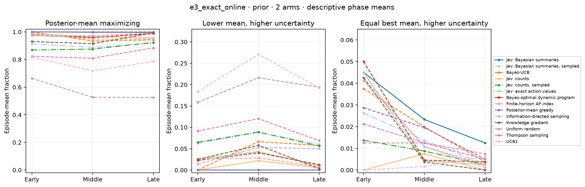

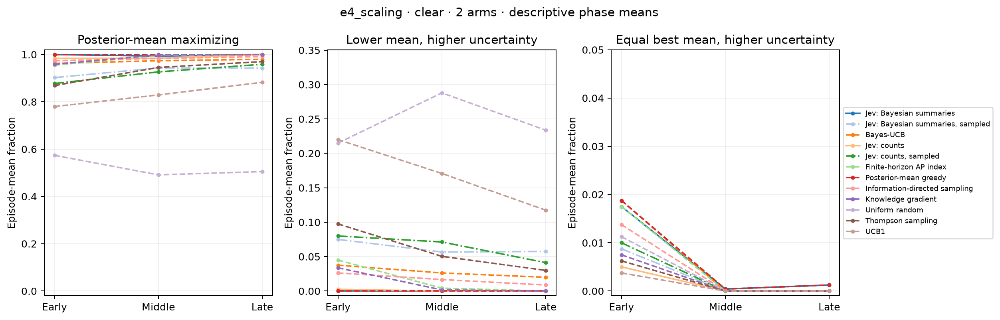

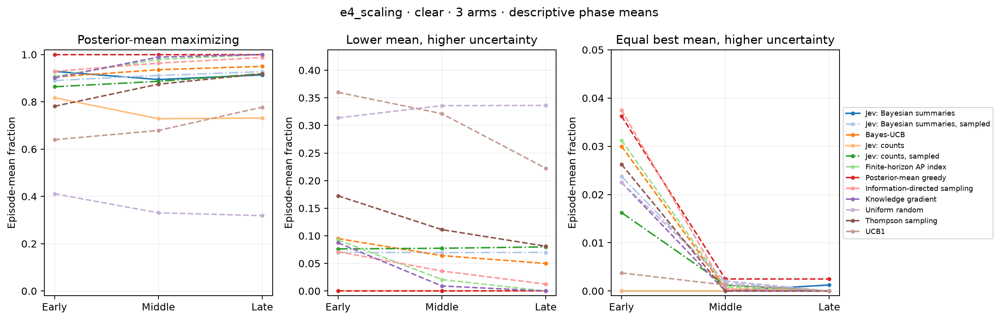

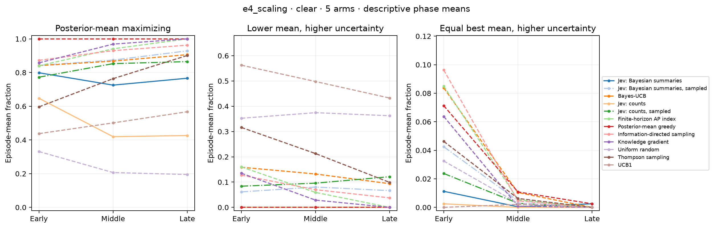

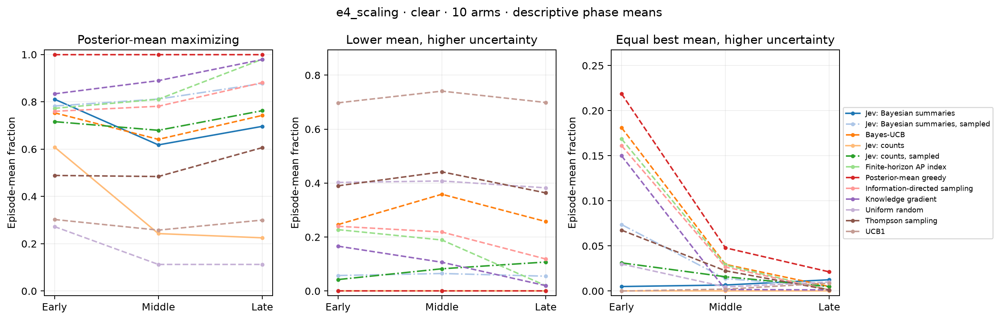

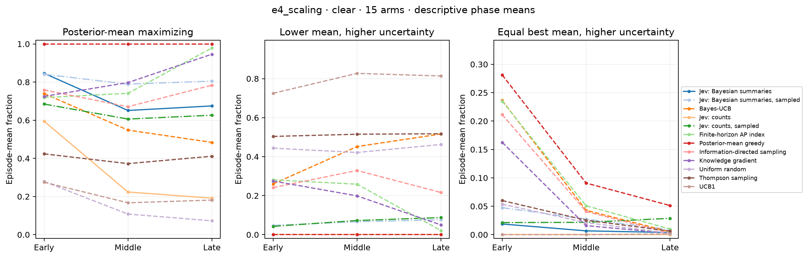

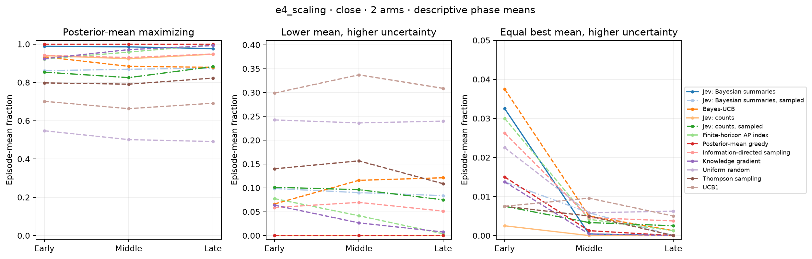

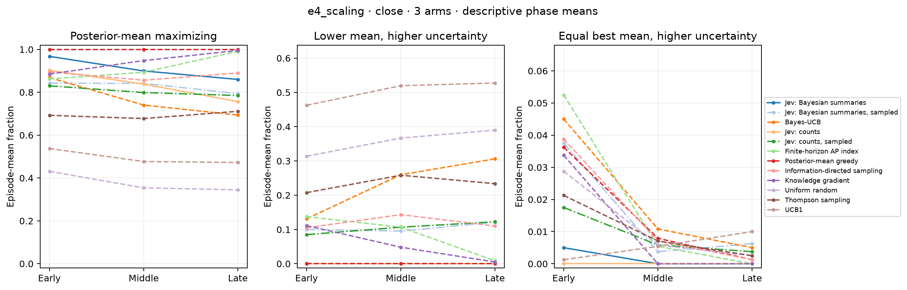

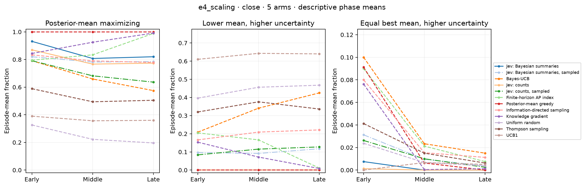

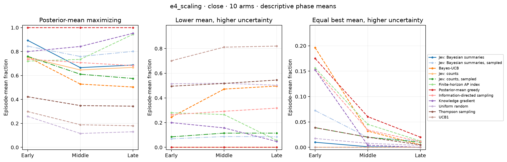

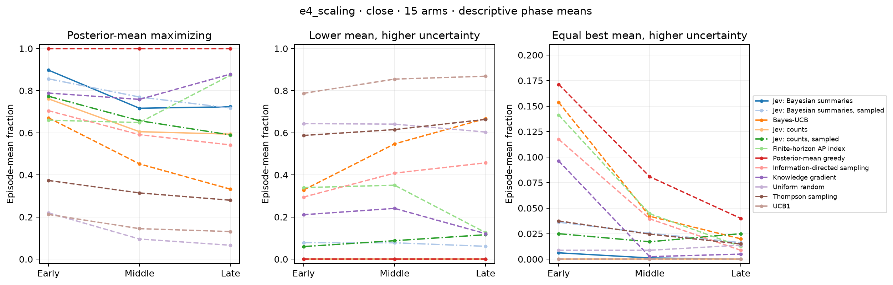

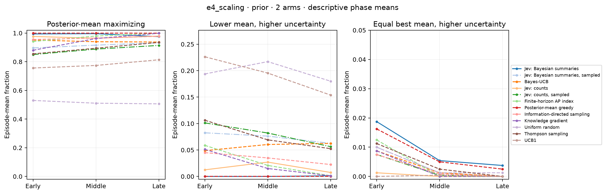

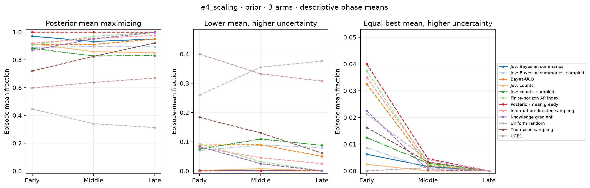

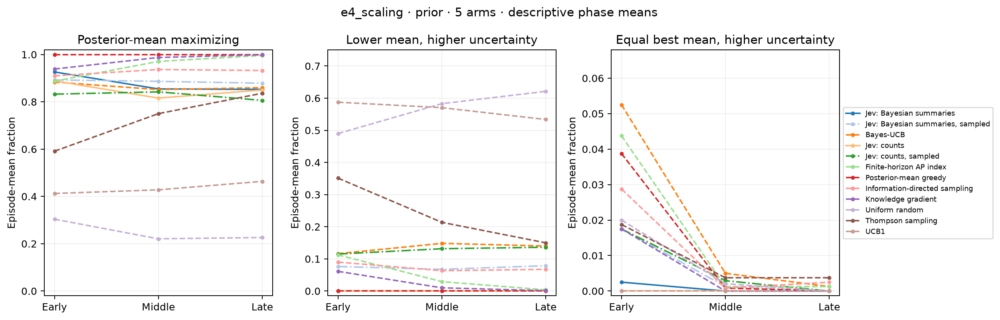

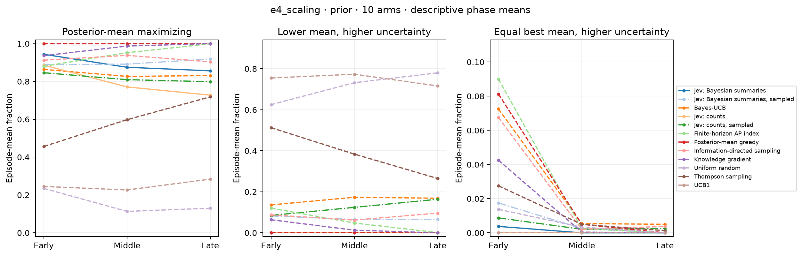

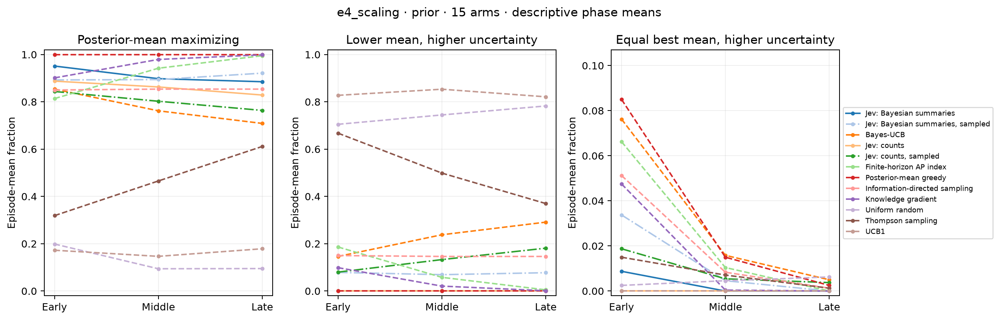

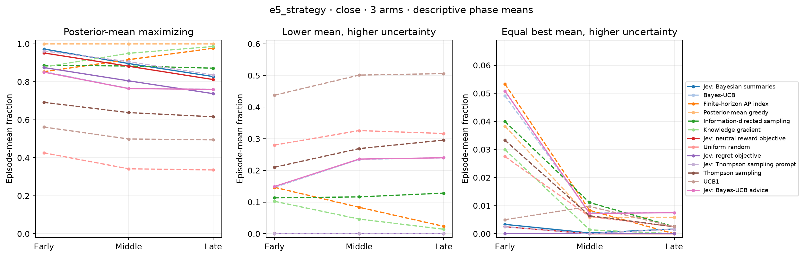

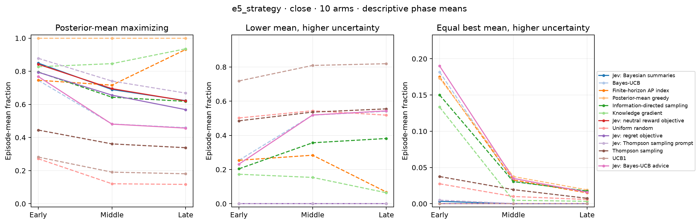

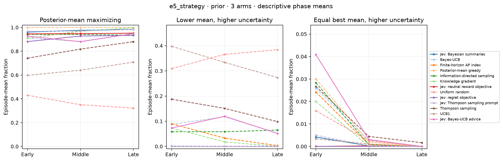

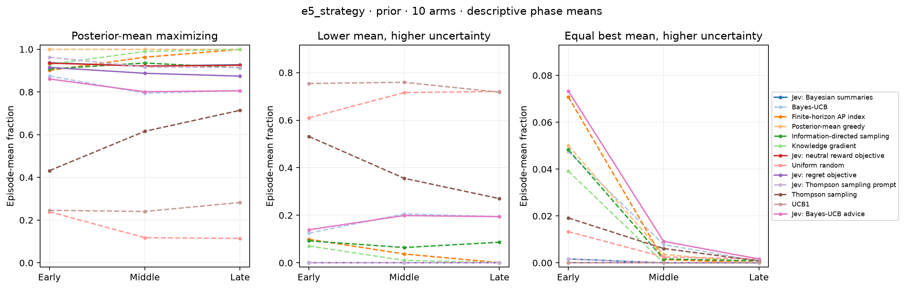
