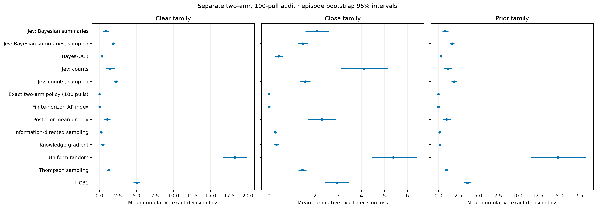

# Post hoc exact audit: two arms, 100 pulls

This separate analysis scores recorded E4 two-arm histories against exact finite-horizon Beta-Bernoulli action values and adds an offline exact-policy comparator. It is not pooled with results at other arm counts and was added after initial collection. No new Jev calls are used. The exact policy is not a clairvoyant oracle.

The frozen target is 40 paired underlying tasks per family; observed counts appear below. Policy rows reuse those tasks and do not increase the independent task count. Intervals bootstrap whole episodes with 10,000 resamples (or the explicitly recorded analysis setting) and are exploratory pointwise 95% intervals. Pseudo-regret contrasts versus the exact policy are paired within family.

Cumulative local exact loss sums the reward sacrificed by each chosen action assuming optimal continuation thereafter. Its expectation equals the policy's Bayesian value gap under the matched independent uniform prior. The prior family is the matched-prior test; clear and close families are fixed-instance stress tests evaluated under a working prior. Their local Q losses are not population reward gaps under those stress-test distributions. Finite-sample pseudo-regret rankings can differ from expected Bayesian optimality.

## Clear family

| Policy | Episodes | Cumulative exact loss | Optimal-action agreement | Pseudo-regret |
| --- | --- | --- | --- | --- |
| Jev: Bayesian summaries | 40 | 0.8677 [0.5116, 1.2650] | 0.7188 [0.6160, 0.8182] | 3.3400 [1.0100, 6.3300] |
| Jev: Bayesian summaries, sampled | 40 | 1.8545 [1.6336, 2.0866] | 0.8880 [0.8535, 0.9163] | 3.2500 [2.7800, 3.7500] |
| Bayes-UCB | 40 | 0.3562 [0.2502, 0.4756] | 0.9727 [0.9670, 0.9780] | 1.9600 [1.5800, 2.3700] |
| Jev: counts | 40 | 1.4201 [0.8468, 2.0585] | 0.6610 [0.5437, 0.7738] | 2.5500 [0.6300, 5.0600] |
| Jev: counts, sampled | 40 | 2.2332 [1.9417, 2.5242] | 0.9015 [0.8840, 0.9170] | 3.8900 [3.3200, 4.5300] |
| Exact two-arm policy (100 pulls) | 40 | 0.0000 [0.0000, 0.0000] | 1.0000 [1.0000, 1.0000] | 1.1700 [0.8700, 1.5100] |
| Finite-horizon AP index | 40 | 0.0038 [0.0018, 0.0062] | 0.9953 [0.9923, 0.9977] | 1.1500 [0.8500, 1.4800] |
| Posterior-mean greedy | 40 | 1.0332 [0.6373, 1.4622] | 0.6890 [0.5780, 0.7990] | 3.0400 [0.9498, 5.7102] |
| Information-directed sampling | 40 | 0.2619 [0.1888, 0.3394] | 0.9393 [0.9075, 0.9655] | 1.5000 [1.1700, 1.8600] |
| Knowledge gradient | 40 | 0.4393 [0.2211, 0.6871] | 0.8238 [0.7375, 0.9023] | 0.9000 [0.6200, 1.2100] |
| Uniform random | 40 | 18.2466 [16.6054, 19.9109] | 0.5088 [0.4885, 0.5283] | 20.0300 [19.2400, 20.8300] |
| Thompson sampling | 40 | 1.2220 [1.0057, 1.4436] | 0.9247 [0.9078, 0.9412] | 3.0400 [2.4600, 3.6700] |
| UCB1 | 40 | 5.0241 [4.5774, 5.4527] | 0.8322 [0.8180, 0.8460] | 7.2900 [6.7000, 7.8800] |

## Close family

| Policy | Episodes | Cumulative exact loss | Optimal-action agreement | Pseudo-regret |
| --- | --- | --- | --- | --- |
| Jev: Bayesian summaries | 40 | 2.0624 [1.5815, 2.5867] | 0.3670 [0.2947, 0.4457] | 2.4600 [1.7338, 3.1913] |
| Jev: Bayesian summaries, sampled | 40 | 1.4661 [1.2654, 1.6805] | 0.7303 [0.6727, 0.7830] | 2.2313 [1.7412, 2.7375] |
| Bayes-UCB | 40 | 0.4154 [0.2699, 0.5861] | 0.9332 [0.9185, 0.9465] | 2.1888 [1.7400, 2.6550] |
| Jev: counts | 40 | 4.1214 [3.1079, 5.1583] | 0.3063 [0.2208, 0.4022] | 2.5313 [1.8075, 3.2613] |
| Jev: counts, sampled | 40 | 1.5693 [1.3471, 1.7913] | 0.7092 [0.6495, 0.7668] | 2.2975 [1.7913, 2.7963] |
| Exact two-arm policy (100 pulls) | 40 | 0.0000 [0.0000, 0.0000] | 1.0000 [1.0000, 1.0000] | 2.1888 [1.6125, 2.7888] |
| Finite-horizon AP index | 40 | 0.0110 [0.0066, 0.0171] | 0.9775 [0.9695, 0.9845] | 2.3175 [1.6863, 2.9325] |
| Posterior-mean greedy | 40 | 2.2877 [1.6806, 2.9122] | 0.3865 [0.2985, 0.4790] | 2.4313 [1.7050, 3.1725] |
| Information-directed sampling | 40 | 0.2733 [0.2028, 0.3511] | 0.8898 [0.8640, 0.9143] | 2.2738 [1.7063, 2.8175] |
| Knowledge gradient | 40 | 0.3264 [0.2153, 0.4473] | 0.7750 [0.7050, 0.8400] | 2.2250 [1.5813, 2.8675] |
| Uniform random | 40 | 5.3860 [4.4638, 6.3985] | 0.5003 [0.4852, 0.5155] | 2.5338 [2.4550, 2.6138] |
| Thompson sampling | 40 | 1.4492 [1.2825, 1.6191] | 0.7775 [0.7430, 0.8135] | 2.2050 [1.7913, 2.6250] |
| UCB1 | 40 | 2.9450 [2.4444, 3.4519] | 0.6925 [0.6725, 0.7127] | 2.1938 [2.0100, 2.3788] |

## Prior family

| Policy | Episodes | Cumulative exact loss | Optimal-action agreement | Pseudo-regret |
| --- | --- | --- | --- | --- |
| Jev: Bayesian summaries | 40 | 0.8623 [0.4976, 1.2634] | 0.6792 [0.5700, 0.7860] | 3.0022 [1.4631, 4.8686] |
| Jev: Bayesian summaries, sampled | 40 | 1.6905 [1.3975, 1.9875] | 0.8512 [0.8053, 0.8910] | 4.0379 [3.0920, 5.2169] |
| Bayes-UCB | 40 | 0.3054 [0.1992, 0.4260] | 0.9517 [0.9330, 0.9680] | 2.3356 [1.4680, 3.5814] |
| Jev: counts | 40 | 1.1780 [0.7026, 1.7038] | 0.6703 [0.5615, 0.7742] | 3.4557 [1.6890, 5.6125] |
| Jev: counts, sampled | 40 | 1.9562 [1.6321, 2.2991] | 0.8522 [0.8148, 0.8848] | 4.4285 [3.4208, 5.6530] |
| Exact two-arm policy (100 pulls) | 40 | 0.0000 [0.0000, 0.0000] | 1.0000 [1.0000, 1.0000] | 2.2267 [1.2080, 3.6334] |
| Finite-horizon AP index | 40 | 0.0039 [0.0019, 0.0063] | 0.9762 [0.9488, 0.9930] | 2.2933 [1.2594, 3.7026] |
| Posterior-mean greedy | 40 | 1.0403 [0.5693, 1.5658] | 0.6790 [0.5653, 0.7900] | 3.6490 [1.5332, 6.2922] |
| Information-directed sampling | 40 | 0.1436 [0.0835, 0.2114] | 0.9270 [0.8918, 0.9580] | 2.2540 [1.2673, 3.6454] |
| Knowledge gradient | 40 | 0.1676 [0.0993, 0.2448] | 0.8902 [0.8430, 0.9325] | 2.2404 [1.1655, 3.6958] |
| Uniform random | 40 | 14.9823 [11.5789, 18.5460] | 0.5095 [0.4942, 0.5252] | 18.2022 [14.1168, 22.3112] |
| Thompson sampling | 40 | 0.9970 [0.8395, 1.1597] | 0.8787 [0.8440, 0.9117] | 3.0930 [2.3161, 4.2050] |
| UCB1 | 40 | 3.6356 [3.1662, 4.1070] | 0.7833 [0.7493, 0.8175] | 6.0944 [5.3523, 6.8366] |

