# Jev bandit experimental results

This report is generated from recorded observations; it does not query Jev. Positive paired pseudo-regret differences favor the comparator (right policy); negative differences favor the left policy. Positive reward differences favor the left policy.

## Analysis and provenance

Input directory: `artifacts/overnight_v2`. Completed episode rows: 13,417; recorded incomplete rows excluded: 0; fixed-state queries: 10,800. Intervals use 10,000 percentile bootstrap resamples with fixed analysis seeds.

Episode comparisons pair identical environment IDs and bootstrap whole episodes. Fixed-state comparisons average repeated calls and label orders within each underlying fixture, then bootstrap fixtures. Repeated calls are not independent environments. Pooled online effects weight task cells equally within each experiment and horizon. All intervals are exploratory, pointwise, and unadjusted for multiple comparisons. An interval overlapping zero does not establish equivalence. A single independent unit has no reported interval.

## API usage and cost

| http_requests | input_tokens | known_cost_usd | uncertain_reserved_usd | error_attempts | inference_decisions | cap_usd | preparation_cost_usd | previous_runs_cost_usd | project_cost_and_reserves_usd | model | price_per_million_input | batch_size | updated_utc |
| --- | --- | --- | --- | --- | --- | --- | --- | --- | --- | --- | --- | --- | --- |
| 24628 | 297358446 | 12.4891 | 0.0083 | 3 | 393160 | 18.0000 | 0.0002 | 0.0559 | 12.5534 | jev-1.13.0 | 0.0420 | 16 | 2026-09-21T05:29:33.364155+00:00 |

Known cost is computed from reported usage. Uncertain reserves cover possibly billed failed attempts and are not verified account charges. Multiple isolated decision questions can share one HTTP request; decisions and request counts differ.

## Backend choice versus probability argmax

The fraction below equally weights observed task cells within each experiment. It describes disagreement between the backend choice and reported probability argmax, including for sampled policies before local sampling.

| experiment | policy | mean_mismatch_fraction | episode_rows | task_cells |
| --- | --- | --- | --- | --- |
| e3_exact_online | bayes_direct | 0.0000 | 200 | 1 |
| e3_exact_online | bayes_sample | 0.0000 | 200 | 1 |
| e3_exact_online | counts_direct | 0.0000 | 200 | 1 |
| e3_exact_online | counts_sample | 0.0000 | 200 | 1 |
| e3_exact_online | dp_direct | 0.0000 | 200 | 1 |
| e4_scaling | bayes_direct | 0.0001 | 600 | 15 |
| e4_scaling | bayes_sample | 0.0002 | 600 | 15 |
| e4_scaling | counts_direct | 0.0000 | 600 | 15 |
| e4_scaling | counts_sample | 0.0002 | 600 | 15 |
| e5_strategy | bayes_direct | 0.0001 | 240 | 4 |
| e5_strategy | neutral_direct | 0.0001 | 240 | 4 |
| e5_strategy | regret_direct | 0.0000 | 240 | 4 |
| e5_strategy | thompson_prompt | 0.0000 | 240 | 4 |
| e5_strategy | ucb_direct | 0.0000 | 240 | 4 |
| pilot | bayes_direct | 0.0000 | 27 | 9 |
| pilot | bayes_sample | 0.0000 | 27 | 9 |
| pilot | counts_direct | 0.0000 | 27 | 9 |
| pilot | counts_sample | 0.0000 | 27 | 9 |

## Online experiments

Equal-cell-weight cumulative pseudo-regret differences. TS is the primary Bayesian comparator; contrasts against Bayes-UCB, knowledge gradient, IDS, greedy and UCB1 are secondary, as is the finite-horizon AP index approximation. A gain over TS alone does not establish improvement over Bayesian methods generally, especially when posterior-mean greedy can be close to finite-horizon optimal on the evaluated prior and horizon. The finite-horizon AP index is a post hoc classical approximation, not an exact multi-arm optimizer. Its bracket-overlap flags can include true index ties and do not alone establish numerical instability.

### e3_exact_online

| left | right | comparison_role | mean_difference | ci_low | ci_high | n_pairs | n_cells |
| --- | --- | --- | --- | --- | --- | --- | --- |
| bayes_direct | bayes_ucb | secondary_baseline | 0.0328 | -0.1066 | 0.1787 | 200 | 1 |
| bayes_direct | counts_direct | primary_assistance | -0.0503 | -0.1787 | 0.0650 | 200 | 1 |
| bayes_direct | exact | planned_comparison | 0.0652 | -0.0563 | 0.1935 | 200 | 1 |
| bayes_direct | finite_ap_index | secondary_baseline | 0.0732 | -0.0438 | 0.2045 | 200 | 1 |
| bayes_direct | greedy | secondary_baseline | 0.1665 | 0.0365 | 0.3159 | 200 | 1 |
| bayes_direct | ids | secondary_baseline | 0.0416 | -0.0654 | 0.1555 | 200 | 1 |
| bayes_direct | knowledge_gradient | secondary_baseline | -0.0010 | -0.1240 | 0.1286 | 200 | 1 |
| bayes_direct | ts | primary_vs_ts | -0.5114 | -0.6486 | -0.3652 | 200 | 1 |
| bayes_direct | ucb1 | secondary_baseline | -0.8989 | -1.0870 | -0.7086 | 200 | 1 |
| bayes_sample | bayes_direct | planned_comparison | 0.3999 | 0.2739 | 0.5219 | 200 | 1 |
| bayes_sample | bayes_ucb | secondary_baseline | 0.4327 | 0.3088 | 0.5610 | 200 | 1 |
| bayes_sample | exact | planned_comparison | 0.4650 | 0.3495 | 0.5816 | 200 | 1 |
| bayes_sample | finite_ap_index | secondary_baseline | 0.4730 | 0.3563 | 0.5872 | 200 | 1 |
| bayes_sample | greedy | secondary_baseline | 0.5663 | 0.4272 | 0.7129 | 200 | 1 |
| bayes_sample | ids | secondary_baseline | 0.4415 | 0.3343 | 0.5489 | 200 | 1 |
| bayes_sample | knowledge_gradient | secondary_baseline | 0.3988 | 0.2815 | 0.5166 | 200 | 1 |
| bayes_sample | ts | planned_comparison | -0.1115 | -0.2247 | 0.0002 | 200 | 1 |
| bayes_sample | ucb1 | secondary_baseline | -0.4990 | -0.6421 | -0.3606 | 200 | 1 |
| counts_direct | bayes_ucb | secondary_baseline | 0.0831 | -0.0994 | 0.2826 | 200 | 1 |
| counts_direct | exact | planned_comparison | 0.1154 | -0.0596 | 0.3153 | 200 | 1 |
| counts_direct | finite_ap_index | secondary_baseline | 0.1234 | -0.0552 | 0.3260 | 200 | 1 |
| counts_direct | greedy | secondary_baseline | 0.2167 | 0.0324 | 0.4200 | 200 | 1 |
| counts_direct | ids | secondary_baseline | 0.0919 | -0.0700 | 0.2712 | 200 | 1 |
| counts_direct | knowledge_gradient | secondary_baseline | 0.0493 | -0.1285 | 0.2429 | 200 | 1 |
| counts_direct | ts | primary_vs_ts | -0.4611 | -0.6446 | -0.2670 | 200 | 1 |
| counts_direct | ucb1 | secondary_baseline | -0.8486 | -1.0612 | -0.6199 | 200 | 1 |
| counts_sample | bayes_ucb | secondary_baseline | 0.4578 | 0.3112 | 0.6070 | 200 | 1 |
| counts_sample | counts_direct | planned_comparison | 0.3747 | 0.2101 | 0.5328 | 200 | 1 |
| counts_sample | exact | planned_comparison | 0.4901 | 0.3575 | 0.6282 | 200 | 1 |
| counts_sample | finite_ap_index | secondary_baseline | 0.4982 | 0.3576 | 0.6416 | 200 | 1 |
| counts_sample | greedy | secondary_baseline | 0.5915 | 0.4285 | 0.7583 | 200 | 1 |
| counts_sample | ids | secondary_baseline | 0.4666 | 0.3365 | 0.6029 | 200 | 1 |
| counts_sample | knowledge_gradient | secondary_baseline | 0.4240 | 0.2822 | 0.5690 | 200 | 1 |
| counts_sample | ts | planned_comparison | -0.0864 | -0.2284 | 0.0549 | 200 | 1 |
| counts_sample | ucb1 | secondary_baseline | -0.4739 | -0.6215 | -0.3194 | 200 | 1 |
| dp_direct | bayes_ucb | secondary_baseline | -0.0197 | -0.1246 | 0.0917 | 200 | 1 |
| dp_direct | exact | planned_comparison | 0.0126 | -0.0600 | 0.0920 | 200 | 1 |
| dp_direct | finite_ap_index | secondary_baseline | 0.0206 | -0.0592 | 0.1006 | 200 | 1 |
| dp_direct | greedy | secondary_baseline | 0.1139 | 0.0011 | 0.2392 | 200 | 1 |
| dp_direct | ids | secondary_baseline | -0.0110 | -0.0726 | 0.0498 | 200 | 1 |
| dp_direct | knowledge_gradient | secondary_baseline | -0.0536 | -0.1404 | 0.0310 | 200 | 1 |
| dp_direct | ts | planned_comparison | -0.5640 | -0.6751 | -0.4557 | 200 | 1 |
| dp_direct | ucb1 | secondary_baseline | -0.9514 | -1.1104 | -0.7900 | 200 | 1 |

Supplying Bayesian summaries was associated with 0.050 lower cumulative pseudo-regret per episode on the equal-cell-weight scale (assisted minus counts: -0.050, 95% interval [-0.179, 0.065]). This intervention changes information presentation and arithmetic accessibility, not the underlying observed evidence.

### e4_scaling

| left | right | comparison_role | mean_difference | ci_low | ci_high | n_pairs | n_cells |
| --- | --- | --- | --- | --- | --- | --- | --- |
| bayes_direct | bayes_ucb | secondary_baseline | 2.4628 | 1.5235 | 3.4097 | 600 | 15 |
| bayes_direct | counts_direct | primary_assistance | -2.6291 | -3.3407 | -1.9516 | 600 | 15 |
| bayes_direct | finite_ap_index | secondary_baseline | 3.7903 | 2.8831 | 4.6821 | 600 | 15 |
| bayes_direct | greedy | secondary_baseline | 2.0252 | 1.1374 | 2.9280 | 600 | 15 |
| bayes_direct | ids | secondary_baseline | 3.4213 | 2.4972 | 4.3620 | 600 | 15 |
| bayes_direct | knowledge_gradient | secondary_baseline | 4.0697 | 3.1553 | 4.9735 | 600 | 15 |
| bayes_direct | ts | primary_vs_ts | 0.2580 | -0.6473 | 1.1866 | 600 | 15 |
| bayes_direct | ucb1 | secondary_baseline | -4.9264 | -5.8574 | -3.9641 | 600 | 15 |
| bayes_sample | bayes_direct | planned_comparison | -1.7912 | -2.5250 | -1.0725 | 600 | 15 |
| bayes_sample | bayes_ucb | secondary_baseline | 0.6716 | 0.1617 | 1.1759 | 600 | 15 |
| bayes_sample | finite_ap_index | secondary_baseline | 1.9991 | 1.5393 | 2.4628 | 600 | 15 |
| bayes_sample | greedy | secondary_baseline | 0.2340 | -0.3845 | 0.8284 | 600 | 15 |
| bayes_sample | ids | secondary_baseline | 1.6301 | 1.1690 | 2.1104 | 600 | 15 |
| bayes_sample | knowledge_gradient | secondary_baseline | 2.2786 | 1.8102 | 2.7506 | 600 | 15 |
| bayes_sample | ts | planned_comparison | -1.5332 | -1.9883 | -1.0741 | 600 | 15 |
| bayes_sample | ucb1 | secondary_baseline | -6.7175 | -7.2379 | -6.1788 | 600 | 15 |
| counts_direct | bayes_ucb | secondary_baseline | 5.0919 | 4.0711 | 6.1664 | 600 | 15 |
| counts_direct | finite_ap_index | secondary_baseline | 6.4194 | 5.3837 | 7.4451 | 600 | 15 |
| counts_direct | greedy | secondary_baseline | 4.6543 | 3.5771 | 5.7508 | 600 | 15 |
| counts_direct | ids | secondary_baseline | 6.0504 | 5.0413 | 7.0891 | 600 | 15 |
| counts_direct | knowledge_gradient | secondary_baseline | 6.6989 | 5.6693 | 7.7529 | 600 | 15 |
| counts_direct | ts | primary_vs_ts | 2.8871 | 1.9059 | 3.9055 | 600 | 15 |
| counts_direct | ucb1 | secondary_baseline | -2.2973 | -3.2990 | -1.2878 | 600 | 15 |
| counts_sample | bayes_ucb | secondary_baseline | 1.4876 | 0.9657 | 2.0203 | 600 | 15 |
| counts_sample | counts_direct | planned_comparison | -3.6043 | -4.4777 | -2.7230 | 600 | 15 |
| counts_sample | finite_ap_index | secondary_baseline | 2.8152 | 2.2981 | 3.3413 | 600 | 15 |
| counts_sample | greedy | secondary_baseline | 1.0500 | 0.3975 | 1.6951 | 600 | 15 |
| counts_sample | ids | secondary_baseline | 2.4461 | 1.9412 | 2.9696 | 600 | 15 |
| counts_sample | knowledge_gradient | secondary_baseline | 3.0946 | 2.5684 | 3.6278 | 600 | 15 |
| counts_sample | ts | planned_comparison | -0.7172 | -1.2018 | -0.2335 | 600 | 15 |
| counts_sample | ucb1 | secondary_baseline | -5.9015 | -6.4538 | -5.3530 | 600 | 15 |

Supplying Bayesian summaries was associated with 2.629 lower cumulative pseudo-regret per episode on the equal-cell-weight scale (assisted minus counts: -2.629, 95% interval [-3.341, -1.952]). This intervention changes information presentation and arithmetic accessibility, not the underlying observed evidence.

### e5_strategy

| left | right | comparison_role | mean_difference | ci_low | ci_high | n_pairs | n_cells |
| --- | --- | --- | --- | --- | --- | --- | --- |
| bayes_direct | bayes_ucb | secondary_baseline | 1.7435 | 0.6808 | 2.8990 | 240 | 4 |
| bayes_direct | finite_ap_index | secondary_baseline | 2.3964 | 1.3401 | 3.4949 | 240 | 4 |
| bayes_direct | greedy | secondary_baseline | 1.0583 | -0.1337 | 2.2500 | 240 | 4 |
| bayes_direct | ids | secondary_baseline | 2.2248 | 1.2339 | 3.2721 | 240 | 4 |
| bayes_direct | knowledge_gradient | secondary_baseline | 1.9965 | 0.9051 | 3.1014 | 240 | 4 |
| bayes_direct | ts | primary_vs_ts | 0.0310 | -0.9776 | 1.0993 | 240 | 4 |
| bayes_direct | ucb1 | secondary_baseline | -4.7557 | -5.7599 | -3.6976 | 240 | 4 |
| neutral_direct | bayes_direct | planned_comparison | 0.2367 | -0.0007 | 0.6400 | 240 | 4 |
| neutral_direct | bayes_ucb | secondary_baseline | 1.9802 | 0.8499 | 3.2099 | 240 | 4 |
| neutral_direct | finite_ap_index | secondary_baseline | 2.6331 | 1.4971 | 3.8378 | 240 | 4 |
| neutral_direct | greedy | secondary_baseline | 1.2950 | 0.0324 | 2.5644 | 240 | 4 |
| neutral_direct | ids | secondary_baseline | 2.4615 | 1.3945 | 3.5928 | 240 | 4 |
| neutral_direct | knowledge_gradient | secondary_baseline | 2.2332 | 1.0634 | 3.4427 | 240 | 4 |
| neutral_direct | ts | planned_comparison | 0.2676 | -0.8067 | 1.4115 | 240 | 4 |
| neutral_direct | ucb1 | secondary_baseline | -4.5191 | -5.5700 | -3.4046 | 240 | 4 |
| regret_direct | bayes_direct | planned_comparison | 0.7631 | 0.2240 | 1.4406 | 240 | 4 |
| regret_direct | bayes_ucb | secondary_baseline | 2.5066 | 1.2990 | 3.8361 | 240 | 4 |
| regret_direct | finite_ap_index | secondary_baseline | 3.1595 | 1.9149 | 4.4559 | 240 | 4 |
| regret_direct | greedy | secondary_baseline | 1.8214 | 0.5479 | 3.1373 | 240 | 4 |
| regret_direct | ids | secondary_baseline | 2.9879 | 1.8376 | 4.2300 | 240 | 4 |
| regret_direct | knowledge_gradient | secondary_baseline | 2.7596 | 1.5273 | 4.0613 | 240 | 4 |
| regret_direct | ts | planned_comparison | 0.7941 | -0.3692 | 2.0255 | 240 | 4 |
| regret_direct | ucb1 | secondary_baseline | -3.9926 | -5.1362 | -2.7649 | 240 | 4 |
| thompson_prompt | bayes_direct | planned_comparison | 0.0643 | -0.4345 | 0.5646 | 240 | 4 |
| thompson_prompt | bayes_ucb | secondary_baseline | 1.8078 | 0.6923 | 3.0213 | 240 | 4 |
| thompson_prompt | finite_ap_index | secondary_baseline | 2.4607 | 1.3154 | 3.6564 | 240 | 4 |
| thompson_prompt | greedy | secondary_baseline | 1.1225 | -0.1060 | 2.4229 | 240 | 4 |
| thompson_prompt | ids | secondary_baseline | 2.2891 | 1.2574 | 3.4170 | 240 | 4 |
| thompson_prompt | knowledge_gradient | secondary_baseline | 2.0608 | 0.9261 | 3.2340 | 240 | 4 |
| thompson_prompt | ts | planned_comparison | 0.0952 | -0.9523 | 1.2404 | 240 | 4 |
| thompson_prompt | ucb1 | secondary_baseline | -4.6915 | -5.7494 | -3.5743 | 240 | 4 |
| ucb_direct | bayes_direct | planned_comparison | -1.7679 | -2.8503 | -0.7584 | 240 | 4 |
| ucb_direct | bayes_ucb | secondary_baseline | -0.0244 | -0.1677 | 0.1124 | 240 | 4 |
| ucb_direct | finite_ap_index | secondary_baseline | 0.6285 | 0.2613 | 0.9827 | 240 | 4 |
| ucb_direct | greedy | secondary_baseline | -0.7096 | -1.6414 | 0.1526 | 240 | 4 |
| ucb_direct | ids | secondary_baseline | 0.4569 | 0.1276 | 0.7716 | 240 | 4 |
| ucb_direct | knowledge_gradient | secondary_baseline | 0.2286 | -0.3091 | 0.7505 | 240 | 4 |
| ucb_direct | ts | planned_comparison | -1.7369 | -1.9829 | -1.5092 | 240 | 4 |
| ucb_direct | ucb1 | secondary_baseline | -6.5236 | -7.0128 | -6.0340 | 240 | 4 |

### pilot

| left | right | comparison_role | mean_difference | ci_low | ci_high | n_pairs | n_cells |
| --- | --- | --- | --- | --- | --- | --- | --- |
| bayes_direct | bayes_ucb | pilot_exploratory | 0.3728 | -0.1198 | 0.8878 | 27 | 9 |
| bayes_direct | counts_direct | pilot_exploratory | -0.3649 | -1.0419 | 0.3308 | 27 | 9 |
| bayes_direct | greedy | pilot_exploratory | 0.6106 | 0.2047 | 1.0511 | 27 | 9 |
| bayes_direct | ids | pilot_exploratory | 0.9418 | 0.2706 | 1.6637 | 27 | 9 |
| bayes_direct | knowledge_gradient | pilot_exploratory | 0.9485 | 0.2414 | 1.7287 | 27 | 9 |
| bayes_direct | ts | pilot_exploratory | -0.0372 | -0.6002 | 0.5339 | 27 | 9 |
| bayes_direct | ucb1 | pilot_exploratory | -0.4713 | -1.0084 | 0.0584 | 27 | 9 |
| bayes_sample | bayes_direct | pilot_exploratory | -0.3894 | -1.1131 | 0.3172 | 27 | 9 |
| bayes_sample | bayes_ucb | pilot_exploratory | -0.0166 | -0.5592 | 0.4887 | 27 | 9 |
| bayes_sample | greedy | pilot_exploratory | 0.2212 | -0.3408 | 0.7751 | 27 | 9 |
| bayes_sample | ids | pilot_exploratory | 0.5525 | -0.0257 | 1.1174 | 27 | 9 |
| bayes_sample | knowledge_gradient | pilot_exploratory | 0.5592 | -0.3150 | 1.4241 | 27 | 9 |
| bayes_sample | ts | pilot_exploratory | -0.4266 | -0.8811 | -0.1203 | 27 | 9 |
| bayes_sample | ucb1 | pilot_exploratory | -0.8607 | -1.3190 | -0.4296 | 27 | 9 |
| counts_direct | bayes_ucb | pilot_exploratory | 0.7377 | -0.0087 | 1.4813 | 27 | 9 |
| counts_direct | greedy | pilot_exploratory | 0.9755 | 0.1762 | 1.7922 | 27 | 9 |
| counts_direct | ids | pilot_exploratory | 1.3067 | 0.5937 | 2.0413 | 27 | 9 |
| counts_direct | knowledge_gradient | pilot_exploratory | 1.3134 | 0.2913 | 2.2809 | 27 | 9 |
| counts_direct | ts | pilot_exploratory | 0.3276 | -0.4115 | 1.0489 | 27 | 9 |
| counts_direct | ucb1 | pilot_exploratory | -0.1064 | -0.8299 | 0.6335 | 27 | 9 |
| counts_sample | bayes_ucb | pilot_exploratory | 0.2917 | -0.3242 | 0.8496 | 27 | 9 |
| counts_sample | counts_direct | pilot_exploratory | -0.4460 | -0.9769 | 0.0114 | 27 | 9 |
| counts_sample | greedy | pilot_exploratory | 0.5294 | -0.0886 | 1.0716 | 27 | 9 |
| counts_sample | ids | pilot_exploratory | 0.8607 | 0.0854 | 1.5879 | 27 | 9 |
| counts_sample | knowledge_gradient | pilot_exploratory | 0.8674 | -0.0071 | 1.7562 | 27 | 9 |
| counts_sample | ts | pilot_exploratory | -0.1184 | -0.7363 | 0.4381 | 27 | 9 |
| counts_sample | ucb1 | pilot_exploratory | -0.5524 | -1.1164 | -0.0611 | 27 | 9 |

Supplying Bayesian summaries was associated with 0.365 lower cumulative pseudo-regret per episode on the equal-cell-weight scale (assisted minus counts: -0.365, 95% interval [-1.042, 0.331]). This intervention changes information presentation and arithmetic accessibility, not the underlying observed evidence.

## Fixed-state experiments

### e1_horizon

| horizon | policy | metric | mean | ci_low | ci_high | n_fixtures |
| --- | --- | --- | --- | --- | --- | --- |
| 1 | counts_explore | exact_loss | 0.0049 | 0.0015 | 0.0091 | 100 |
| 1 | counts_explore | optimal_agreement | 0.9350 | 0.8875 | 0.9750 | 100 |
| 1 | counts_neutral | exact_loss | 0.0051 | 0.0017 | 0.0094 | 100 |
| 1 | counts_neutral | optimal_agreement | 0.9325 | 0.8825 | 0.9750 | 100 |
| 1 | counts_regret | exact_loss | 0.0112 | 0.0057 | 0.0173 | 100 |
| 1 | counts_regret | optimal_agreement | 0.8975 | 0.8425 | 0.9450 | 100 |
| 2 | counts_explore | exact_loss | 0.0116 | 0.0059 | 0.0183 | 100 |
| 2 | counts_explore | optimal_agreement | 0.8350 | 0.7650 | 0.9000 | 100 |
| 2 | counts_neutral | exact_loss | 0.0130 | 0.0071 | 0.0197 | 100 |
| 2 | counts_neutral | optimal_agreement | 0.8275 | 0.7575 | 0.8925 | 100 |
| 2 | counts_regret | exact_loss | 0.0146 | 0.0082 | 0.0220 | 100 |
| 2 | counts_regret | optimal_agreement | 0.8300 | 0.7575 | 0.8950 | 100 |
| 5 | counts_explore | exact_loss | 0.0147 | 0.0086 | 0.0214 | 100 |
| 5 | counts_explore | optimal_agreement | 0.8075 | 0.7300 | 0.8775 | 100 |
| 5 | counts_neutral | exact_loss | 0.0196 | 0.0119 | 0.0280 | 100 |
| 5 | counts_neutral | optimal_agreement | 0.7725 | 0.6900 | 0.8501 | 100 |
| 5 | counts_regret | exact_loss | 0.0182 | 0.0108 | 0.0264 | 100 |
| 5 | counts_regret | optimal_agreement | 0.7825 | 0.7050 | 0.8550 | 100 |
| 10 | counts_explore | exact_loss | 0.0139 | 0.0085 | 0.0198 | 100 |
| 10 | counts_explore | optimal_agreement | 0.8450 | 0.7800 | 0.9050 | 100 |
| 10 | counts_neutral | exact_loss | 0.0207 | 0.0128 | 0.0292 | 100 |
| 10 | counts_neutral | optimal_agreement | 0.7700 | 0.6875 | 0.8475 | 100 |
| 10 | counts_regret | exact_loss | 0.0214 | 0.0139 | 0.0296 | 100 |
| 10 | counts_regret | optimal_agreement | 0.7825 | 0.7050 | 0.8525 | 100 |

### e2_assistance

| horizon | policy | metric | mean | ci_low | ci_high | n_fixtures |
| --- | --- | --- | --- | --- | --- | --- |
| 1 | bayes_explore | exact_loss | 0.0000 | 0.0000 | 0.0000 | 100 |
| 1 | bayes_explore | optimal_agreement | 1.0000 | 1.0000 | 1.0000 | 100 |
| 1 | counts_explore | exact_loss | 0.0071 | 0.0027 | 0.0123 | 100 |
| 1 | counts_explore | optimal_agreement | 0.9150 | 0.8650 | 0.9600 | 100 |
| 1 | dp_values_explore | exact_loss | 0.0000 | 0.0000 | 0.0000 | 100 |
| 1 | dp_values_explore | optimal_agreement | 1.0000 | 1.0000 | 1.0000 | 100 |
| 1 | means_explore | exact_loss | 0.0000 | 0.0000 | 0.0000 | 100 |
| 1 | means_explore | optimal_agreement | 1.0000 | 1.0000 | 1.0000 | 100 |
| 1 | recommendation_explore | exact_loss | 0.0005 | 0.0000 | 0.0013 | 100 |
| 1 | recommendation_explore | optimal_agreement | 0.9875 | 0.9700 | 1.0000 | 100 |
| 2 | bayes_explore | exact_loss | 0.0032 | 0.0010 | 0.0057 | 100 |
| 2 | bayes_explore | optimal_agreement | 0.9550 | 0.9200 | 0.9850 | 100 |
| 2 | counts_explore | exact_loss | 0.0099 | 0.0047 | 0.0159 | 100 |
| 2 | counts_explore | optimal_agreement | 0.8800 | 0.8225 | 0.9325 | 100 |
| 2 | dp_values_explore | exact_loss | 0.0000 | 0.0000 | 0.0000 | 100 |
| 2 | dp_values_explore | optimal_agreement | 1.0000 | 1.0000 | 1.0000 | 100 |
| 2 | means_explore | exact_loss | 0.0003 | 0.0000 | 0.0007 | 100 |
| 2 | means_explore | optimal_agreement | 0.9875 | 0.9650 | 1.0000 | 100 |
| 2 | recommendation_explore | exact_loss | 0.0021 | 0.0005 | 0.0043 | 100 |
| 2 | recommendation_explore | optimal_agreement | 0.9650 | 0.9350 | 0.9900 | 100 |
| 10 | bayes_explore | exact_loss | 0.0037 | 0.0013 | 0.0065 | 100 |
| 10 | bayes_explore | optimal_agreement | 0.9225 | 0.8700 | 0.9675 | 100 |
| 10 | counts_explore | exact_loss | 0.0078 | 0.0042 | 0.0118 | 100 |
| 10 | counts_explore | optimal_agreement | 0.8775 | 0.8200 | 0.9300 | 100 |
| 10 | dp_values_explore | exact_loss | 0.0000 | 0.0000 | 0.0000 | 100 |
| 10 | dp_values_explore | optimal_agreement | 1.0000 | 1.0000 | 1.0000 | 100 |
| 10 | means_explore | exact_loss | 0.0026 | 0.0007 | 0.0050 | 100 |
| 10 | means_explore | optimal_agreement | 0.9350 | 0.8850 | 0.9800 | 100 |
| 10 | recommendation_explore | exact_loss | 0.0067 | 0.0037 | 0.0103 | 100 |
| 10 | recommendation_explore | optimal_agreement | 0.8925 | 0.8375 | 0.9400 | 100 |

Exact action-value loss measures expected remaining reward sacrificed by the first action assuming optimal continuation. Optimal-action agreement is tie-aware and can treat tiny and consequential mistakes identically, so it must be read alongside action-value loss. Long-horizon states without exact values are behavioral diagnostics only. Label sensitivity is in `label_sensitivity.csv`; its absolute version measures observed choice changes and includes repeated-call variability, so it is not pure systematic label bias.

Fixtures are designed state panels: E1 has six named anchors plus seeded random states; E2 uses a disjoint seed namespace and entirely random states. Random states have arm counts chosen from 0, 2, 5, 10 and 20 and successes uniform from zero to that count. Conditional on this randomized nonadaptive allocation, uniform successes are exactly the Beta-Binomial(n,1,1) prior-predictive distribution under the uniform prior. This is nevertheless not the state-visit distribution of an adaptive policy. Fixture bootstrap intervals describe sensitivity across this panel. They do not by themselves generalize to online performance. The numeric action-value and recommendation conditions supply outputs of an exact planning algorithm; their comparison measures the use of supplied computation, not independent planning ability.

### Secondary analysis: when exploration is valuable

These state strata and horizon contrasts were added after the E1 results were inspected and are post hoc secondary analyses. Strict exploration is required when the best exact action value exceeds the best value among all posterior-mean maximizers by more than 1e-10. Tied means are handled as a set; uncertainty alone does not define a need to explore. Terminal states are shown separately. `state_regime_summary.csv` reports optimal-action agreement alongside exact loss, loss per remaining pull, non-greedy choice/probability, and the fraction losing at least 0.01 expected reward. The latter threshold is a descriptive scale, not a preregistered materiality criterion. Exploration-required subsets contain few fixtures, so their intervals are fragile. An empirical bootstrap interval of [0,0] or [1,1] in a boundary case does not establish certainty for new states.

| experiment | horizon | policy | metric | mean | ci_low | ci_high | n_fixtures |
| --- | --- | --- | --- | --- | --- | --- | --- |
| e1_horizon | 2 | counts_explore | optimal_agreement | 0.0000 | NA | NA | 1 |
| e1_horizon | 2 | counts_explore | exact_loss | 0.0083 | NA | NA | 1 |
| e1_horizon | 2 | counts_explore | non_greedy_choice | 0.0000 | NA | NA | 1 |
| e1_horizon | 2 | counts_neutral | optimal_agreement | 0.0000 | NA | NA | 1 |
| e1_horizon | 2 | counts_neutral | exact_loss | 0.0083 | NA | NA | 1 |
| e1_horizon | 2 | counts_neutral | non_greedy_choice | 0.0000 | NA | NA | 1 |
| e1_horizon | 2 | counts_regret | optimal_agreement | 0.0000 | NA | NA | 1 |
| e1_horizon | 2 | counts_regret | exact_loss | 0.0083 | NA | NA | 1 |
| e1_horizon | 2 | counts_regret | non_greedy_choice | 0.0000 | NA | NA | 1 |
| e1_horizon | 5 | counts_explore | optimal_agreement | 0.2500 | 0.0000 | 0.6250 | 8 |
| e1_horizon | 5 | counts_explore | exact_loss | 0.0275 | 0.0125 | 0.0439 | 8 |
| e1_horizon | 5 | counts_explore | non_greedy_choice | 0.2500 | 0.0000 | 0.6250 | 8 |
| e1_horizon | 5 | counts_neutral | optimal_agreement | 0.2500 | 0.0000 | 0.5000 | 8 |
| e1_horizon | 5 | counts_neutral | exact_loss | 0.0275 | 0.0125 | 0.0439 | 8 |
| e1_horizon | 5 | counts_neutral | non_greedy_choice | 0.2500 | 0.0000 | 0.6250 | 8 |
| e1_horizon | 5 | counts_regret | optimal_agreement | 0.1250 | 0.0000 | 0.3125 | 8 |
| e1_horizon | 5 | counts_regret | exact_loss | 0.0276 | 0.0134 | 0.0440 | 8 |
| e1_horizon | 5 | counts_regret | non_greedy_choice | 0.1250 | 0.0000 | 0.3125 | 8 |
| e1_horizon | 10 | counts_explore | optimal_agreement | 0.3125 | 0.0625 | 0.6250 | 8 |
| e1_horizon | 10 | counts_explore | exact_loss | 0.0422 | 0.0203 | 0.0620 | 8 |
| e1_horizon | 10 | counts_explore | non_greedy_choice | 0.3125 | 0.0625 | 0.6250 | 8 |
| e1_horizon | 10 | counts_neutral | optimal_agreement | 0.0312 | 0.0000 | 0.0938 | 8 |
| e1_horizon | 10 | counts_neutral | exact_loss | 0.0461 | 0.0285 | 0.0629 | 8 |
| e1_horizon | 10 | counts_neutral | non_greedy_choice | 0.0312 | 0.0000 | 0.0938 | 8 |
| e1_horizon | 10 | counts_regret | optimal_agreement | 0.1250 | 0.0000 | 0.3125 | 8 |
| e1_horizon | 10 | counts_regret | exact_loss | 0.0451 | 0.0266 | 0.0629 | 8 |
| e1_horizon | 10 | counts_regret | non_greedy_choice | 0.1250 | 0.0000 | 0.3125 | 8 |
| e2_assistance | 2 | bayes_explore | optimal_agreement | 0.0000 | NA | NA | 1 |
| e2_assistance | 2 | bayes_explore | exact_loss | 0.0152 | NA | NA | 1 |
| e2_assistance | 2 | bayes_explore | non_greedy_choice | 0.0000 | NA | NA | 1 |
| e2_assistance | 2 | counts_explore | optimal_agreement | 0.0000 | NA | NA | 1 |
| e2_assistance | 2 | counts_explore | exact_loss | 0.0152 | NA | NA | 1 |
| e2_assistance | 2 | counts_explore | non_greedy_choice | 0.0000 | NA | NA | 1 |
| e2_assistance | 2 | dp_values_explore | optimal_agreement | 1.0000 | NA | NA | 1 |
| e2_assistance | 2 | dp_values_explore | exact_loss | 0.0000 | NA | NA | 1 |
| e2_assistance | 2 | dp_values_explore | non_greedy_choice | 1.0000 | NA | NA | 1 |
| e2_assistance | 2 | means_explore | optimal_agreement | 0.0000 | NA | NA | 1 |
| e2_assistance | 2 | means_explore | exact_loss | 0.0152 | NA | NA | 1 |
| e2_assistance | 2 | means_explore | non_greedy_choice | 0.0000 | NA | NA | 1 |
| e2_assistance | 2 | recommendation_explore | optimal_agreement | 0.0000 | NA | NA | 1 |
| e2_assistance | 2 | recommendation_explore | exact_loss | 0.0152 | NA | NA | 1 |
| e2_assistance | 2 | recommendation_explore | non_greedy_choice | 0.0000 | NA | NA | 1 |
| e2_assistance | 10 | bayes_explore | optimal_agreement | 0.0000 | 0.0000 | 0.0000 | 6 |
| e2_assistance | 10 | bayes_explore | exact_loss | 0.0367 | 0.0186 | 0.0577 | 6 |
| e2_assistance | 10 | bayes_explore | non_greedy_choice | 0.0000 | 0.0000 | 0.0000 | 6 |
| e2_assistance | 10 | counts_explore | optimal_agreement | 0.1667 | 0.0000 | 0.3333 | 6 |
| e2_assistance | 10 | counts_explore | exact_loss | 0.0325 | 0.0122 | 0.0558 | 6 |
| e2_assistance | 10 | counts_explore | non_greedy_choice | 0.1667 | 0.0000 | 0.3333 | 6 |
| e2_assistance | 10 | dp_values_explore | optimal_agreement | 1.0000 | 1.0000 | 1.0000 | 6 |
| e2_assistance | 10 | dp_values_explore | exact_loss | 0.0000 | 0.0000 | 0.0000 | 6 |
| e2_assistance | 10 | dp_values_explore | non_greedy_choice | 1.0000 | 1.0000 | 1.0000 | 6 |
| e2_assistance | 10 | means_explore | optimal_agreement | 0.0000 | 0.0000 | 0.0000 | 6 |
| e2_assistance | 10 | means_explore | exact_loss | 0.0367 | 0.0186 | 0.0577 | 6 |
| e2_assistance | 10 | means_explore | non_greedy_choice | 0.0000 | 0.0000 | 0.0000 | 6 |
| e2_assistance | 10 | recommendation_explore | optimal_agreement | 0.0000 | 0.0000 | 0.0000 | 6 |
| e2_assistance | 10 | recommendation_explore | exact_loss | 0.0367 | 0.0186 | 0.0577 | 6 |
| e2_assistance | 10 | recommendation_explore | non_greedy_choice | 0.0000 | 0.0000 | 0.0000 | 6 |

### Secondary analysis: paired horizon response

The table compares horizon 10 minus horizon 1 within the same underlying posterior fixture, restricted to fixtures requiring a non-greedy action at horizon 10. The exact required-exploration indicator is the behavioral target; observed choice rates and reported probability mass are separate responses. This does not infer online reward from fixed-state behavior.

| experiment | policy | metric | low_mean | high_mean | mean_difference | ci_low | ci_high | n_fixtures |
| --- | --- | --- | --- | --- | --- | --- | --- | --- |
| e1_horizon | counts_explore | non_greedy_choice | 0.0312 | 0.3125 | 0.2812 | 0.0625 | 0.5625 | 8 |
| e1_horizon | counts_explore | non_greedy_probability | 0.1634 | 0.3181 | 0.1547 | 0.1216 | 0.1897 | 8 |
| e1_horizon | counts_explore | exploration_required | 0.0000 | 1.0000 | 1.0000 | 1.0000 | 1.0000 | 8 |
| e1_horizon | counts_neutral | non_greedy_choice | 0.0312 | 0.0312 | 0.0000 | 0.0000 | 0.0000 | 8 |
| e1_horizon | counts_neutral | non_greedy_probability | 0.1387 | 0.1772 | 0.0384 | 0.0078 | 0.0787 | 8 |
| e1_horizon | counts_neutral | exploration_required | 0.0000 | 1.0000 | 1.0000 | 1.0000 | 1.0000 | 8 |
| e1_horizon | counts_regret | non_greedy_choice | 0.0625 | 0.1250 | 0.0625 | 0.0000 | 0.1562 | 8 |
| e1_horizon | counts_regret | non_greedy_probability | 0.1284 | 0.2325 | 0.1041 | 0.0856 | 0.1287 | 8 |
| e1_horizon | counts_regret | exploration_required | 0.0000 | 1.0000 | 1.0000 | 1.0000 | 1.0000 | 8 |
| e2_assistance | bayes_explore | non_greedy_choice | 0.0000 | 0.0000 | 0.0000 | 0.0000 | 0.0000 | 6 |
| e2_assistance | bayes_explore | non_greedy_probability | 0.0008 | 0.2025 | 0.2017 | 0.1804 | 0.2258 | 6 |
| e2_assistance | bayes_explore | exploration_required | 0.0000 | 1.0000 | 1.0000 | 1.0000 | 1.0000 | 6 |
| e2_assistance | counts_explore | non_greedy_choice | 0.0417 | 0.1667 | 0.1250 | -0.0833 | 0.3333 | 6 |
| e2_assistance | counts_explore | non_greedy_probability | 0.1021 | 0.2750 | 0.1729 | 0.1237 | 0.2275 | 6 |
| e2_assistance | counts_explore | exploration_required | 0.0000 | 1.0000 | 1.0000 | 1.0000 | 1.0000 | 6 |
| e2_assistance | dp_values_explore | non_greedy_choice | 0.0000 | 1.0000 | 1.0000 | 1.0000 | 1.0000 | 6 |
| e2_assistance | dp_values_explore | non_greedy_probability | 0.0000 | 0.9517 | 0.9517 | 0.9429 | 0.9596 | 6 |
| e2_assistance | dp_values_explore | exploration_required | 0.0000 | 1.0000 | 1.0000 | 1.0000 | 1.0000 | 6 |
| e2_assistance | means_explore | non_greedy_choice | 0.0000 | 0.0000 | 0.0000 | 0.0000 | 0.0000 | 6 |
| e2_assistance | means_explore | non_greedy_probability | 0.0000 | 0.1846 | 0.1846 | 0.1396 | 0.2392 | 6 |
| e2_assistance | means_explore | exploration_required | 0.0000 | 1.0000 | 1.0000 | 1.0000 | 1.0000 | 6 |
| e2_assistance | recommendation_explore | non_greedy_choice | 0.0000 | 0.0000 | 0.0000 | 0.0000 | 0.0000 | 6 |
| e2_assistance | recommendation_explore | non_greedy_probability | 0.0042 | 0.1475 | 0.1433 | 0.1188 | 0.1704 | 6 |
| e2_assistance | recommendation_explore | exploration_required | 0.0000 | 1.0000 | 1.0000 | 1.0000 | 1.0000 | 6 |

### Secondary analysis: errors across random fixtures

For E2's randomly drawn fixtures, a fixture error means at least one suboptimal direct choice across both label orders and both repeated queries at the stated horizon. Each complete fixture counts once. The table uses two-sided 95% Clopper–Pearson binomial intervals, which remain nondegenerate with zero errors. The CSV also supplies a one-sided 95% upper bound. For zero errors in 100 fixtures, these upper limits are about 3.62% and 2.95%, respectively. These are fixture-level bounds for this query protocol, not per-call error bounds. They assume independent random fixtures and a stable service; dependence caused by shared batching or time variation is not modeled. E1's hand-selected anchors and selected exploration strata are excluded from this analysis.

| horizon | policy | n_random_fixtures | n_error_fixtures | any_error_rate | exact_95_ci_low | exact_95_ci_high |
| --- | --- | --- | --- | --- | --- | --- |
| 1 | bayes_explore | 100 | 0 | 0.0000 | 0.0000 | 0.0362 |
| 1 | counts_explore | 100 | 13 | 0.1300 | 0.0711 | 0.2120 |
| 1 | dp_values_explore | 100 | 0 | 0.0000 | 0.0000 | 0.0362 |
| 1 | means_explore | 100 | 0 | 0.0000 | 0.0000 | 0.0362 |
| 1 | recommendation_explore | 100 | 3 | 0.0300 | 0.0062 | 0.0852 |
| 2 | bayes_explore | 100 | 8 | 0.0800 | 0.0352 | 0.1516 |
| 2 | counts_explore | 100 | 17 | 0.1700 | 0.1023 | 0.2582 |
| 2 | dp_values_explore | 100 | 0 | 0.0000 | 0.0000 | 0.0362 |
| 2 | means_explore | 100 | 2 | 0.0200 | 0.0024 | 0.0704 |
| 2 | recommendation_explore | 100 | 7 | 0.0700 | 0.0286 | 0.1389 |
| 10 | bayes_explore | 100 | 9 | 0.0900 | 0.0420 | 0.1640 |
| 10 | counts_explore | 100 | 17 | 0.1700 | 0.1023 | 0.2582 |
| 10 | dp_values_explore | 100 | 0 | 0.0000 | 0.0000 | 0.0362 |
| 10 | means_explore | 100 | 7 | 0.0700 | 0.0286 | 0.1389 |
| 10 | recommendation_explore | 100 | 17 | 0.1700 | 0.1023 | 0.2582 |

## Figures

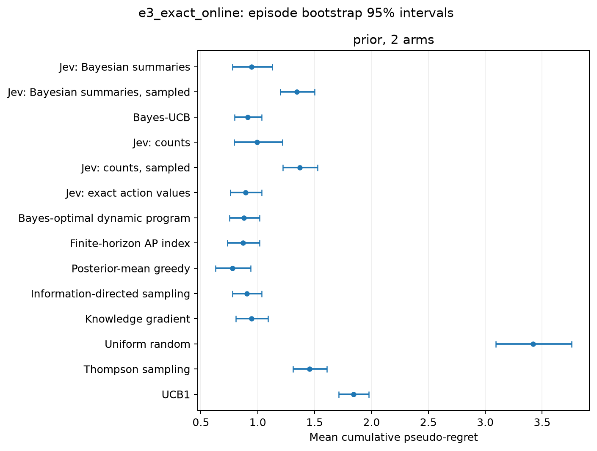

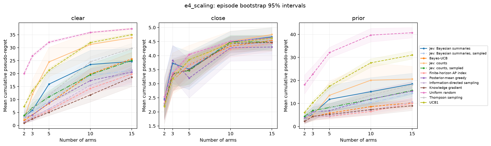

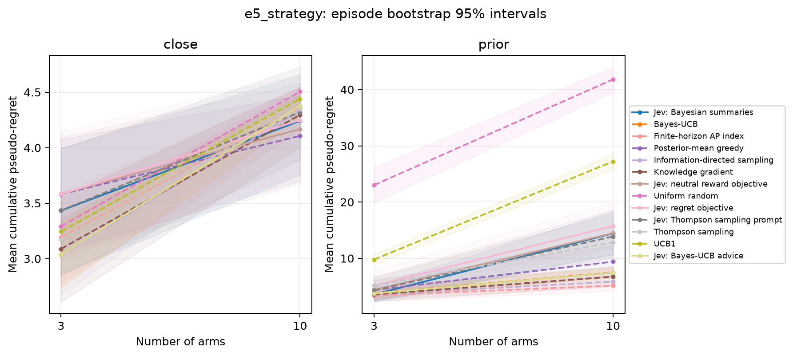

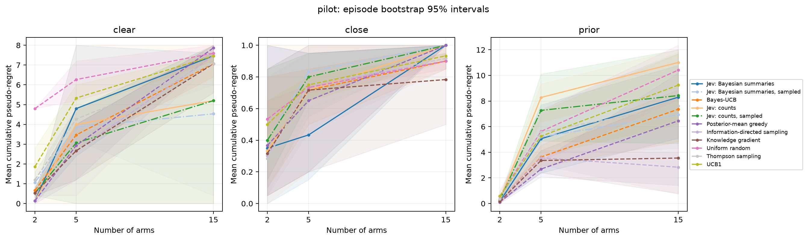

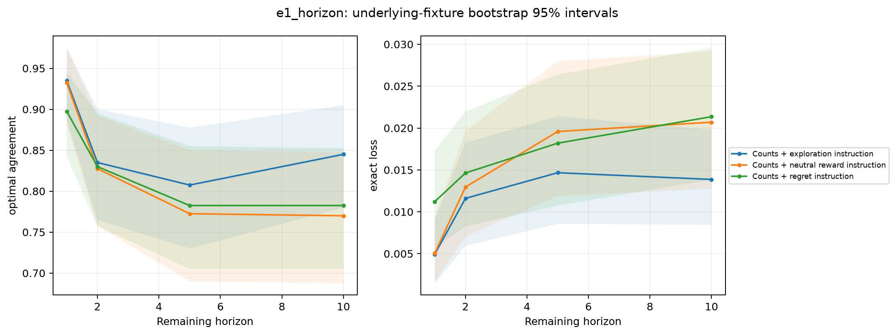

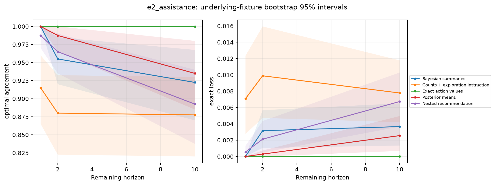

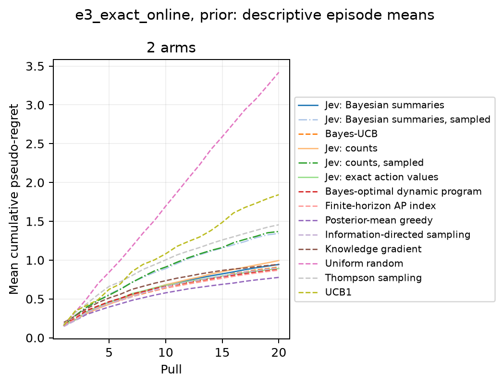

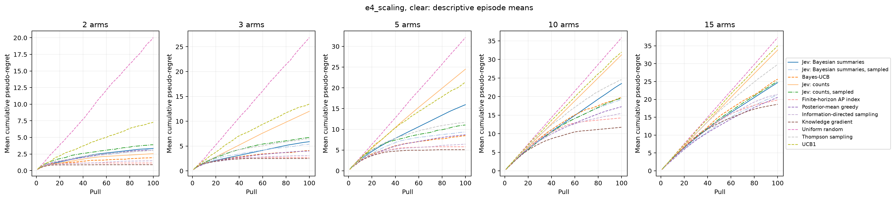

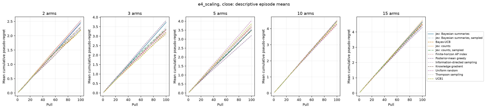

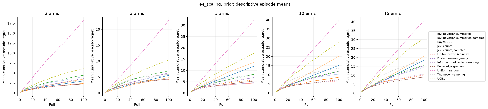

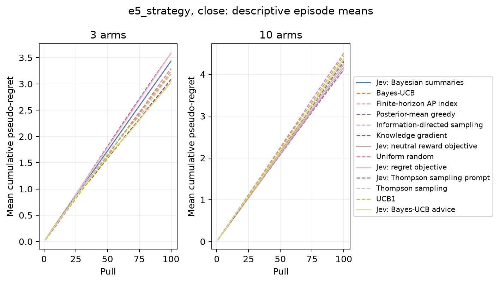

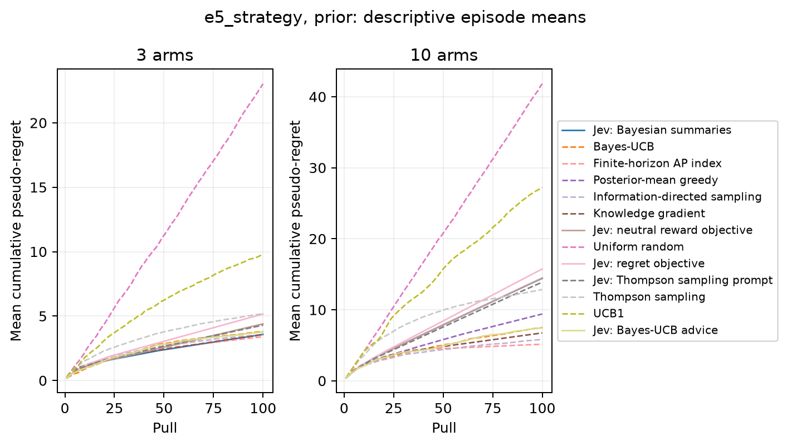

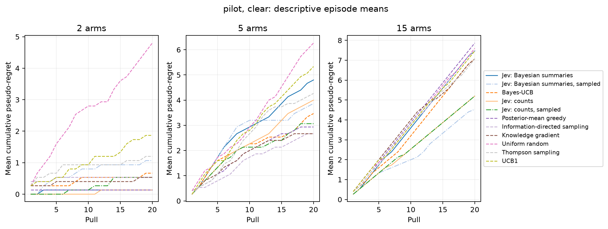

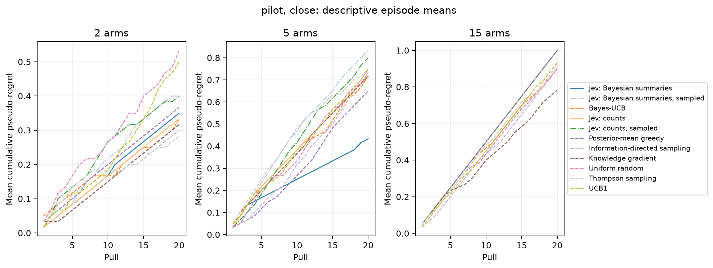

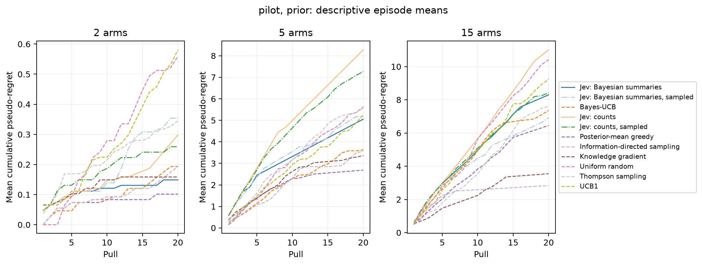

## Interpretation boundaries and next tests

Thompson sampling and Bayes-UCB are useful Bayesian algorithms, not exact finite-horizon optima. The exact two-arm panel supplies a separate optimality reference. Posterior-greedy choices do not prove absence of exploration reasoning, and non-greedy choices do not prove valuable exploration. Reward and exact action-value loss determine whether the behavior helps.

The service's probabilities describe answer choices, not reward probabilities or the Bayesian probability that an arm is best. Direct and sampled policies differ in their action-selection rule; interpreting sampling gains requires comparison with simple randomized baselines. Counts and Bayesian summaries contain the same information under the stated prior. Better assisted performance supports a representation or computation benefit, not extra data.

Direct policies execute the API's returned choice, which is not guaranteed in practice to equal the argmax of its reported probabilities. The v1 pilot encountered a returned choice with probability 0.44 while another arm had 0.45, contradicting the documented argmax description. The amended v2 protocol retains valid backend choices and records their probability gap rather than replacing them. `choice_mismatch_fraction` reports how often that discrepancy occurs. Sampled policies instead draw locally from the normalized reported distribution. A pure-probability-argmax policy would be a separate intervention; offline action agreement cannot establish its counterfactual online reward.

The experiments use stationary Bernoulli rewards, supplied sufficient statistics, anonymous arms, and one pinned model. They do not establish general Bayesian competence or incompetence, an internal algorithm, transfer to nonstationary environments, or benefits for reasoning-model harnesses. Stress-test families and matched-prior tasks should be interpreted separately. Any outcome-informed prompt changes require fresh evaluation seeds and a new experiment ID.

Next investigations should follow the observed contrasts: check whether numerical assistance reduces meaningful action-value loss, whether horizon framing changes valuable exploration, and whether any sampling benefit persists against TS and uncertainty-index controls. Validate promising effects on fresh tasks before making publication-level superiority claims.

## Machine-readable outputs

- [episode_summary.csv](episode_summary.csv)
- [paired_effects.csv](paired_effects.csv)
- [pooled_effects.csv](pooled_effects.csv)
- [diagnostic_summary.csv](diagnostic_summary.csv)
- [diagnostic_effects.csv](diagnostic_effects.csv)
- [label_sensitivity.csv](label_sensitivity.csv)
- [incomplete_episodes.csv](incomplete_episodes.csv)
- [trajectory_summary.csv](trajectory_summary.csv)
- [state_regime_summary.csv](state_regime_summary.csv)
- [horizon_contrasts.csv](horizon_contrasts.csv)
- [random_fixture_error_intervals.csv](random_fixture_error_intervals.csv)
