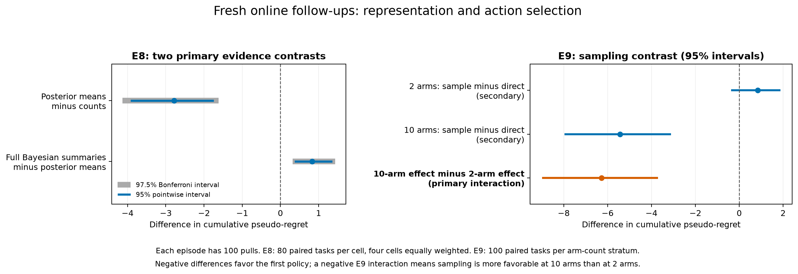
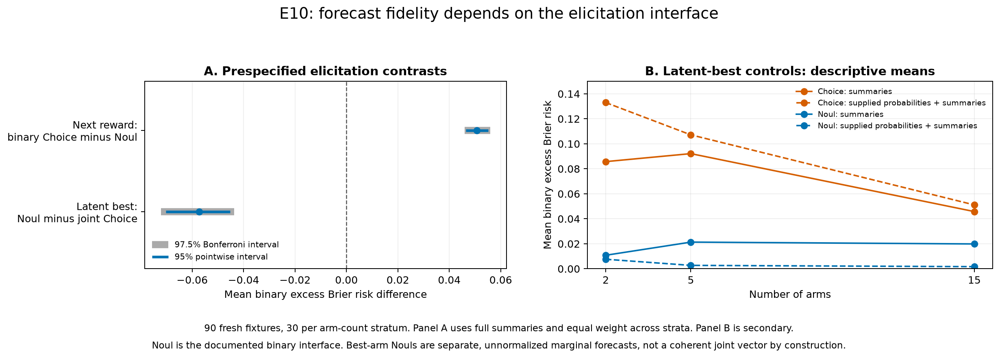

# Jev on finite-horizon Bayesian decisions

Research report, September 21, 2026. Model: `jev-1.13.0`. This is a study of one model and interface on synthetic stationary Bernoulli bandits, with prospective follow-ups and numerical controls. It is not a general verdict on Bayesian reasoning.

The clearest result is that **evidence representation, externally supplied computation, probability elicitation, and action selection each matter**. Jev can use posterior means and numerical decision values effectively. Richer summaries are not uniformly better, and a correct recommendation can be ignored when it conflicts with the apparent immediate reward ranking. Noul forecasts were closer to Bayesian event probabilities than Choice outputs in a controlled follow-up, although their separately elicited marginals were not always jointly coherent. Sampling the returned answer distribution changes exploration and has different consequences across task regimes. These observations support a study of how probabilistic models and classical decision algorithms can cooperate; they do not establish that Jev replaces Bayesian planning.

## Study design and scope

The [original five-study protocol](first_experiment_Plan.md) was recorded before its evaluation runs. Follow-ups were specified after inspecting earlier studies and collected in new namespaces on fresh fixtures or tasks. These are locally recorded prospective protocols, not external preregistrations. The pilot is excluded from scientific estimates. No reasoning LLM, casino deployment, or model-training experiment was run.

| Study | Question | Independent task or fixture allocation | Jev questions |
|---|---|---|---:|
| E1 | Horizon and exploration/regret wording | 100 two-arm states, 4 horizons, 3 instructions, label reversals and repeats | 4,800 |
| E2 | Counts, means, uncertainty, action values, recommendation | 100 new two-arm states, 3 horizons, 5 formats, label reversals and repeats | 6,000 |
| E3 | Closed-loop behavior with an exact reference | 200 two-arm tasks, 20 pulls, 5 Jev policies | 20,000 |
| E4 | Scaling and host sampling | 40 tasks in each of 15 cells: 2/3/5/10/15 arms by 3 families; 100 pulls, 4 policies | 240,000 |
| E5 | Strategy wording and supplied Bayes-UCB indices | 60 tasks in each of 4 cells: 3/10 arms by 2 families; 100 pulls, 5 policies | 120,000 |
| E6 | Binding an optimal recommendation to an action | 100 random and 100 deliberately exploration-requiring states; 6 formats, 3 horizons, labels and repeats | 28,800 |
| E7 | Predictive and latent-best probabilities | 100 states at each of 2/3/5/10/15 arms; 3 representations and repeats | 24,000 |
| E8 | Fresh online evidence ladder | 80 tasks in each of 4 cells; counts/means/full summaries, 100 pulls | 96,000 |
| E9 | Fresh sampling-by-arm-count interaction | 100 prior-drawn tasks each at 2 and 10 arms; direct/sampled summaries, 100 pulls | 40,000 |
| E10 | Forecast primitive and known-probability controls | 30 fresh states each at 2/5/15 arms; 4 representations, crossed elicitation packages, repeats | 16,560 |
| Batch validation | Standalone versus mixed questions | 20 E6 states reused for a paired interface audit | 1,920 |

All **598,080 scientific and final-validation questions** completed, excluding development calls. There are 1,560 independent online environments across E3–E5/E8/E9, evaluated under 5,960 Jev trajectories. Turns, arm components, repeated questions, and policies sharing an environment do not increase the independent sample size. Final collection status and ledger counts are recorded in the [data audit](docs/data_completeness_audit.md).

Total estimated Jev spending was **$18.0997**, including development, preparation, and $0.00826 of conservative retry reserves. Known token-derived charges including preparation were $18.09145. This remains below the reported $20 credits; no credits were purchased. It is not a verified account-balance statement and excludes coding-agent and earlier OCR costs. The original $18 operational cap was raised prospectively to $19 for the final controls under the user's existing authorization.

All arms have independent Bernoulli outcomes. The declared working prior is independent $\operatorname{Beta}(1,1)$. The families are a clear winner (.70 versus .30), a close winner (.55 versus .50), and independently prior-drawn means. Only the last matches the Bayesian prior as a population model. Policies know their own observations, remaining horizon, likelihood, and prior; they do not see hidden means, future outcomes, task-family identity, or another policy's history. Counts determine the posterior, so adding summaries changes numerical accessibility rather than underlying evidence.

Policies share each physical arm's $n$th potential outcome on its $n$th pull. Labels are anonymous and randomized. Direct Jev executes the backend's selected category. Sampled Jev draws locally from the normalized reported distribution with a reproducible random seed. Neither operation is assumed to be Thompson sampling. Small Choice probability-mass rounding discrepancies are retained in raw data and normalized for distribution diagnostics, scoring, and sampling; normalization never changes the backend action used by a direct policy. E1 contains six fixed illustrative anchors and 94 randomly generated states; its whole-panel intervals describe that designed mixture rather than an entirely random natural-state population.

## What the experiments found

### Useful summaries, with a non-monotone evidence ladder

In E4, full Bayesian summaries reduced cumulative pseudo-regret relative to counts by **2.629 reward units per 100-pull episode**, with a paired 95% bootstrap interval of **[1.952, 3.341]** for the reduction. This averages the 15 task cells equally. The effect is a benefit of supplying redundant calculations in this representation package, not of revealing new observations. [Core results](reports/overnight_v2/report.md)

E8 tested a more informative decomposition on fresh tasks. Adding posterior means to counts reduced regret by **2.784 [1.618, 4.136]**. Adding Beta parameters, standard deviations, and credible intervals to that means condition then **increased** regret by **0.833 [0.321, 1.434]**. These are the two prespecified overall contrasts with 97.5% individual bootstrap intervals, targeting Bonferroni 95% family coverage. The gain and reversal were concentrated in the prior-drawn family; close-gap subgroup intervals were less informative. [E8 report](reports/e8_evidence/report.md)

This does not isolate a causal effect of uncertainty itself. The full-summary intervention simultaneously changes fields, wording, length, and numerical demands. It does show that more correct derived statistics do not guarantee better adaptive decisions. The next experiment should separate these components instead of selecting the best-looking prompt on the same test tasks.

### Exploration wording helps some choices; horizon-aware planning remains uneven

At ten remaining pulls in E1, tie-aware optimal-action agreement was 84.5% with the exploration-benefit instruction, 77.0% with neutral wording, and 78.25% with regret wording. Only eight fixtures at this horizon strictly required a non-greedy action, so their descriptive rates are fragile: 31.25%, 3.125%, and 12.5%, respectively. Jev continued choosing the .55-mean incumbent in the illustrative $\operatorname{Beta}(11,9)$ versus $\operatorname{Beta}(1,1)$ crossover, including the two-pull condition where exploring is optimal.

In E5, regret wording increased regret relative to the exploration-benefit wording by **0.763 [0.224, 1.441]**. Neutral wording's contrast was **0.237 [-0.001, 0.640]**, and instructing a Thompson-like strategy while still executing the direct choice produced **0.064 [-0.435, 0.565]**. These exploratory intervals do not establish equivalence for the latter comparisons. Reward maximization and expected cumulative-regret minimization have the same optimizer in this task; these are framing effects. [Fixed-state and online analyses](reports/overnight_v2/report.md)

The answer to the initial exploration question is therefore qualified: **yes, an exploration-benefit instruction can influence choices and improve some results, but naming the long-term objective does not reliably implement its optimal strategy**. A model can choose the highest-rated action and still explore if the ratings incorporate future information value. Our tests concern whether the resulting choices actually exhibit that behavior.

### Sampling is a consequential control choice

In the two-arm, 20-pull E3 panel, sampling the Bayesian-summary answer distribution increased regret relative to direct choice by **0.400 [0.274, 0.522]**. In E4's broader 100-pull matrix, the same intervention reduced average regret by **1.791 [1.073, 2.525]**. Pooling these settings into a single recommendation would conceal an important interaction.

E9 prospectively tested the two-versus-ten-arm interaction on fresh prior-drawn tasks. The prespecified difference of sampling effects was **-6.284 [-8.986, -3.700]** reward units. At ten arms, sampling reduced regret by **5.441 [3.113, 7.960]**; at two arms, its estimated increase was **0.843 [-0.372, 1.875]**, individually inconclusive. Arm count, input arity, and fixed-budget difficulty change together; the result identifies a regime interaction, not a precise arm-count threshold or internal mechanism. [E9 recorded analysis](results/sampling_v1/interaction_summary.json)

The [behavior audit](reports/overnight_v2/behavior/report.md) reconstructs public histories and separates posterior-mean departures, uncertainty seeking, arm coverage, and abandonment. Non-greedy actions are not automatically useful exploration. At two arms we additionally classify them by exact action values; at larger arm counts we keep the behavioral labels descriptive.

*E8 and E9 use different task samples and interventions. Their effect sizes are not a head-to-head policy comparison.*

### Numerical advice is usable, but recommendation binding is context sensitive

With exact action values supplied, E2 achieved zero observed decision loss across its tested horizons and E3 achieved zero local action-value loss in all 4,000 online decisions. This demonstrates reliable use of supplied values on this panel, not autonomous calculation of those values. The random-fixture error bound in E2 remains nonzero: the two-sided 95% Clopper–Pearson upper bound is 3.62% for the event of any observed error in a fresh fixture's tested repeats. [Error intervals](reports/overnight_v2/random_fixture_error_intervals.csv)

In E5, Jev followed its own-history Bayes-UCB maximum approximately 99.93% of the time. Supplying these indices reduced regret by **1.768 [0.758, 2.850]** relative to Bayesian-summary direct choice. The observed difference from the classical Bayes-UCB trajectory was **-0.024 [-0.168, 0.112]**; this is not a formal equivalence test. An ordinary deterministic argmax can also use the supplied indices, more cheaply. The result concerns compatibility with external computation rather than added value over that computation.

E6 explains why “supply the answer” is too coarse a description. On its deliberately exploration-requiring ten-pull states, the original nested recommendation and a simple inline recommendation were followed 0% of the time. Explicit field lookup improved adherence to 84.25% for letter labels and 56.75% for numeric labels; supplying only the advice achieved 100%. Exact numerical action values again yielded 100% optimal agreement. The targeted cohort is intentionally difficult and is not an estimate of naturally encountered state frequency. The formats are bundled interventions, and advice-only also removes the competing statistical context. [E6 report](reports/e6_advice/report.md)

The final standalone-versus-batched control reproduced the gross pattern on ten reused targeted fixtures: nested and inline advice had 0% optimal agreement in both modes; advice-only and exact values had 100% in both. Explicit lookup achieved 78.75% alone and 77.5% batched. This small descriptive audit makes batching an unlikely explanation for that large format contrast on these fixtures. It does not prove universal independence or equivalence; its fixture bootstrap also does not capture dependence induced by mixed requests. [Batch validation](reports/batch_control_v1/report.md)

### Belief forecasts must be evaluated separately from action scores

E7's full-summary Noul next-reward forecasts had mean absolute error about .029 against the analytic posterior predictive probability. The best-arm Choice distribution was substantially less faithful to its Bayesian reference: at 15 arms the full-summary categorical excess Brier risk was .403. These targets differ, and so do their API primitives. E7 alone cannot attribute the difference to joint Bayesian inference.

An offline repeat audit found that most of the deviation was reproducible across two calls: the estimated repeat-variance contribution was about 3% of next-reward full-summary Brier risk and 0.17% of best-arm risk. The algebraic decomposition is exact; interpreting its components as variance and squared systematic error assumes independent, stationary repeats conditional on a fixture. Correlated provider noise would weaken that interpretation. It does not reveal the provider's internal sampling method. [E7 results](reports/forecast_v1/report.md), [repeat audit](reports/forecast_v1/repeats/report.md)

E10 resolves a substantial part of the interface confounding. On 90 fresh fixtures with full Bayesian summaries, **binary Choice had .05075 [.04595, .05584] greater mean binary excess Brier risk than Noul** for next reward. The question text, evidence, and true/false rubric were identical; only the primitive changed. For latent-best events, **separate Noul questions reduced risk by .05721 [.04369, .07213]** relative to joint Choice. These are the two prespecified contrasts with 97.5% Bonferroni intervals. The latter comparison also changes marginal versus joint question scope. E10's binary questions include all arms' evidence, unlike E7's single-arm reward questions. [E10 results](reports/primitive_v1/report.md)

Supplying exact event probabilities did not make the answer probabilities exact. For example, at five arms, full-summary best-arm Noul risk fell descriptively from .02134 to .00273 when known probabilities were added, while Choice risk rose from .09215 to .10719. Removing all counts and moments did not repair the Choice distribution. These controls separate following supplied probabilities from calculating them; they do not identify the internal cause of the output transformation.

Noul's better marginal forecasts were not automatically coherent jointly. At 15 arms, full-summary best-arm Noul probabilities summed to **1.466 on average**. This package also asks $K$ questions instead of one joint Choice question, so its accuracy benefit consumes more question evaluations. Normalization is a possible downstream intervention, not an assumed property of the raw output and not part of the primary risk calculation. A more faithful marginal estimate need not imply a better finite-horizon action policy.

This finding is consistent with treating API choice as part of the experimental intervention. The documentation recommends [Noul for yes/no questions](https://docs.typesafe.ai/primitives/noul) and [Choice for selecting among categories](https://docs.typesafe.ai/primitives/choice); our binary Choice condition intentionally crosses that recommendation as a control. Both pages were rechecked September 21. The study measures fidelity when those outputs are used as event probabilities; it does not establish that a model's answer distribution is a programmable numeric output channel or reveal why a primitive transforms supplied probabilities.

*The right panel is descriptive. The mean binary-risk scale changes with the event distribution and arm count, so its slope is not a direct measure of increasing or decreasing task difficulty.*

## Bayesian comparisons and mathematical interpretation

Thompson sampling is an important reference, but it is not the finite-horizon Bayes optimum. We also implemented Bayes-UCB, a one-step knowledge-gradient approximation, information-directed sampling, posterior-mean greedy, UCB1, uniform random, exact two-arm dynamic programming, and a finite-horizon AP index approximation. The AP comparator and longer-horizon exact audit were added after the original design and are labeled post hoc.

For posterior state $s$, arm mean $m_a$, and $h$ remaining pulls,

$$
Q_h(s,a)=m_a+m_aV_{h-1}(s^{a,+})+(1-m_a)V_{h-1}(s^{a,-}),\qquad
V_h(s)=\max_aQ_h(s,a),\qquad V_0=0.
$$

The episode endpoint is cumulative pseudo-regret,

$$
\bar R_T=\sum_{t=1}^T(\theta^*-\theta_{A_t}),
$$

where hidden means are used only by the evaluator. Local Bellman loss is

$$
\ell_t=V_{h_t}(S_t)-Q_{h_t}(S_t,A_t).
$$

Under the matched prior and reward model,

$$
\mathbb E_\pi\!\left[\sum_t\ell_t\right]=V_T(S_1)-V_T^\pi(S_1).
$$

Thus a sampled trajectory's summed local losses supplies a normative diagnostic without identifying realized reward with optimality. A finite panel's realized regret ranking can differ from the population-optimal ranking. In the clear/close families, these values remain working-prior diagnostics, not population value gaps for the fixed-instance distribution.

An independent exact policy-value recursion gave expected 20-pull rewards of **12.431265** for the optimum, **12.365352** for greedy, and **11.931792** for Thompson sampling. Greedy is only .065913 below optimal here. Jev's E3 full-summary direct policy had mean cumulative Bellman loss .064887, versus .185170 for counts and .502511 for Thompson sampling. Its favorable comparison with Thompson sampling therefore does not by itself demonstrate sophisticated exploration. [Independent analytic audit](docs/theory_audit.md)

The broader matrix makes the comparator choice consequential. In E4, full-summary direct Jev's regret difference from Thompson sampling was **0.258 [-0.647, 1.187]**, while its differences from Bayes-UCB, IDS, and knowledge gradient were **2.463 [1.524, 3.410]**, **3.421 [2.497, 4.362]**, and **4.070 [3.155, 4.974]**, respectively. Smaller regret is better. These equal-cell exploratory comparisons support using a diverse Bayesian reference set rather than treating TS as synonymous with Bayes.

The separate exact 100-pull two-arm audit computes the prior-optimal value as **64.918421**. In E4's 40 prior-drawn two-arm tasks, mean local loss was .8623 for direct full-summary Jev, 1.6905 for its sampled version, .0039 for the AP index, .1436 for IDS, and .1676 for knowledge gradient. These are separate two-arm findings, never pooled as if an exact reference existed for 15 arms. The AP index is very close here but demonstrably not exact; a two-pull analytic counterexample is documented. [Long-horizon audit](reports/overnight_v2/long_horizon_exact/report.md), [index implementation](docs/finite_index_implementation.md)

IDS used 2,048 posterior samples per action. A separate two-arm quadrature audit found a 95th-percentile excess true information ratio of .000861 at that setting, decreasing to .0000548 at 32,768 samples. This tests numerical approximation on those fixtures, not online regret or accuracy at larger arm counts. [IDS audit](reports/numerical_audits/ids/report.md)

The probability experiments have a different reference. For independent posterior density $f_i$ and cumulative distribution $F_i$,

$$
q_i^{\mathrm{reward}}=\frac{\alpha_i}{\alpha_i+\beta_i},\qquad
q_i^{\mathrm{best}}=\int_0^1 f_i(x)\prod_{j\ne i}F_j(x)\,dx.
$$

These are predictive event probabilities, not action values. E7's categorical excess Brier risk is $\sum_i(p_i-q_i)^2$. E10 puts all elicitation packages on a mean binary-event scale, $2K^{-1}\sum_i(p_i-q_i)^2$, without normalizing separately elicited Noul marginals for primary scoring. These are analytic excess expected proper-scoring risks, not empirical losses on newly simulated outcomes. They measure fidelity to the specified conditional distribution, which should not be reduced to a generic claim about calibration alone.

## Inference, implementation, and reproducibility

Online intervals resample paired whole environments within task cells; fixed-state intervals resample whole fixtures after averaging label assignments and repeats. Reports use 10,000 bootstrap resamples. Core and subgroup intervals are exploratory and pointwise. E8 has two prospectively specified primary contrasts with Bonferroni intervals; E9 has one primary interaction. E10 specifies its own two-contrast family. No nonsignificant comparison is interpreted as equivalence, and zero observed failures do not establish certainty.

The client logs compressed requests and responses, model IDs, token usage, hashes, retries, and decisions without keys or authorization headers. Frozen scientific source hashes protect replay. Shared state contains only the task definition; each question carries its own public observation. A development run rejected a valid backend choice that differed slightly from probability argmax; the validator was amended before evaluation, the old run retained, and both costs counted. A later transport-retry interruption was resumed without changing scientific inputs. [Execution log](docs/execution_log.md)

Compact numeric datasets and source manifests are under [results](results/); raw local ledgers remain in ignored `artifacts/`. Downloaded and OCR-cleaned papers remain in ignored `pdfs/`. The lockfile fixes Python dependencies. The [data audit](docs/data_completeness_audit.md) found no missing or duplicate expected records and records final token-derived spending. Final validation passed **319 tests**, the full Ruff check, and the whitespace/diff check. No external publication or upload has been performed.

## What could support a paper

A defensible contribution would be a controlled decomposition of **representation, probability elicitation, external decision computation, and execution policy** in a non-generative decision model. The exact Bellman diagnostics, fresh evidence-ladder test, sampling interaction, and advice-binding controls give this story more substance than a simple model leaderboard. Relevant antecedents include [Krishnamurthy et al., *Can Large Language Models Explore In-Context?*](https://arxiv.org/abs/2403.15371v3) and [Sun et al., *Large Language Model-Enhanced Multi-Armed Bandits*](https://arxiv.org/abs/2502.01118v1); their models, interfaces, environments, and intervention packages differ. The [selected literature review](docs/literature_design_review.md) explains those distinctions and the Bayesian references.

Before treating this as an arXiv-ready empirical claim, we should replicate the main contrasts across service dates or versions, test isolated uncertainty fields and matched-length controls, and evaluate whether calibrated forecast use improves held-out online control. We should also verify model/API semantics with the provider before attributing a probability discrepancy to an architectural limitation. Anonymous stationary arms deliberately omit the semantic knowledge that could make Jev valuable in a real application.

The [revised continuation plan](docs/next_experiments.md) prioritizes those tests. Gaussian-process Bayesian optimization is a subsequent transfer study with a distinct objective and evaluation budget. A reasoning-model harness remains deferred, as requested.
